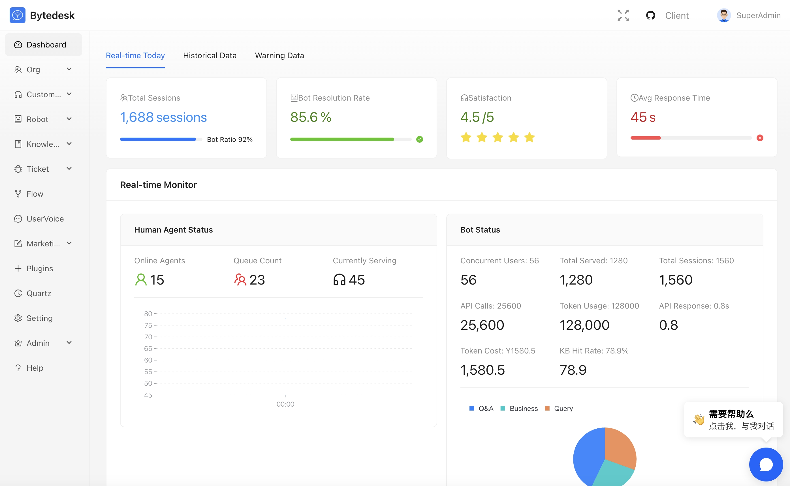
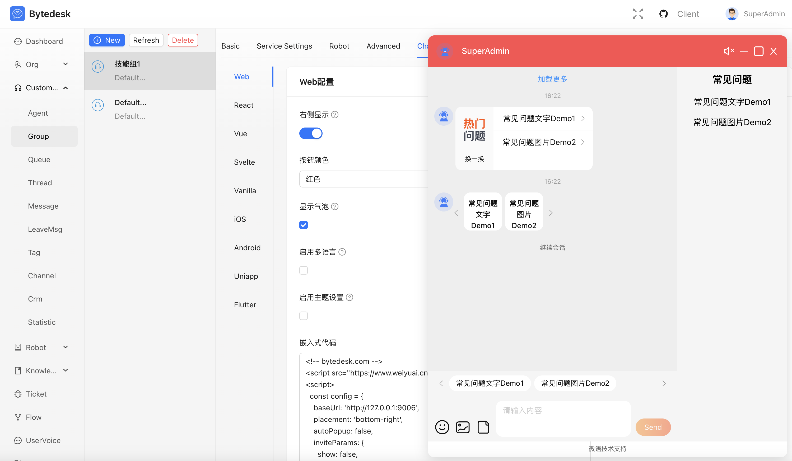
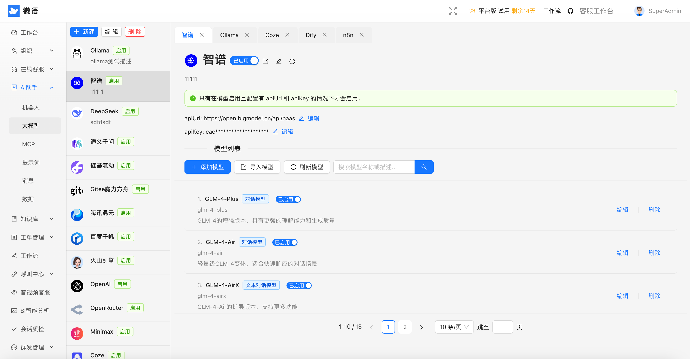

# Bytedesk - Chat als Service

KI-gestützter Omnichannel-Kundenservice mit Teamzusammenarbeit

## Sprache

- [English](./README.md)
- [中文](./README.zh.md)
- [Deutsch](./README.de.md)

## Admin-Dashboard



## Admin-Chat



## Admin LLM + Agent



## Admin-Kanäle


## Agent-Workspace


## Einführung

### [TeamIM](./modules/team/readme.md)

- Mehrstufige Organisationsstruktur
- Rollen- und Berechtigungsmanagement
- Transparente Audit- und Archivfunktionen
- ...

### [Kundenservice](./modules/service/readme.md)

- Unterstützung für Web, App, Social, Shop u. v. m.
- Intelligente Routing-Strategien mit KPI-Tracking
- Einheitliche Arbeitsoberfläche für Agents
- ...

### [Wissensdatenbank](./modules/kbase/readme.md)

- Interne Dokumente & Help Center
- FAQ-Veröffentlichung sowie RAG-Wissensspeicher
- Nahtlose Verbindung mit AI-Agenten
- ...

### [Ticket-System](./modules/ticket/readme.md)

- Lebenszyklus-Management für Tickets
- SLA-Definition und Nachverfolgung
- Analysen und Berichte in Echtzeit
- ...

### [AI Agent](./modules/ai/readme.md)

- Chats mit Ollama / DeepSeek / ZhipuAI / ...
- Wissensdatenbank-Chat (RAG)
- Function Calling & MCP
- ...

### [Workflow](./modules/core/readme.workflow.md)

- Individuelle Formulare
- Visuelle Prozessdesigner
- Ticket-Workflows automatisieren
- ...

### [Voice of Customer](./modules/voc/readme.md)

- Feedback und Umfragen
- Beschwerdemanagement
- Zufriedenheits-Monitoring
- ...

### [Callcenter](./plugins/freeswitch/readme.zh.md)

- Professionelle Plattform auf Basis von FreeSwitch
- Screen-Pop, Auto-Distribution, Aufzeichnung
- Sprach- und Textservice in einem Dashboard

### [Video-Support](./plugins/webrtc/readme.zh.md)

- HD-Video via WebRTC
- Ein-Klick-Video & Screensharing
- Ideal für erklärungsbedürftige Services

### [Open Platform](./plugins/readme.md)

- Vollständige RESTful APIs & SDKs
- Einfache Integration mit Drittsystemen
- Mehrsprachige SDKs zur schnellen Umsetzung

## Schnellstart

```bash
git clone https://github.com/Bytedesk/bytedesk.git
cd bytedesk/deploy/docker
# Start ohne AI-Funktionen
docker compose -p bytedesk -f docker-compose-noai.yaml up -d
# Start mit ZhipuAI (API-Key erforderlich)
docker compose -p bytedesk -f docker-compose.yaml up -d
# Start mit lokalem Ollama
docker compose -p bytedesk -f docker-compose-ollama.yaml up -d
```

- [Docker-Deployment](https://www.weiyuai.cn/docs/docs/deploy/docker/)
- [Baota-Deployment](https://www.weiyuai.cn/docs/docs/deploy/baota)
- [Start aus dem Quellcode](https://www.weiyuai.cn/docs/docs/deploy/source)

## Demo & Zugriff

```bash
# 127.0.0.1 durch Server-IP ersetzen
http://127.0.0.1:9003/
# Offene Ports: 9003, 9885
Standard-Account: admin@email.com
Standard-Passwort: admin
```

## Projektstruktur

Monorepo auf Maven-Basis (zentrales `pom.xml`) mit mehreren Modulen und Deployments.

```text
bytedesk/
├─ channels/           # Kanal-Integrationen (Douyin, Shops, Social, WeChat)
├─ demos/              # Beispielprojekte & Sample-Code
├─ deploy/             # Deployment-Assets: Docker, K8s, Server-Konfigurationen
├─ enterprise/         # Enterprise-Module (ai, call, core, kbase, service, ticket)
├─ images/             # Screenshots & Dokumentationsgrafiken
├─ jmeter/             # Performance-Tests und Skripte
├─ logs/               # Laufzeit-Logs (lokal/dev)
├─ modules/            # Kernmodule (TeamIM, Service, KBase, Ticket, AI ...)
├─ plugins/            # Optionale Plugins (freeswitch, webrtc, open platform)
├─ projects/           # Kundenspezifische Erweiterungen
├─ starter/            # Starter-Apps & Bootstraps
```

## Architektur

- [Architektur-Diagramm](https://www.weiyuai.cn/architecture.html)

## Open-Source-Clients

- [Desktop](https://github.com/Bytedesk/bytedesk-desktop)
- [Mobile](https://github.com/Bytedesk/bytedesk-mobile)
- [SipPhone](https://github.com/Bytedesk/bytedesk-phone)
- [Conference](https://github.com/Bytedesk/bytedesk-conference)
- [FreeSwitch Docker](https://github.com/Bytedesk/bytedesk-freeswitch)
- [Jitsi Docker](https://github.com/Bytedesk/bytedesk-jitsi)

## Open-Source-Demos & SDKs

| Projekt | Beschreibung | Forks | Stars |
|---------|--------------|-------|-------|
| [iOS](https://github.com/bytedesk/bytedesk-swift) | Native iOS-App |  |  |
| [Android](https://github.com/bytedesk/bytedesk-android) | Native Android-App |  |  |
| [Flutter](https://github.com/bytedesk/bytedesk-flutter) | Flutter-Paket |  |  |
| [UniApp](https://github.com/bytedesk/bytedesk-uniapp) | UniApp-Komponente |  |  |
| [Web](https://github.com/bytedesk/bytedesk-web) | Vue/React/Angular/Next.js Frontend |  |  |
| [WordPress](https://github.com/bytedesk/bytedesk-wordpress) | WordPress-Plugin |  |  |
| [WooCommerce](https://github.com/bytedesk/bytedesk-woocommerce) | WooCommerce-Integration |  |  |
| [Magento](https://github.com/bytedesk/bytedesk-magento) | Magento-Extension |  |  |
| [PrestaShop](https://github.com/bytedesk/bytedesk-prestashop) | PrestaShop-Modul |  |  |
| [Shopify](https://github.com/bytedesk/bytedesk-shopify) | Shopify-App |  |  |
| [OpenCart](https://github.com/bytedesk/bytedesk-opencart) | OpenCart-Plugin |  |  |
| [Laravel](https://github.com/bytedesk/bytedesk-laravel) | Laravel-Paket |  |  |
| [Django](https://github.com/bytedesk/bytedesk-django) | Django-App |  |  |

## Links

- [Download](https://www.weiyuai.cn/download.html)
- [Dokumentation](https://www.weiyuai.cn/docs/)

## Lizenz

Copyright (c) 2013-2025 Bytedesk.com.

Lizenziert unter der GNU AFFERO GENERAL PUBLIC LICENSE (AGPL v3). Vollständiger Text:

<https://www.gnu.org/licenses/agpl-3.0.html>

Bereitgestellt "wie besehen" ohne ausdrückliche oder stillschweigende Garantien. Prüfen Sie die Lizenz vor kommerzieller Nutzung.

## Nutzungsbedingungen

- **Erlaubt**: Kommerzielle Nutzung möglich, Weiterverkauf ohne Genehmigung verboten
- **Verboten**: Einsatz in illegalen Szenarien wie Malware, Betrug, Glücksspiel etc.
- **Haftungsausschluss**: Nutzung auf eigenes Risiko, keine rechtliche Verantwortung