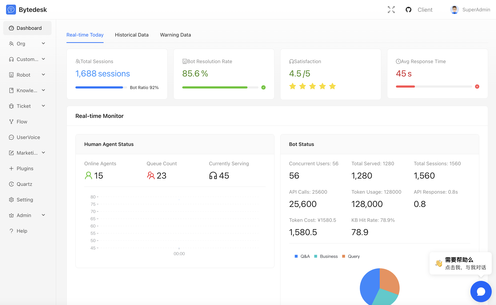

# Bytedesk - Servicio de Chat

Atención al cliente omnicanal impulsada por IA con colaboración entre equipos

## Idioma

- [English](./README.md)
- [中文](./README.zh.md)
- [Español](./README.es.md)

## Panel de administración



## Chat de administración


## Administración LLM + Agente


## Canales de administración


## Consola del agente


## Introducción

### [TeamIM](./modules/team/readme.md)

- Estructura organizativa multinivel
- Gestión de roles y permisos
- Supervisión y auditoría centralizada
- ...

### [Atención al cliente](./modules/service/readme.md)

- Integración de web, app, redes sociales y e-commerce
- Estrategias de enrutamiento inteligentes con KPIs
- Escritorio unificado para agentes
- ...

### [Base de conocimientos](./modules/kbase/readme.md)

- Documentación interna y Help Center
- FAQs y bibliotecas RAG conectadas al LLM
- Sincronización con agentes inteligentes
- ...

### [Sistema de tickets](./modules/ticket/readme.md)

- Gestión completa del ciclo de vida del ticket
- SLA configurable y seguimiento automático
- Informes y analíticas en tiempo real
- ...

### [Agente de IA](./modules/ai/readme.md)

- Chats con Ollama / DeepSeek / ZhipuAI / ...
- RAG conectado a la base de conocimiento
- Function Calling y MCP
- ...

### [Workflow](./modules/core/readme.workflow.md)

- Formularios personalizados
- Diseñador visual de procesos
- Automatización de flujos de tickets
- ...

### [Voz del cliente](./modules/voc/readme.md)

- Feedback, encuestas y reclamaciones
- Medición continua de satisfacción
- Paneles listos para auditoría
- ...

### [Centro de llamadas](./plugins/freeswitch/readme.zh.md)

- Plataforma profesional basada en FreeSwitch
- Pantallas emergentes, distribución automática y grabación
- Integración sin fisuras de voz y texto

### [Atención por video](./plugins/webrtc/readme.zh.md)

- Videollamadas HD con WebRTC
- Conversaciones y compartición de pantalla con un clic
- Ideal para demostraciones en vivo

### [Plataforma abierta](./plugins/readme.md)

- APIs RESTful completas y SDKs multi-idioma
- Integración sencilla con sistemas externos
- Reduce tiempos de desarrollo e implantación

## Inicio rápido

```bash
git clone https://github.com/Bytedesk/bytedesk.git
cd bytedesk/deploy/docker
# Iniciar sin capacidades IA
docker compose -p bytedesk -f docker-compose-noai.yaml up -d
# Iniciar con ZhipuAI (requiere API Key)
docker compose -p bytedesk -f docker-compose.yaml up -d
# Iniciar con Ollama local
docker compose -p bytedesk -f docker-compose-ollama.yaml up -d
```

- [Despliegue Docker](https://www.weiyuai.cn/docs/docs/deploy/docker/)
- [Despliegue Baota](https://www.weiyuai.cn/docs/docs/deploy/baota)
- [Arranque desde código fuente](https://www.weiyuai.cn/docs/docs/deploy/source)

## Acceso de prueba

```bash
# Sustituye 127.0.0.1 por la IP de tu servidor
http://127.0.0.1:9003/
# Puertos abiertos: 9003, 9885
Cuenta por defecto: admin@email.com
Contraseña por defecto: admin
```

## Estructura del proyecto

Monorepo basado en Maven (archivo `pom.xml` en la raíz) con múltiples módulos y activos de despliegue.

```text
bytedesk/
├─ channels/           # Integraciones de canales (Douyin, tiendas, social, WeChat)
├─ demos/              # Proyectos de ejemplo y código de muestra
├─ deploy/             # Activos de despliegue: Docker, K8s, configuración de servidores
├─ enterprise/         # Capacidades enterprise (ai, call, core, kbase, service, ticket)
├─ images/             # Recursos visuales y capturas
├─ jmeter/             # Pruebas de rendimiento y scripts
├─ logs/               # Registros locales/dev
├─ modules/            # Módulos core (TeamIM, Service, KBase, Ticket, AI ...)
├─ plugins/            # Plugins opcionales (freeswitch, webrtc, open platform)
├─ projects/           # Proyectos personalizados o extensiones
├─ starter/            # Starters y entry points
```

## Arquitectura

- [Diagrama de arquitectura](https://www.weiyuai.cn/architecture.html)

## Clientes open source

- [Escritorio](https://github.com/Bytedesk/bytedesk-desktop)
- [Móvil](https://github.com/Bytedesk/bytedesk-mobile)
- [SipPhone](https://github.com/Bytedesk/bytedesk-phone)
- [Conferencia](https://github.com/Bytedesk/bytedesk-conference)
- [FreeSwitch Docker](https://github.com/Bytedesk/bytedesk-freeswitch)
- [Jitsi Docker](https://github.com/Bytedesk/bytedesk-jitsi)

## Demos y SDK open source

| Proyecto | Descripción | Forks | Stars |
|----------|-------------|-------|-------|
| [iOS](https://github.com/bytedesk/bytedesk-swift) | App nativa iOS |  |  |
| [Android](https://github.com/bytedesk/bytedesk-android) | App nativa Android |  |  |
| [Flutter](https://github.com/bytedesk/bytedesk-flutter) | SDK Flutter |  |  |
| [UniApp](https://github.com/bytedesk/bytedesk-uniapp) | Paquete UniApp |  |  |
| [Web](https://github.com/bytedesk/bytedesk-web) | Frontend Vue/React/Angular/Next.js |  |  |
| [WordPress](https://github.com/bytedesk/bytedesk-wordpress) | Plugin WordPress |  |  |
| [WooCommerce](https://github.com/bytedesk/bytedesk-woocommerce) | Integración WooCommerce |  |  |
| [Magento](https://github.com/bytedesk/bytedesk-magento) | Extensión Magento |  |  |
| [PrestaShop](https://github.com/bytedesk/bytedesk-prestashop) | Módulo PrestaShop |  |  |
| [Shopify](https://github.com/bytedesk/bytedesk-shopify) | App Shopify |  |  |
| [OpenCart](https://github.com/bytedesk/bytedesk-opencart) | Plugin OpenCart |  |  |
| [Laravel](https://github.com/bytedesk/bytedesk-laravel) | Paquete Laravel |  |  |
| [Django](https://github.com/bytedesk/bytedesk-django) | App Django |  |  |

## Enlaces

- [Descarga](https://www.weiyuai.cn/download.html)
- [Documentación](https://www.weiyuai.cn/docs/)

## Licencia

Copyright (c) 2013-2025 Bytedesk.com.

Licenciado bajo GNU AFFERO GENERAL PUBLIC LICENSE (AGPL v3). Consulta el texto completo en:

<https://www.gnu.org/licenses/agpl-3.0.html>

Software distribuido "tal cual" sin garantías expresas ni implícitas. Revisa los términos antes de cualquier uso comercial.

## Términos de uso

- **Usos permitidos**: Uso comercial permitido, se prohíbe la reventa sin autorización previa
- **Usos prohibidos**: Estrictamente prohibido para actividades ilegales (malware, fraude, apuestas, etc.)
- **Descargo de responsabilidad**: Uso bajo tu propio riesgo; no se asume responsabilidad legal