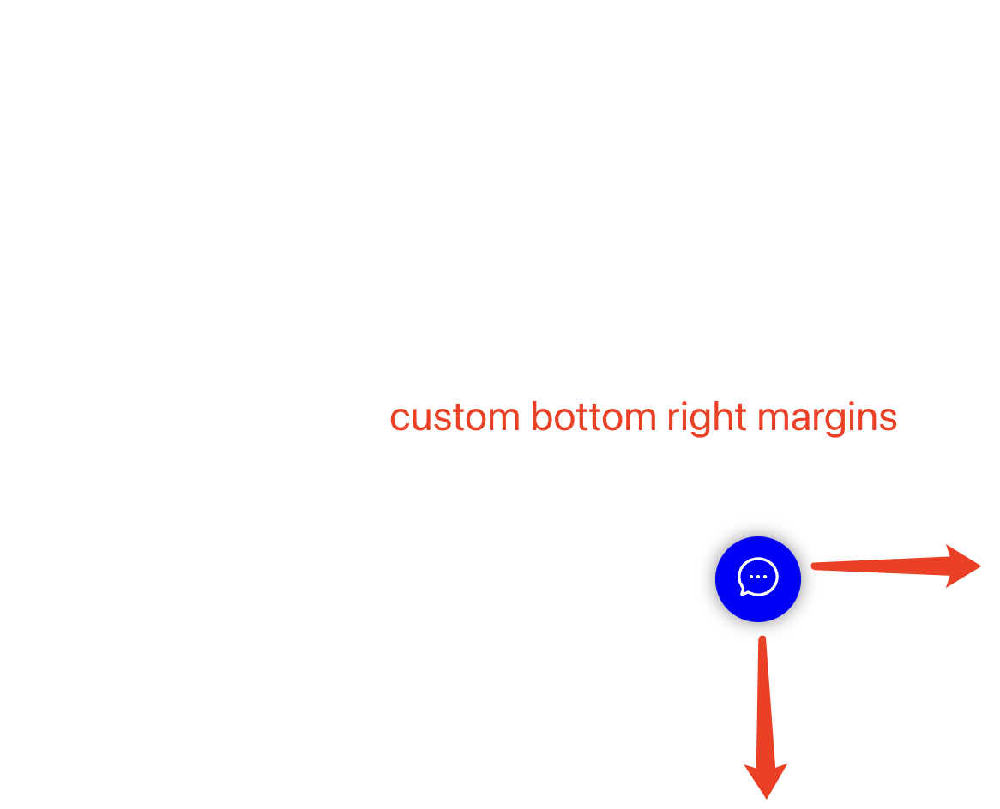
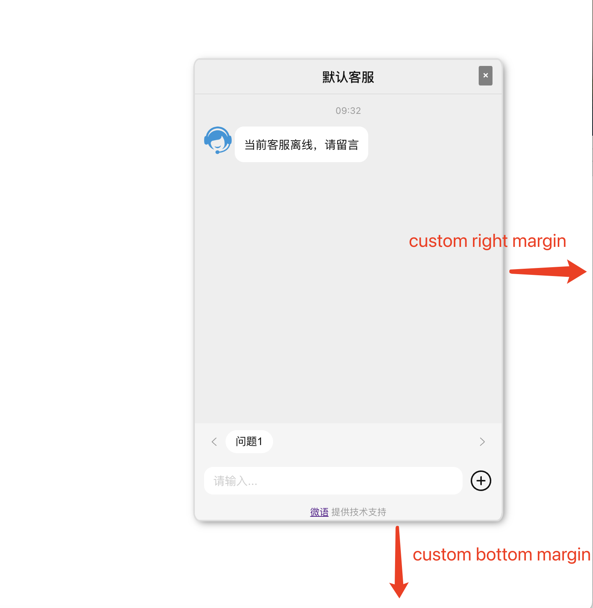

<!--
 * @Author: jackning 270580156@qq.com
 * @Date: 2024-06-05 09:43:27
 * @LastEditors: jackning 270580156@qq.com
 * @LastEditTime: 2024-10-19 11:25:05
 * @Description: bytedesk.com https://github.com/Bytedesk/bytedesk
 *   Please be aware of the BSL license restrictions before installing Bytedesk IM – 
 *  selling, reselling, or hosting Bytedesk IM as a service is a breach of the terms and automatically terminates your rights under the license. 
 *  仅支持企业内部员工自用，严禁私自用于销售、二次销售或者部署SaaS方式销售 
 *  Business Source License 1.1: https://github.com/Bytedesk/bytedesk/blob/main/LICENSE 
 *  contact: 270580156@qq.com 
 *  联系：270580156@qq.com
 * Copyright (c) 2024 by bytedesk.com, All Rights Reserved. 
-->
# Bytedesk

Chat as a Service

## Language

- [English](./README.md)
- [中文](./README.zh.md)

## Introduction

### Chat With Your Team

- Multi-level organizational structure
- Role management
- Permission management
- Chat record management
- Group chat

### Chat With AI

- Chat with LLM
- Chat with Knowledge base(RAG)

### Chat With Your Customers

- Support multiple channels
- multiple routing strategies, and detailed assessment indicators
- Seating workbench
- Work order system
- Seat management
- Data dashboard
- manual knowledge base
- Skill group management
- Real-time monitoring
- Announcements
- sensitive words
- CRM
- Report function,
- Provide customers with integrated customer service workbench services

## Getting Started

```bash
# Notice: this repo is still under active development, 
# many features are not completed or not stable，the docs are not completed
git clone https://github.com/Bytedesk/bytedesk.git
# config file: bytedesk/starter/src/main/resources/application-dev.properties
# use maven && vscode
#
# java --version
# java 17.0.4 2022-07-19 LTS
# 
# mvn --version
# Apache Maven 3.8.4 (9b656c72d54e5bacbed989b64718c159fe39b537)
# OS name: "mac os x", version: "14.2.1", arch: "aarch64", family: "mac"
# 
# protobuf is used to generate java code, you may need to install protobuf on your machine
# protoc --version
# libprotoc 25.3
# 
cd bytedesk
mvn install -Dmaven.test.skip=true
# 
cd starter
mvn spring-boot:run
# 
# local preview:
web: http://127.0.0.1:9003/
developer: http://127.0.0.1:9003/dev
admin: http://127.0.0.1:9003/admin, user/password: admin@email.com/admin
agent: http://127.0.0.1:9003/agent/chat, user/password: admin@email.com/admin
chat: http://127.0.0.1:9003/chat?org=df_org_uid&t=0&sid=df_ag_uid&
api docs: http://127.0.0.1:9003/swagger-ui/index.html
actuator: http://127.0.0.1:9003/actuator
# h2-console: http://127.0.0.1:9003/h2-console, path: ./h2db/weiyuim, user/password: sa/sa
```

## Docs

- [Docs](https://www.weiyuai.cn/docs/)

## Preview

### Admin

| team | service | ai |
| :----------: | :----------: | :----------: |
|  |  |  |

## [Desktop](https://github.com/Bytedesk/bytedesk-desktop)

| login | chat | contact | setting |
| :----------: | :----------: | :----------: | :----------: |
|  |  |  |  |

| chat-ai | chat-cs | chat-userinfo |
| :----------: | :----------: | :----------: |
| |  |  |

<!-- ## [Mobile](https://github.com/Bytedesk/bytedesk-mobile)

- [github](https://github.com/Bytedesk/bytedesk-mobile) -->

<!-- ## [Web Chat](https://github.com/bytedesk/bytedesk-react)

- [github](https://github.com/Bytedesk/bytedesk-react) -->

<!-- | custom button color |  custom button left | custom button margin | custom iframe margin |
| :----------: | :----------: | :----------:  | :----------: |
|  |  |  |  |

| custom iframe width |  chat full window | chat iframe window | chat embed window |
| :----------: | :----------: | :----------:  | :----------: |
|  |  |  |  | -->

## Chat SDK

<!-- - [iOS-oc](https://github.com/Bytedesk/bytedesk-oc) -->
<!-- - [React-native](https://github.com/bytedesk/bytedesk-react-native) -->
<!-- - [Vue](https://github.com/bytedesk/bytedesk-vue) -->
<!-- - [Browser-Extension](https://github.com/Bytedesk/bytedesk-browser-extention) -->
<!-- - [Vscode-plugin](https://github.com/bytedesk/bytedesk-vscode-plugin) -->
<!-- - [iOS-swift](https://github.com/bytedesk/bytedesk-swift)
- [Android](https://github.com/bytedesk/bytedesk-android)
- [Flutter](https://github.com/bytedesk/bytedesk-flutter)
- [React](https://github.com/bytedesk/bytedesk-react)
- [UniApp](https://github.com/bytedesk/bytedesk-uniapp)
- [Web](https://github.com/bytedesk/bytedesk-web) -->

| Project     | Description           | Forks          | Stars             |
|-------------|-----------------------|----------------|-------------------|
| [iOS-swift](https://github.com/bytedesk/bytedesk-swift) | iOS swift  |  |                  |
| [Android](https://github.com/bytedesk/bytedesk-android) | Android |  |   |
| [Flutter](https://github.com/bytedesk/bytedesk-flutter) | Flutter | |  |
| [React](https://github.com/bytedesk/bytedesk-react) | React |  |  |
| [UniApp](https://github.com/bytedesk/bytedesk-uniapp) | Uniapp |  |  |
| [Web](https://github.com/bytedesk/bytedesk-web) | Web |  |  |

## Download Client

- [Windows](https://www.weiyuai.cn/download.html)
- [Mac](https://www.weiyuai.cn/download.html)
- [Linux](https://www.weiyuai.cn/download.html)
- [Android](https://www.weiyuai.cn/download.html)
- [IOS](https://www.weiyuai.cn/download.html)

## Dev Stack

<!-- - [sofaboot](https://github.com/sofastack/sofa-boot/blob/master/README_ZH.md) for im server -->
- [springboot-3.x for im server](https://github.com/Bytedesk/bytedesk)
- [python for ai](https://github.com/Bytedesk/bytedesk-ai)
- [react for web](https://github.com/Bytedesk/bytedesk-react)
- [flutter for ios&android](https://github.com/Bytedesk/bytedesk-mobile)
- [electron for windows&mac&linux](https://github.com/Bytedesk/bytedesk-desktop)

## Contact

- [Email](mailto:270580156@qq.com)
- [Wechat](./images/wechat.png)

## License

- support business usage
- must not remove trademark && logo info
- selling, reselling, or hosting Bytedesk IM as a service is a breach of the terms and automatically terminates your rights under the license.
- 仅支持企业内部员工自用，销售、二次销售或者部署SaaS方式销售需要获得授权，请勿用于非法用途。
