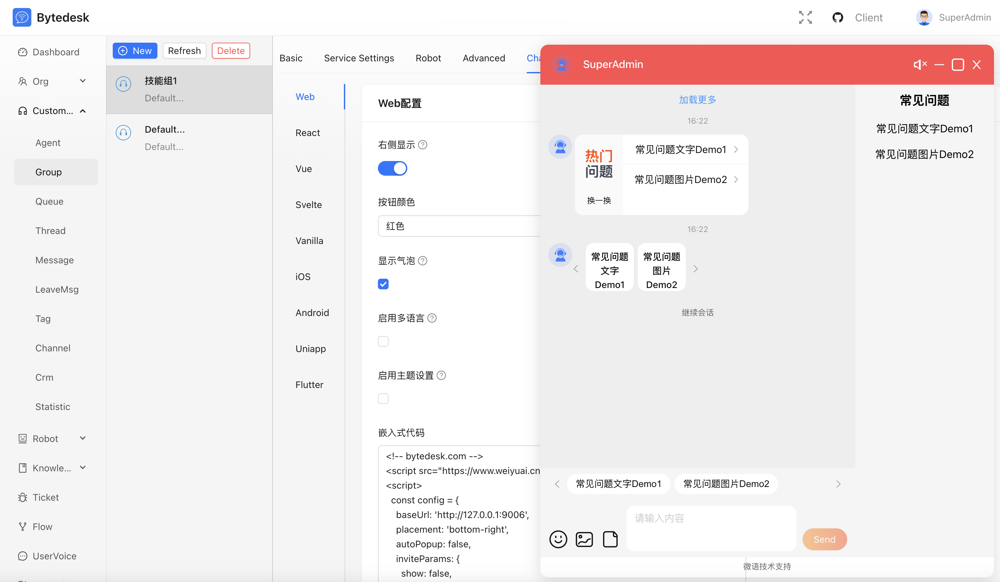

# Bytedesk - Serviço de Chat

Atendimento ao cliente omnicanal com IA e colaboração entre equipes

## Idioma

- [English](./README.md)
- [中文](./README.zh.md)
- [Português](./README.pt.md)

## Painel Administrativo


## Chat Administrativo



## LLM + Agente


## Canais Administrativos


## Mesa do Agente


## Visão Geral

### [TeamIM](./modules/team/readme.md)

- Estrutura organizacional multinível
- Gestão de papéis e permissões
- Auditoria e registros consolidados
- ...

### [Atendimento ao Cliente](./modules/service/readme.md)

- Integração de web, app, social e e-commerce
- Estratégias inteligentes de roteamento com KPIs
- Mesa de trabalho unificada para agentes
- ...

### [Base de Conhecimento](./modules/kbase/readme.md)

- Documentação interna e Help Center
- FAQs e bases RAG conectadas ao LLM
- Sincronização com agentes de IA
- ...

### [Sistema de Tickets](./modules/ticket/readme.md)

- Gestão completa do ciclo do ticket
- SLA configurável e monitoramento automático
- Relatórios e painéis em tempo real
- ...

### [Agente de IA](./modules/ai/readme.md)

- Conversas com Ollama / DeepSeek / ZhipuAI / ...
- Chat baseado em conhecimento (RAG)
- Function Calling e MCP
- ...

### [Workflow](./modules/core/readme.workflow.md)

- Formulários personalizados
- Designer visual de processos
- Automação de fluxos de tickets
- ...

### [Voz do Cliente](./modules/voc/readme.md)

- Pesquisas, feedbacks e reclamações
- Monitoramento de satisfação
- ...

### [Call Center](./plugins/freeswitch/readme.zh.md)

- Plataforma profissional baseada em FreeSwitch
- Pop-up de chamada, distribuição automática, gravação
- Integração de voz e texto em um só painel

### [Atendimento em Vídeo](./plugins/webrtc/readme.zh.md)

- Chamadas de vídeo HD via WebRTC
- Conversa e compartilhamento de tela com um clique
- Ideal para demonstrações guiadas

### [Plataforma Aberta](./plugins/readme.md)

- APIs RESTful completas e SDKs multilíngues
- Integração fluida com sistemas terceiros
- Acelera projetos de extensão

## Início Rápido

```bash
git clone https://github.com/Bytedesk/bytedesk.git
cd bytedesk/deploy/docker
# Executar sem recursos de IA
docker compose -p bytedesk -f docker-compose-noai.yaml up -d
# Executar com ZhipuAI (necessário API Key)
docker compose -p bytedesk -f docker-compose.yaml up -d
# Executar com Ollama local
docker compose -p bytedesk -f docker-compose-ollama.yaml up -d
```

- [Deploy Docker](https://www.weiyuai.cn/docs/docs/deploy/docker/)
- [Deploy Baota](https://www.weiyuai.cn/docs/docs/deploy/baota)
- [Execução via código-fonte](https://www.weiyuai.cn/docs/docs/deploy/source)

## Acesso de Demonstração

```bash
# Substitua 127.0.0.1 pelo IP do servidor
http://127.0.0.1:9003/
# Portas abertas: 9003, 9885
Usuário padrão: admin@email.com
Senha padrão: admin
```

## Estrutura do Projeto

Monorepo baseado em Maven (arquivo `pom.xml` raiz) com múltiplos módulos e artefatos de deploy.

```text
bytedesk/
├─ channels/           # Integrações (Douyin, lojas, social, WeChat)
├─ demos/              # Projetos de exemplo e código demo
├─ deploy/             # Docker, K8s e configs de servidor
├─ enterprise/         # Recursos enterprise (ai, call, core, kbase, service, ticket)
├─ images/             # Imagens de documentação/UI
├─ jmeter/             # Testes de performance
├─ logs/               # Logs locais/dev
├─ modules/            # Módulos core (TeamIM, Service, KBase, Ticket, AI ...)
├─ plugins/            # Plugins opcionais (freeswitch, webrtc, open platform)
├─ projects/           # Extensões personalizadas
├─ starter/            # Starters e entry points
```

## Arquitetura

- [Diagrama de arquitetura](https://www.weiyuai.cn/architecture.html)

## Clientes Open Source

- [Desktop](https://github.com/Bytedesk/bytedesk-desktop)
- [Mobile](https://github.com/Bytedesk/bytedesk-mobile)
- [SipPhone](https://github.com/Bytedesk/bytedesk-phone)
- [Conference](https://github.com/Bytedesk/bytedesk-conference)
- [FreeSwitch Docker](https://github.com/Bytedesk/bytedesk-freeswitch)
- [Jitsi Docker](https://github.com/Bytedesk/bytedesk-jitsi)

## Demos e SDKs Open Source

| Projeto | Descrição | Forks | Stars |
|---------|-----------|-------|-------|
| [iOS](https://github.com/bytedesk/bytedesk-swift) | App nativa iOS |  |  |
| [Android](https://github.com/bytedesk/bytedesk-android) | App nativa Android |  |  |
| [Flutter](https://github.com/bytedesk/bytedesk-flutter) | SDK Flutter |  |  |
| [UniApp](https://github.com/bytedesk/bytedesk-uniapp) | Pacote UniApp |  |  |
| [Web](https://github.com/bytedesk/bytedesk-web) | Front-end Vue/React/Angular/Next.js |  |  |
| [WordPress](https://github.com/bytedesk/bytedesk-wordpress) | Plugin WordPress |  |  |
| [WooCommerce](https://github.com/bytedesk/bytedesk-woocommerce) | Integração WooCommerce |  |  |
| [Magento](https://github.com/bytedesk/bytedesk-magento) | Extensão Magento |  |  |
| [PrestaShop](https://github.com/bytedesk/bytedesk-prestashop) | Módulo PrestaShop |  |  |
| [Shopify](https://github.com/bytedesk/bytedesk-shopify) | App Shopify |  |  |
| [OpenCart](https://github.com/bytedesk/bytedesk-opencart) | Plugin OpenCart |  |  |
| [Laravel](https://github.com/bytedesk/bytedesk-laravel) | Pacote Laravel |  |  |
| [Django](https://github.com/bytedesk/bytedesk-django) | App Django |  |  |

## Links

- [Download](https://www.weiyuai.cn/download.html)
- [Documentação](https://www.weiyuai.cn/docs/)

## Licença

Copyright (c) 2013-2025 Bytedesk.com.

Distribuído sob GNU AFFERO GENERAL PUBLIC LICENSE (AGPL v3):

<https://www.gnu.org/licenses/agpl-3.0.html>

Software fornecido "no estado" sem garantias explícitas ou implícitas.

## Termos de uso

- **Uso permitido**: pode ser usado comercialmente; revenda sem autorização é proibida
- **Uso proibido**: atividades ilegais (malware, fraude, jogos de azar etc.)
- **Isenção**: uso por conta e risco do usuário