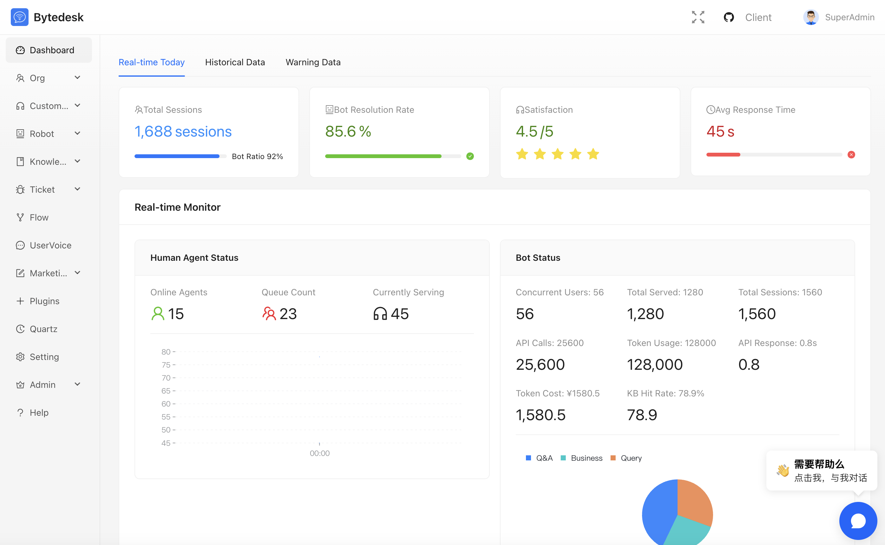
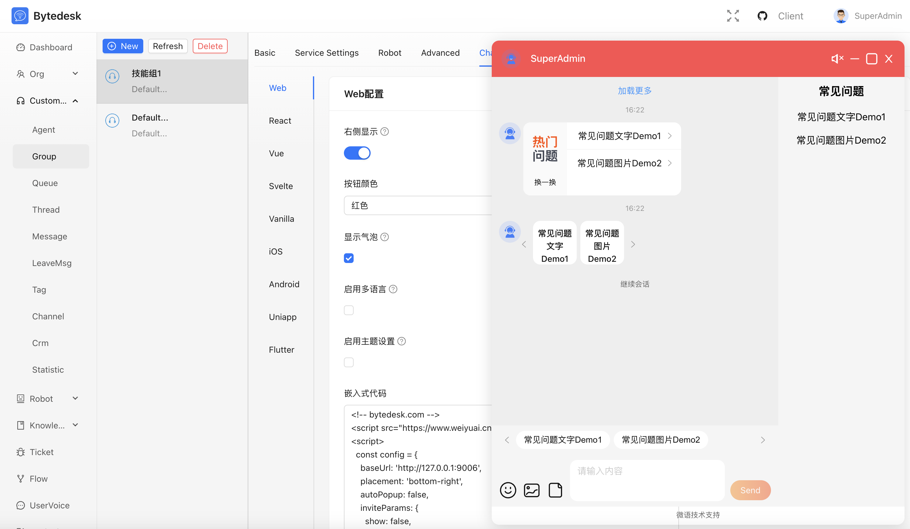
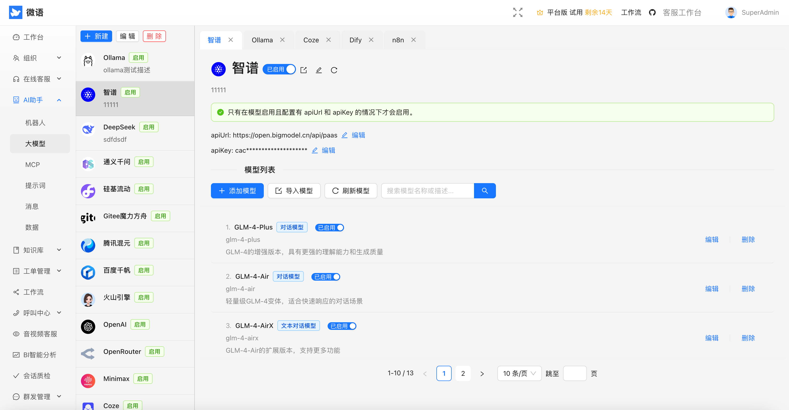
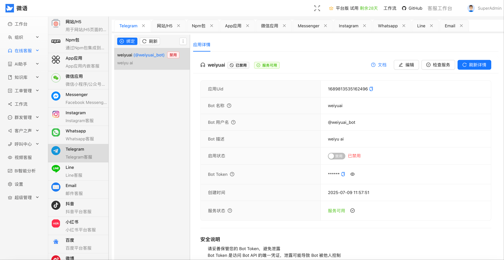
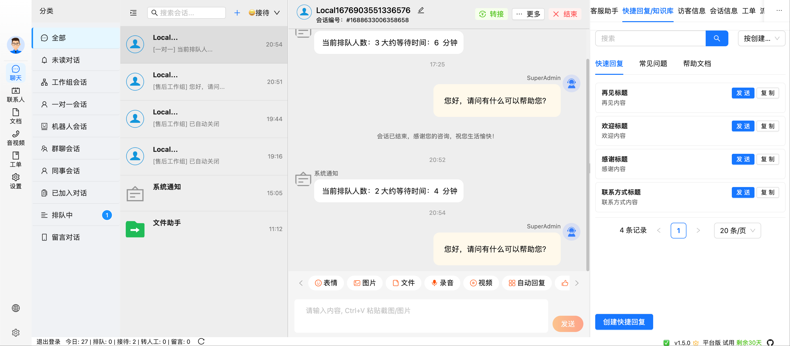
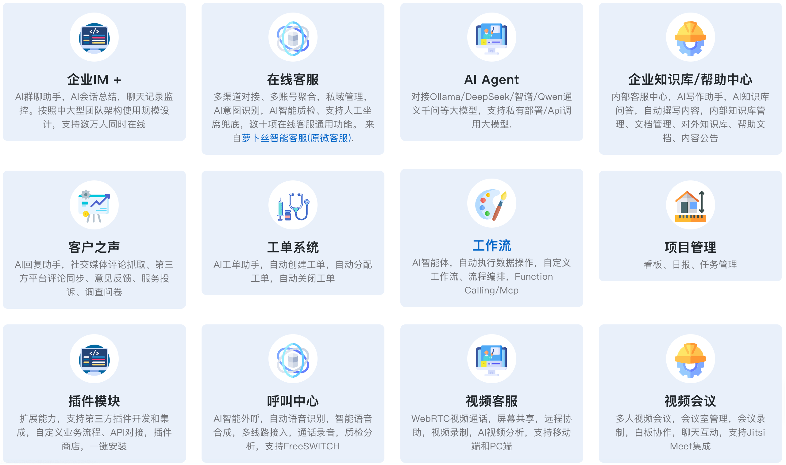
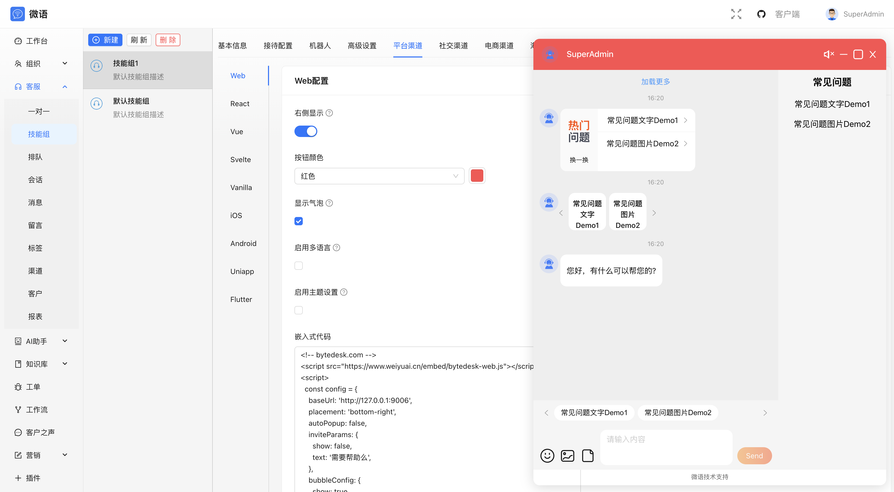

<!--@nrg.languages=en,ar,de,es,fr,hi,it,ja,ko,pt,ru,zh-->
<!--@nrg.defaultLanguage=en-->
<!--<!--en-->
 * @Author: jackning 270580156@qq.com<!--en-->
 * @Date: 2024-06-05 09:43:27<!--en-->
 * @LastEditors: jackning 270580156@qq.com<!--en-->
 * @LastEditTime: 2025-09-24 11:42:56<!--en-->
 * @Description: bytedesk.com https://github.com/Bytedesk/bytedesk<!--en-->
 *   Please be aware of the BSL license restrictions before installing Bytedesk IM – <!--en-->
 *  selling, reselling, or hosting Bytedesk IM as a service is a breach of the terms and automatically terminates your rights under the license.<!--en-->
 *  Business Source License 1.1: https://github.com/Bytedesk/bytedesk/blob/main/LICENSE <!--en-->
 *  contact: 270580156@qq.com <!--en-->
 *  联系：270580156@qq.com<!--en-->
 * Copyright (c) 2024 by bytedesk.com, All Rights Reserved. <!--en-->
--><!--en-->
# Bytedesk - Chat as a Service<!--en-->
<!--en-->
AI powered Omnichannel customer service With Team Cooperation<!--en-->
<!--en-->
**Language:** [English](README.md) | [中文](README.zh.md)<!--en-->
<!--en-->
## Admin Dashboard<!--en-->
<!--en-->
<!--en-->
<!--en-->
## Admin Chat<!--en-->
<!--en-->
<!--en-->
<!--en-->
## Admin LLM+Agent<!--en-->
<!--en-->
<!--en-->
<!--en-->
## Admin Channel<!--en-->
<!--en-->
<!--en-->
<!--en-->
## Agent<!--en-->
<!--en-->
<!--en-->
<!--en-->
## Introduction<!--en-->
<!--en-->
### [TeamIM](./modules/team/readme.md)<!--en-->
<!--en-->
- Multi-level organizational structure<!--en-->
- Role management<!--en-->
- Permission management<!--en-->
- ...<!--en-->
<!--en-->
### [Customer Service](./modules/service/readme.md)<!--en-->
<!--en-->
- Support multiple channels<!--en-->
- multiple routing strategies, and detailed assessment indicators<!--en-->
- Seating workbench<!--en-->
- ...<!--en-->
<!--en-->
### [Knowledge Base](./modules/kbase/readme.md)<!--en-->
<!--en-->
- Internal Docs<!--en-->
- HelpCenter<!--en-->
- FAQ<!--en-->
<!--en-->
### [Ticket](./modules/ticket/readme.md)<!--en-->
<!--en-->
- Ticket management<!--en-->
- Ticket SLA management<!--en-->
- Ticket statistics and reports<!--en-->
- ...<!--en-->
<!--en-->
### [AI Agent](./modules/ai/readme.md)<!--en-->
<!--en-->
- Chat with Ollama/DeepSeek/ZhipuAI/...<!--en-->
- Chat with Knowledge base(RAG)<!--en-->
- Function calling<!--en-->
- Mcp<!--en-->
<!--en-->
### [workflow](./modules/core/readme.workflow.md)<!--en-->
<!--en-->
- form<!--en-->
- process<!--en-->
- ticket process<!--en-->
- ...<!--en-->
<!--en-->
### [Voice Of Customer](./modules/voc/readme.md)<!--en-->
<!--en-->
- feedback<!--en-->
- survey<!--en-->
- ...<!--en-->
<!--en-->
### [Call Center](./plugins/freeswitch/readme.zh.md)<!--en-->
<!--en-->
- Professional call platform based on FreeSwitch<!--en-->
- Supports incoming call pop-up screens, automatic allocation, and call recording<!--en-->
- Data statistics, seamless integration of voice and text services<!--en-->
<!--en-->
### [Video Customer Service](./plugins/webrtc/readme.zh.md)<!--en-->
<!--en-->
- High-definition video calls based on WebRTC technology<!--en-->
- Supports one-click video conversations and screen sharing<!--en-->
- Suitable for service scenarios requiring intuitive demonstrations<!--en-->
<!--en-->
### [Open Platform](./plugins/readme.md)<!--en-->
<!--en-->
- Provides complete RESTful API interfaces and SDK toolKits<!--en-->
- Supports seamless integration with third-party systems for data interoperability<!--en-->
- Multi-language SDK support to simplify development and integration processes<!--en-->
<!--en-->
## Quick Start<!--en-->
<!--en-->
```bash<!--en-->
git clone https://github.com/Bytedesk/bytedesk.git<!--en-->
cd bytedesk/deploy/docker<!--en-->
# default startup (MySQL + Artemis + standard, middleware only)<!--en-->
./start.sh mysql artemis standard middleware<!--en-->
# or WebRTC middleware scenarios (coturn + janus, middleware only)<!--en-->
./start.sh mysql artemis webrtc middleware<!--en-->
```<!--en-->
<!--en-->
For more startup/stop combinations (PostgreSQL, Oracle, RabbitMQ, noai, webrtc, call, full stack), see [docker readme](deploy/docker/readme.md).<!--en-->
<!--en-->
```bash<!--en-->
# Please replace 127.0.0.1 with your server IP<!--en-->
Access address: http://127.0.0.1:9003/<!--en-->
Default account: admin@email.com<!--en-->
Default password: admin<!--en-->
```<!--en-->
<!--en-->
- [Docker Deploy](https://www.weiyuai.cn/docs/docs/deploy/docker/)<!--en-->
- [Baota Deploy](https://www.weiyuai.cn/docs/docs/deploy/baota)<!--en-->
- [Source Code](https://www.weiyuai.cn/docs/docs/deploy/source)<!--en-->
<!--en-->
## Project Structure<!--en-->
<!--en-->
Monorepo powered by Maven (root `pom.xml`) with multiple modules and deploy assets.<!--en-->
<!--en-->
```text<!--en-->
bytedesk/<!--en-->
├─ channels/           # Channel integrations (douyin, shop, social, wechat)<!--en-->
├─ demos/              # Example projects and sample code<!--en-->
├─ deploy/             # Deployment assets: docker, k8s, server configs<!--en-->
├─ enterprise/         # Enterprise features (ai, call, core, kbase, service, ticket)<!--en-->
├─ images/             # Images used in docs and UI previews<!--en-->
├─ jmeter/             # Performance tests and scripts<!--en-->
├─ logs/               # Runtime logs (local/dev)<!--en-->
├─ modules/            # Core product modules (TeamIM, Service, KBase, Ticket, AI, ...)<!--en-->
├─ plugins/            # Optional plugins (freeswitch, webrtc, open platform)<!--en-->
├─ projects/           # Custom projects or extensions<!--en-->
├─ starter/            # Starters/entry points<!--en-->
```<!--en-->
<!--en-->
## architecture<!--en-->
<!--en-->
- [architecture](https://www.weiyuai.cn/architecture.html)<!--en-->
- [docs](https://www.weiyuai.cn/docs/)<!--en-->
- [api docs](https://www.weiyuai.cn/apidocs/)<!--en-->
<!--en-->
## Open Source Client<!--en-->
<!--en-->
- [desktop](https://github.com/Bytedesk/bytedesk-desktop)<!--en-->
- [QT client](https://github.com/Bytedesk/bytedesk-qt)<!--en-->
- [mobile](https://github.com/Bytedesk/bytedesk-mobile)<!--en-->
- [siphone](https://github.com/Bytedesk/bytedesk-phone)<!--en-->
- [conference](https://github.com/Bytedesk/bytedesk-conference)<!--en-->
- [freeswitch docker](https://github.com/Bytedesk/bytedesk-freeswitch)<!--en-->
- [janus docker](https://github.com/Bytedesk/bytedesk-janus)<!--en-->
<!-- - [jitsi docker](https://github.com/Bytedesk/bytedesk-jitsi) --><!--en-->
<!--en-->
## Open Source Demo + SDK<!--en-->
<!--en-->
|Project|Description|Forks|Stars|<!--en-->
|---|---|---|---|<!--en-->
|[iOS](https://github.com/bytedesk/bytedesk-swift)|iOS|||<!--en-->
|[Android](https://github.com/bytedesk/bytedesk-android)|Android|||<!--en-->
|[Flutter](https://github.com/bytedesk/bytedesk-flutter)|Flutter|||<!--en-->
|[UniApp](https://github.com/bytedesk/bytedesk-uniapp)|Uniapp|||<!--en-->
|[Web](https://github.com/bytedesk/bytedesk-web)|Vue/React/Angular/Next.js/JQuery/...|||<!--en-->
|[Wordpress](https://github.com/bytedesk/bytedesk-wordpress)|Wordpress|||<!--en-->
|[Woocommerce](https://github.com/bytedesk/bytedesk-woocommerce)|woocommerce|||<!--en-->
<!-- |[Magento](https://github.com/bytedesk/bytedesk-magento)|Magento|||<!--en-->
|[Prestashop](https://github.com/bytedesk/bytedesk-prestashop)|Prestashop|||<!--en-->
|[Shopify](https://github.com/bytedesk/bytedesk-shopify)|Shopify|||<!--en-->
|[Opencart](https://github.com/bytedesk/bytedesk-opencart)|Opencart|||<!--en-->
|[Laravel](https://github.com/bytedesk/bytedesk-laravel)|Laravel|||<!--en-->
|[Django](https://github.com/bytedesk/bytedesk-django)|Django||| --><!--en-->
<!--en-->
## Links<!--en-->
<!--en-->
- [Download](https://www.weiyuai.cn/download.html)<!--en-->
- [Docs](https://www.weiyuai.cn/docs/)<!--en-->
<!--en-->
<!-- ## Dev Stack --><!--en-->
<!-- - [sofaboot](https://github.com/sofastack/sofa-boot/blob/master/README_ZH.md) for im server --><!--en-->
<!-- - [springboot-3.x for im server](https://github.com/Bytedesk/bytedesk) --><!--en-->
<!-- - [python for ai](https://github.com/Bytedesk/bytedesk-ai) --><!--en-->
<!-- - [react for web](https://github.com/Bytedesk/bytedesk-react) --><!--en-->
<!-- - [flutter for ios&android](https://github.com/Bytedesk/bytedesk-mobile) --><!--en-->
<!-- - [electron for windows&mac&linux](https://github.com/Bytedesk/bytedesk-desktop) --><!--en-->
<!--en-->
## License<!--en-->
<!--en-->
Copyright (c) 2013-2025 微语 Bytedesk.com, All rights reserved.<!--en-->
<!--en-->
Licensed under GNU AFFERO GENERAL PUBLIC LICENSE(AGPL v3)  (the "License"); you may not use this file except in compliance with the License. You may obtain a copy of the License at<!--en-->
<!--en-->
<https://www.gnu.org/licenses/agpl-3.0.html><!--en-->
<!--en-->
Unless required by applicable law or agreed to in writing, software distributed under the License is distributed on an "AS IS" BASIS, WITHOUT WARRANTIES OR CONDITIONS OF ANY KIND, either express or implied. See the License for the specific language governing permissions and limitations under the License.<!--en-->
<!--en-->
## Terms of Use<!--en-->
<!--en-->
- **Allowed Uses**: Can be used for commercial purposes, but prohibited from resale without prior permission<!--en-->
- **Prohibited Uses**: Strictly prohibited for use in illegal and non-compliant businesses including trojans, viruses, pornography, gambling, fraud, and other illegal activities<!--en-->
- **Disclaimer**: This software does not guarantee any form of legal liability. Users are responsible for their own usage risks<!--en-->
<div dir="rtl"><!--ar-->
<!--ar-->
<!-- يرجى مراجعة قيود ترخيص BSL قبل تثبيت Bytedesk IM. --><!--ar-->
<!--ar-->
# بايت ديسك - المحادثة كخدمة<!--ar-->
<!--ar-->
خدمة عملاء أومني-قناة مدعومة بالذكاء الاصطناعي مع تعاون فرق العمل<!--ar-->
<!--ar-->
## اللغة<!--ar-->
<!--ar-->
- [English](./README.md)<!--ar-->
- [中文](./README.zh.md)<!--ar-->
- [العربية](./README.ar.md)<!--ar-->
<!--ar-->
## لوحة تحكم المشرف<!--ar-->
<!--ar-->
<!--ar-->
<!--ar-->
## دردشة المشرف<!--ar-->
<!--ar-->
<!--ar-->
<!--ar-->
## المشرف: النماذج الكبيرة + الوكلاء<!--ar-->
<!--ar-->
<!--ar-->
<!--ar-->
## قنوات المشرف<!--ar-->
<!--ar-->
<!--ar-->
<!--ar-->
## منصة الوكلاء<!--ar-->
<!--ar-->
<!--ar-->
<!--ar-->
## مقدمة<!--ar-->
<!--ar-->
### [دردشة الفريق TeamIM](./modules/team/readme.md)<!--ar-->
<!--ar-->
- هيكل تنظيمي هرمي متعدد المستويات<!--ar-->
- إدارة الأدوار والسياسات<!--ar-->
- التحكم في الأذونات والمراقبة<!--ar-->
- ...<!--ar-->
<!--ar-->
### [خدمة العملاء](./modules/service/readme.md)<!--ar-->
<!--ar-->
- دعم قنوات متعددة (ويب، تطبيقات، متاجر، شبكات اجتماعية)<!--ar-->
- استراتيجيات توزيع ومسارات ذكية مع مؤشرات أداء مفصلة<!--ar-->
- مكتب عمل متكامل للوكلاء<!--ar-->
- ...<!--ar-->
<!--ar-->
### [قاعدة المعرفة](./modules/kbase/readme.md)<!--ar-->
<!--ar-->
- مستندات داخلية ومركز مساعدة<!--ar-->
- نشر الأسئلة الشائعة ومكتبات RAG<!--ar-->
- تكامل مع الوكلاء الذكيين<!--ar-->
- ...<!--ar-->
<!--ar-->
### [نظام التذاكر](./modules/ticket/readme.md)<!--ar-->
<!--ar-->
- إدارة دورة حياة التذكرة<!--ar-->
- إدارة اتفاقيات مستوى الخدمة SLA<!--ar-->
- تحليلات وتقارير تفصيلية<!--ar-->
- ...<!--ar-->
<!--ar-->
### [الوكيل الذكي AI Agent](./modules/ai/readme.md)<!--ar-->
<!--ar-->
- محادثة مع Ollama / DeepSeek / ZhipuAI / ...<!--ar-->
- تكامل قاعدة المعرفة (RAG)<!--ar-->
- Function Calling و MCP<!--ar-->
- ...<!--ar-->
<!--ar-->
### [سير العمل](./modules/core/readme.workflow.md)<!--ar-->
<!--ar-->
- نماذج مخصصة<!--ar-->
- عمليات مرئية<!--ar-->
- أتمتة عمليات التذكرة<!--ar-->
- ...<!--ar-->
<!--ar-->
### [صوت العميل](./modules/voc/readme.md)<!--ar-->
<!--ar-->
- جمع الملاحظات<!--ar-->
- الاستبيانات والمتابعة<!--ar-->
- قياس جودة الخدمة<!--ar-->
- ...<!--ar-->
<!--ar-->
### [مركز الاتصال](./plugins/freeswitch/readme.zh.md)<!--ar-->
<!--ar-->
- منصة احترافية مبنية على FreeSwitch<!--ar-->
- دعم عرض بيانات المتصل، التوزيع الآلي، تسجيل المكالمات<!--ar-->
- تقارير صوتية ودمج مع المحادثة النصية<!--ar-->
<!--ar-->
### [خدمة الفيديو](./plugins/webrtc/readme.zh.md)<!--ar-->
<!--ar-->
- مكالمات فيديو عالية الدقة عبر WebRTC<!--ar-->
- مكالمات بنقرة واحدة ومشاركة شاشة<!--ar-->
- مناسبة لسيناريوهات الخدمة التوضيحية<!--ar-->
<!--ar-->
### [منصة مفتوحة](./plugins/readme.md)<!--ar-->
<!--ar-->
- واجهات RESTful كاملة وأدوات SDK متعددة اللغات<!--ar-->
- تكامل سلس مع أنظمة الطرف الثالث<!--ar-->
- تسهيل عمليات التطوير والدمج<!--ar-->
<!--ar-->
## بدء سريع<!--ar-->
<!--ar-->
```bash<!--ar-->
git clone https://github.com/Bytedesk/bytedesk.git<!--ar-->
cd bytedesk/deploy/docker<!--ar-->
# تشغيل بدون قدرات AI<!--ar-->
docker compose -p bytedesk -f docker-compose-noai.yaml up -d<!--ar-->
# أو استخدام ZhipuAI (يتطلب مفتاح API)<!--ar-->
docker compose -p bytedesk -f docker-compose.yaml up -d<!--ar-->
# أو الاعتماد على Ollama محلياً<!--ar-->
docker compose -p bytedesk -f docker-compose-ollama.yaml up -d<!--ar-->
```<!--ar-->
<!--ar-->
- [نشر Docker](https://www.weiyuai.cn/docs/docs/deploy/docker/)<!--ar-->
- [النشر عبر لوحة باوتا](https://www.weiyuai.cn/docs/docs/deploy/baota)<!--ar-->
- [تشغيل من المصدر](https://www.weiyuai.cn/docs/docs/deploy/source)<!--ar-->
<!--ar-->
## تجربة سريعة<!--ar-->
<!--ar-->
```bash<!--ar-->
# استبدل 127.0.0.1 بعنوان خادمك<!--ar-->
http://127.0.0.1:9003/<!--ar-->
# المنافذ المفتوحة: 9003، 9885<!--ar-->
اسم المستخدم الافتراضي: admin@email.com<!--ar-->
كلمة المرور الافتراضية: admin<!--ar-->
```<!--ar-->
<!--ar-->
## هيكل المشروع<!--ar-->
<!--ar-->
مستودع أحادي يعتمد على Maven (ملف `pom.xml` في الجذر) ويضم وحدات متعددة وأصول نشر.<!--ar-->
<!--ar-->
```text<!--ar-->
bytedesk/<!--ar-->
├─ channels/           # تكاملات القنوات (دوين، المتاجر، الشبكات الاجتماعية، WeChat)<!--ar-->
├─ demos/              # المشاريع والأمثلة<!--ar-->
├─ deploy/             # أصول النشر: Docker، K8s، إعدادات الخوادم<!--ar-->
├─ enterprise/         # قدرات المؤسسات (ai، call، core، kbase، service، ticket)<!--ar-->
├─ images/             # صور الوثائق وواجهات المعاينة<!--ar-->
├─ jmeter/             # اختبارات الأداء والبرامج النصية<!--ar-->
├─ logs/               # سجلات التشغيل البيئية المحلية<!--ar-->
├─ modules/            # الوحدات الجوهرية (TeamIM، Service، KBase، Ticket، AI ...)<!--ar-->
├─ plugins/            # إضافات اختيارية (freeswitch، webrtc، open platform)<!--ar-->
├─ projects/           # مشاريع وتخصيصات إضافية<!--ar-->
├─ starter/            # نقاط الانطلاق والمشاريع الجاهزة<!--ar-->
```<!--ar-->
<!--ar-->
## البنية<!--ar-->
<!--ar-->
- [مخطط البنية](https://www.weiyuai.cn/architecture.html)<!--ar-->
<!--ar-->
## العملاء مفتوحة المصدر<!--ar-->
<!--ar-->
- [سطح المكتب](https://github.com/Bytedesk/bytedesk-desktop)<!--ar-->
- [الهاتف المحمول](https://github.com/Bytedesk/bytedesk-mobile)<!--ar-->
- [هاتف SIP](https://github.com/Bytedesk/bytedesk-phone)<!--ar-->
- [المؤتمر](https://github.com/Bytedesk/bytedesk-conference)<!--ar-->
- [FreeSwitch Docker](https://github.com/Bytedesk/bytedesk-freeswitch)<!--ar-->
- [Jitsi Docker](https://github.com/Bytedesk/bytedesk-jitsi)<!--ar-->
<!--ar-->
## العروض التجريبية و SDK مفتوحة المصدر<!--ar-->
<!--ar-->
| المشروع | الوصف | Forks | Stars |<!--ar-->
|---------|--------|-------|-------|<!--ar-->
| [iOS](https://github.com/bytedesk/bytedesk-swift) | تطبيق iOS أصلي |  |  |<!--ar-->
| [Android](https://github.com/bytedesk/bytedesk-android) | تطبيق Android أصلي |  |  |<!--ar-->
| [Flutter](https://github.com/bytedesk/bytedesk-flutter) | حزمة Flutter |  |  |<!--ar-->
| [UniApp](https://github.com/bytedesk/bytedesk-uniapp) | مكون UniApp |  |  |<!--ar-->
| [Web](https://github.com/bytedesk/bytedesk-web) | واجهات Vue/React/Angular/Next.js |  |  |<!--ar-->
| [WordPress](https://github.com/bytedesk/bytedesk-wordpress) | إضافة WordPress |  |  |<!--ar-->
| [WooCommerce](https://github.com/bytedesk/bytedesk-woocommerce) | تكامل WooCommerce |  |  |<!--ar-->
| [Magento](https://github.com/bytedesk/bytedesk-magento) | ملحق Magento |  |  |<!--ar-->
| [PrestaShop](https://github.com/bytedesk/bytedesk-prestashop) | تكامل PrestaShop |  |  |<!--ar-->
| [Shopify](https://github.com/bytedesk/bytedesk-shopify) | تطبيق Shopify |  |  |<!--ar-->
| [OpenCart](https://github.com/bytedesk/bytedesk-opencart) | إضافة OpenCart |  |  |<!--ar-->
| [Laravel](https://github.com/bytedesk/bytedesk-laravel) | حزمة Laravel |  |  |<!--ar-->
| [Django](https://github.com/bytedesk/bytedesk-django) | تطبيق Django |  |  |<!--ar-->
<!--ar-->
## روابط مفيدة<!--ar-->
<!--ar-->
- [التنزيل](https://www.weiyuai.cn/download.html)<!--ar-->
- [المستندات](https://www.weiyuai.cn/docs/)<!--ar-->
<!--ar-->
## الترخيص<!--ar-->
<!--ar-->
حقوق الطبع والنشر (c) 2013-2025 Bytedesk.com، جميع الحقوق محفوظة.<!--ar-->
<!--ar-->
يتم توزيع المشروع بموجب ترخيص GNU AFFERO GENERAL PUBLIC LICENSE (AGPL v3). يمكنك الاطلاع على نص الترخيص عبر الرابط:<!--ar-->
<!--ar-->
<https://www.gnu.org/licenses/agpl-3.0.html><!--ar-->
<!--ar-->
يتم تقديم البرنامج "كما هو" دون أي ضمانات، صريحة أو ضمنية، ويقع على عاتقك التحقق من شروط الترخيص قبل الاستخدام التجاري.<!--ar-->
<!--ar-->
## شروط الاستخدام<!--ar-->
<!--ar-->
- **الاستخدام المسموح**: يمكن استخدامه تجارياً، لكن يحظر إعادة البيع بدون إذن مسبق<!--ar-->
- **الاستخدام المحظور**: يمنع استخدامه لأي نشاط غير قانوني مثل البرمجيات الخبيثة أو المقامرة أو الاحتيال<!--ar-->
- **إخلاء المسؤولية**: لا يتحمل البرنامج أي مسؤولية قانونية؛ يتحمل المستخدم المخاطر بالكامل<!--ar-->
<!--ar-->
</div><!--ar-->
# Bytedesk - Chat als Service<!--de-->
<!--de-->
KI-gestützter Omnichannel-Kundenservice mit Teamzusammenarbeit<!--de-->
<!--de-->
## Sprache<!--de-->
<!--de-->
- [English](./README.md)<!--de-->
- [中文](./README.zh.md)<!--de-->
- [Deutsch](./README.de.md)<!--de-->
<!--de-->
## Admin-Dashboard<!--de-->
<!--de-->
<!--de-->
<!--de-->
## Admin-Chat<!--de-->
<!--de-->
<!--de-->
<!--de-->
## Admin LLM + Agent<!--de-->
<!--de-->
<!--de-->
<!--de-->
## Admin-Kanäle<!--de-->
<!--de-->
<!--de-->
<!--de-->
## Agent-Workspace<!--de-->
<!--de-->
<!--de-->
<!--de-->
## Einführung<!--de-->
<!--de-->
### [TeamIM](./modules/team/readme.md)<!--de-->
<!--de-->
- Mehrstufige Organisationsstruktur<!--de-->
- Rollen- und Berechtigungsmanagement<!--de-->
- Transparente Audit- und Archivfunktionen<!--de-->
- ...<!--de-->
<!--de-->
### [Kundenservice](./modules/service/readme.md)<!--de-->
<!--de-->
- Unterstützung für Web, App, Social, Shop u. v. m.<!--de-->
- Intelligente Routing-Strategien mit KPI-Tracking<!--de-->
- Einheitliche Arbeitsoberfläche für Agents<!--de-->
- ...<!--de-->
<!--de-->
### [Wissensdatenbank](./modules/kbase/readme.md)<!--de-->
<!--de-->
- Interne Dokumente & Help Center<!--de-->
- FAQ-Veröffentlichung sowie RAG-Wissensspeicher<!--de-->
- Nahtlose Verbindung mit AI-Agenten<!--de-->
- ...<!--de-->
<!--de-->
### [Ticket-System](./modules/ticket/readme.md)<!--de-->
<!--de-->
- Lebenszyklus-Management für Tickets<!--de-->
- SLA-Definition und Nachverfolgung<!--de-->
- Analysen und Berichte in Echtzeit<!--de-->
- ...<!--de-->
<!--de-->
### [AI Agent](./modules/ai/readme.md)<!--de-->
<!--de-->
- Chats mit Ollama / DeepSeek / ZhipuAI / ...<!--de-->
- Wissensdatenbank-Chat (RAG)<!--de-->
- Function Calling & MCP<!--de-->
- ...<!--de-->
<!--de-->
### [Workflow](./modules/core/readme.workflow.md)<!--de-->
<!--de-->
- Individuelle Formulare<!--de-->
- Visuelle Prozessdesigner<!--de-->
- Ticket-Workflows automatisieren<!--de-->
- ...<!--de-->
<!--de-->
### [Voice of Customer](./modules/voc/readme.md)<!--de-->
<!--de-->
- Feedback und Umfragen<!--de-->
- Beschwerdemanagement<!--de-->
- Zufriedenheits-Monitoring<!--de-->
- ...<!--de-->
<!--de-->
### [Callcenter](./plugins/freeswitch/readme.zh.md)<!--de-->
<!--de-->
- Professionelle Plattform auf Basis von FreeSwitch<!--de-->
- Screen-Pop, Auto-Distribution, Aufzeichnung<!--de-->
- Sprach- und Textservice in einem Dashboard<!--de-->
<!--de-->
### [Video-Support](./plugins/webrtc/readme.zh.md)<!--de-->
<!--de-->
- HD-Video via WebRTC<!--de-->
- Ein-Klick-Video & Screensharing<!--de-->
- Ideal für erklärungsbedürftige Services<!--de-->
<!--de-->
### [Open Platform](./plugins/readme.md)<!--de-->
<!--de-->
- Vollständige RESTful APIs & SDKs<!--de-->
- Einfache Integration mit Drittsystemen<!--de-->
- Mehrsprachige SDKs zur schnellen Umsetzung<!--de-->
<!--de-->
## Schnellstart<!--de-->
<!--de-->
```bash<!--de-->
git clone https://github.com/Bytedesk/bytedesk.git<!--de-->
cd bytedesk/deploy/docker<!--de-->
# Start ohne AI-Funktionen<!--de-->
docker compose -p bytedesk -f docker-compose-noai.yaml up -d<!--de-->
# Start mit ZhipuAI (API-Key erforderlich)<!--de-->
docker compose -p bytedesk -f docker-compose.yaml up -d<!--de-->
# Start mit lokalem Ollama<!--de-->
docker compose -p bytedesk -f docker-compose-ollama.yaml up -d<!--de-->
```<!--de-->
<!--de-->
- [Docker-Deployment](https://www.weiyuai.cn/docs/docs/deploy/docker/)<!--de-->
- [Baota-Deployment](https://www.weiyuai.cn/docs/docs/deploy/baota)<!--de-->
- [Start aus dem Quellcode](https://www.weiyuai.cn/docs/docs/deploy/source)<!--de-->
<!--de-->
## Demo & Zugriff<!--de-->
<!--de-->
```bash<!--de-->
# 127.0.0.1 durch Server-IP ersetzen<!--de-->
http://127.0.0.1:9003/<!--de-->
# Offene Ports: 9003, 9885<!--de-->
Standard-Account: admin@email.com<!--de-->
Standard-Passwort: admin<!--de-->
```<!--de-->
<!--de-->
## Projektstruktur<!--de-->
<!--de-->
Monorepo auf Maven-Basis (zentrales `pom.xml`) mit mehreren Modulen und Deployments.<!--de-->
<!--de-->
```text<!--de-->
bytedesk/<!--de-->
├─ channels/           # Kanal-Integrationen (Douyin, Shops, Social, WeChat)<!--de-->
├─ demos/              # Beispielprojekte & Sample-Code<!--de-->
├─ deploy/             # Deployment-Assets: Docker, K8s, Server-Konfigurationen<!--de-->
├─ enterprise/         # Enterprise-Module (ai, call, core, kbase, service, ticket)<!--de-->
├─ images/             # Screenshots & Dokumentationsgrafiken<!--de-->
├─ jmeter/             # Performance-Tests und Skripte<!--de-->
├─ logs/               # Laufzeit-Logs (lokal/dev)<!--de-->
├─ modules/            # Kernmodule (TeamIM, Service, KBase, Ticket, AI ...)<!--de-->
├─ plugins/            # Optionale Plugins (freeswitch, webrtc, open platform)<!--de-->
├─ projects/           # Kundenspezifische Erweiterungen<!--de-->
├─ starter/            # Starter-Apps & Bootstraps<!--de-->
```<!--de-->
<!--de-->
## Architektur<!--de-->
<!--de-->
- [Architektur-Diagramm](https://www.weiyuai.cn/architecture.html)<!--de-->
<!--de-->
## Open-Source-Clients<!--de-->
<!--de-->
- [Desktop](https://github.com/Bytedesk/bytedesk-desktop)<!--de-->
- [Mobile](https://github.com/Bytedesk/bytedesk-mobile)<!--de-->
- [SipPhone](https://github.com/Bytedesk/bytedesk-phone)<!--de-->
- [Conference](https://github.com/Bytedesk/bytedesk-conference)<!--de-->
- [FreeSwitch Docker](https://github.com/Bytedesk/bytedesk-freeswitch)<!--de-->
- [Jitsi Docker](https://github.com/Bytedesk/bytedesk-jitsi)<!--de-->
<!--de-->
## Open-Source-Demos & SDKs<!--de-->
<!--de-->
| Projekt | Beschreibung | Forks | Stars |<!--de-->
|---------|--------------|-------|-------|<!--de-->
| [iOS](https://github.com/bytedesk/bytedesk-swift) | Native iOS-App |  |  |<!--de-->
| [Android](https://github.com/bytedesk/bytedesk-android) | Native Android-App |  |  |<!--de-->
| [Flutter](https://github.com/bytedesk/bytedesk-flutter) | Flutter-Paket |  |  |<!--de-->
| [UniApp](https://github.com/bytedesk/bytedesk-uniapp) | UniApp-Komponente |  |  |<!--de-->
| [Web](https://github.com/bytedesk/bytedesk-web) | Vue/React/Angular/Next.js Frontend |  |  |<!--de-->
| [WordPress](https://github.com/bytedesk/bytedesk-wordpress) | WordPress-Plugin |  |  |<!--de-->
| [WooCommerce](https://github.com/bytedesk/bytedesk-woocommerce) | WooCommerce-Integration |  |  |<!--de-->
| [Magento](https://github.com/bytedesk/bytedesk-magento) | Magento-Extension |  |  |<!--de-->
| [PrestaShop](https://github.com/bytedesk/bytedesk-prestashop) | PrestaShop-Modul |  |  |<!--de-->
| [Shopify](https://github.com/bytedesk/bytedesk-shopify) | Shopify-App |  |  |<!--de-->
| [OpenCart](https://github.com/bytedesk/bytedesk-opencart) | OpenCart-Plugin |  |  |<!--de-->
| [Laravel](https://github.com/bytedesk/bytedesk-laravel) | Laravel-Paket |  |  |<!--de-->
| [Django](https://github.com/bytedesk/bytedesk-django) | Django-App |  |  |<!--de-->
<!--de-->
## Links<!--de-->
<!--de-->
- [Download](https://www.weiyuai.cn/download.html)<!--de-->
- [Dokumentation](https://www.weiyuai.cn/docs/)<!--de-->
<!--de-->
## Lizenz<!--de-->
<!--de-->
Copyright (c) 2013-2025 Bytedesk.com.<!--de-->
<!--de-->
Lizenziert unter der GNU AFFERO GENERAL PUBLIC LICENSE (AGPL v3). Vollständiger Text:<!--de-->
<!--de-->
<https://www.gnu.org/licenses/agpl-3.0.html><!--de-->
<!--de-->
Bereitgestellt "wie besehen" ohne ausdrückliche oder stillschweigende Garantien. Prüfen Sie die Lizenz vor kommerzieller Nutzung.<!--de-->
<!--de-->
## Nutzungsbedingungen<!--de-->
<!--de-->
- **Erlaubt**: Kommerzielle Nutzung möglich, Weiterverkauf ohne Genehmigung verboten<!--de-->
- **Verboten**: Einsatz in illegalen Szenarien wie Malware, Betrug, Glücksspiel etc.<!--de-->
- **Haftungsausschluss**: Nutzung auf eigenes Risiko, keine rechtliche Verantwortung<!--de-->
# Bytedesk - Servicio de Chat<!--es-->
<!--es-->
Atención al cliente omnicanal impulsada por IA con colaboración entre equipos<!--es-->
<!--es-->
## Idioma<!--es-->
<!--es-->
- [English](./README.md)<!--es-->
- [中文](./README.zh.md)<!--es-->
- [Español](./README.es.md)<!--es-->
<!--es-->
## Panel de administración<!--es-->
<!--es-->
<!--es-->
<!--es-->
## Chat de administración<!--es-->
<!--es-->
<!--es-->
<!--es-->
## Administración LLM + Agente<!--es-->
<!--es-->
<!--es-->
<!--es-->
## Canales de administración<!--es-->
<!--es-->
<!--es-->
<!--es-->
## Consola del agente<!--es-->
<!--es-->
<!--es-->
<!--es-->
## Introducción<!--es-->
<!--es-->
### [TeamIM](./modules/team/readme.md)<!--es-->
<!--es-->
- Estructura organizativa multinivel<!--es-->
- Gestión de roles y permisos<!--es-->
- Supervisión y auditoría centralizada<!--es-->
- ...<!--es-->
<!--es-->
### [Atención al cliente](./modules/service/readme.md)<!--es-->
<!--es-->
- Integración de web, app, redes sociales y e-commerce<!--es-->
- Estrategias de enrutamiento inteligentes con KPIs<!--es-->
- Escritorio unificado para agentes<!--es-->
- ...<!--es-->
<!--es-->
### [Base de conocimientos](./modules/kbase/readme.md)<!--es-->
<!--es-->
- Documentación interna y Help Center<!--es-->
- FAQs y bibliotecas RAG conectadas al LLM<!--es-->
- Sincronización con agentes inteligentes<!--es-->
- ...<!--es-->
<!--es-->
### [Sistema de tickets](./modules/ticket/readme.md)<!--es-->
<!--es-->
- Gestión completa del ciclo de vida del ticket<!--es-->
- SLA configurable y seguimiento automático<!--es-->
- Informes y analíticas en tiempo real<!--es-->
- ...<!--es-->
<!--es-->
### [Agente de IA](./modules/ai/readme.md)<!--es-->
<!--es-->
- Chats con Ollama / DeepSeek / ZhipuAI / ...<!--es-->
- RAG conectado a la base de conocimiento<!--es-->
- Function Calling y MCP<!--es-->
- ...<!--es-->
<!--es-->
### [Workflow](./modules/core/readme.workflow.md)<!--es-->
<!--es-->
- Formularios personalizados<!--es-->
- Diseñador visual de procesos<!--es-->
- Automatización de flujos de tickets<!--es-->
- ...<!--es-->
<!--es-->
### [Voz del cliente](./modules/voc/readme.md)<!--es-->
<!--es-->
- Feedback, encuestas y reclamaciones<!--es-->
- Medición continua de satisfacción<!--es-->
- Paneles listos para auditoría<!--es-->
- ...<!--es-->
<!--es-->
### [Centro de llamadas](./plugins/freeswitch/readme.zh.md)<!--es-->
<!--es-->
- Plataforma profesional basada en FreeSwitch<!--es-->
- Pantallas emergentes, distribución automática y grabación<!--es-->
- Integración sin fisuras de voz y texto<!--es-->
<!--es-->
### [Atención por video](./plugins/webrtc/readme.zh.md)<!--es-->
<!--es-->
- Videollamadas HD con WebRTC<!--es-->
- Conversaciones y compartición de pantalla con un clic<!--es-->
- Ideal para demostraciones en vivo<!--es-->
<!--es-->
### [Plataforma abierta](./plugins/readme.md)<!--es-->
<!--es-->
- APIs RESTful completas y SDKs multi-idioma<!--es-->
- Integración sencilla con sistemas externos<!--es-->
- Reduce tiempos de desarrollo e implantación<!--es-->
<!--es-->
## Inicio rápido<!--es-->
<!--es-->
```bash<!--es-->
git clone https://github.com/Bytedesk/bytedesk.git<!--es-->
cd bytedesk/deploy/docker<!--es-->
# Iniciar sin capacidades IA<!--es-->
docker compose -p bytedesk -f docker-compose-noai.yaml up -d<!--es-->
# Iniciar con ZhipuAI (requiere API Key)<!--es-->
docker compose -p bytedesk -f docker-compose.yaml up -d<!--es-->
# Iniciar con Ollama local<!--es-->
docker compose -p bytedesk -f docker-compose-ollama.yaml up -d<!--es-->
```<!--es-->
<!--es-->
- [Despliegue Docker](https://www.weiyuai.cn/docs/docs/deploy/docker/)<!--es-->
- [Despliegue Baota](https://www.weiyuai.cn/docs/docs/deploy/baota)<!--es-->
- [Arranque desde código fuente](https://www.weiyuai.cn/docs/docs/deploy/source)<!--es-->
<!--es-->
## Acceso de prueba<!--es-->
<!--es-->
```bash<!--es-->
# Sustituye 127.0.0.1 por la IP de tu servidor<!--es-->
http://127.0.0.1:9003/<!--es-->
# Puertos abiertos: 9003, 9885<!--es-->
Cuenta por defecto: admin@email.com<!--es-->
Contraseña por defecto: admin<!--es-->
```<!--es-->
<!--es-->
## Estructura del proyecto<!--es-->
<!--es-->
Monorepo basado en Maven (archivo `pom.xml` en la raíz) con múltiples módulos y activos de despliegue.<!--es-->
<!--es-->
```text<!--es-->
bytedesk/<!--es-->
├─ channels/           # Integraciones de canales (Douyin, tiendas, social, WeChat)<!--es-->
├─ demos/              # Proyectos de ejemplo y código de muestra<!--es-->
├─ deploy/             # Activos de despliegue: Docker, K8s, configuración de servidores<!--es-->
├─ enterprise/         # Capacidades enterprise (ai, call, core, kbase, service, ticket)<!--es-->
├─ images/             # Recursos visuales y capturas<!--es-->
├─ jmeter/             # Pruebas de rendimiento y scripts<!--es-->
├─ logs/               # Registros locales/dev<!--es-->
├─ modules/            # Módulos core (TeamIM, Service, KBase, Ticket, AI ...)<!--es-->
├─ plugins/            # Plugins opcionales (freeswitch, webrtc, open platform)<!--es-->
├─ projects/           # Proyectos personalizados o extensiones<!--es-->
├─ starter/            # Starters y entry points<!--es-->
```<!--es-->
<!--es-->
## Arquitectura<!--es-->
<!--es-->
- [Diagrama de arquitectura](https://www.weiyuai.cn/architecture.html)<!--es-->
<!--es-->
## Clientes open source<!--es-->
<!--es-->
- [Escritorio](https://github.com/Bytedesk/bytedesk-desktop)<!--es-->
- [Móvil](https://github.com/Bytedesk/bytedesk-mobile)<!--es-->
- [SipPhone](https://github.com/Bytedesk/bytedesk-phone)<!--es-->
- [Conferencia](https://github.com/Bytedesk/bytedesk-conference)<!--es-->
- [FreeSwitch Docker](https://github.com/Bytedesk/bytedesk-freeswitch)<!--es-->
- [Jitsi Docker](https://github.com/Bytedesk/bytedesk-jitsi)<!--es-->
<!--es-->
## Demos y SDK open source<!--es-->
<!--es-->
| Proyecto | Descripción | Forks | Stars |<!--es-->
|----------|-------------|-------|-------|<!--es-->
| [iOS](https://github.com/bytedesk/bytedesk-swift) | App nativa iOS |  |  |<!--es-->
| [Android](https://github.com/bytedesk/bytedesk-android) | App nativa Android |  |  |<!--es-->
| [Flutter](https://github.com/bytedesk/bytedesk-flutter) | SDK Flutter |  |  |<!--es-->
| [UniApp](https://github.com/bytedesk/bytedesk-uniapp) | Paquete UniApp |  |  |<!--es-->
| [Web](https://github.com/bytedesk/bytedesk-web) | Frontend Vue/React/Angular/Next.js |  |  |<!--es-->
| [WordPress](https://github.com/bytedesk/bytedesk-wordpress) | Plugin WordPress |  |  |<!--es-->
| [WooCommerce](https://github.com/bytedesk/bytedesk-woocommerce) | Integración WooCommerce |  |  |<!--es-->
| [Magento](https://github.com/bytedesk/bytedesk-magento) | Extensión Magento |  |  |<!--es-->
| [PrestaShop](https://github.com/bytedesk/bytedesk-prestashop) | Módulo PrestaShop |  |  |<!--es-->
| [Shopify](https://github.com/bytedesk/bytedesk-shopify) | App Shopify |  |  |<!--es-->
| [OpenCart](https://github.com/bytedesk/bytedesk-opencart) | Plugin OpenCart |  |  |<!--es-->
| [Laravel](https://github.com/bytedesk/bytedesk-laravel) | Paquete Laravel |  |  |<!--es-->
| [Django](https://github.com/bytedesk/bytedesk-django) | App Django |  |  |<!--es-->
<!--es-->
## Enlaces<!--es-->
<!--es-->
- [Descarga](https://www.weiyuai.cn/download.html)<!--es-->
- [Documentación](https://www.weiyuai.cn/docs/)<!--es-->
<!--es-->
## Licencia<!--es-->
<!--es-->
Copyright (c) 2013-2025 Bytedesk.com.<!--es-->
<!--es-->
Licenciado bajo GNU AFFERO GENERAL PUBLIC LICENSE (AGPL v3). Consulta el texto completo en:<!--es-->
<!--es-->
<https://www.gnu.org/licenses/agpl-3.0.html><!--es-->
<!--es-->
Software distribuido "tal cual" sin garantías expresas ni implícitas. Revisa los términos antes de cualquier uso comercial.<!--es-->
<!--es-->
## Términos de uso<!--es-->
<!--es-->
- **Usos permitidos**: Uso comercial permitido, se prohíbe la reventa sin autorización previa<!--es-->
- **Usos prohibidos**: Estrictamente prohibido para actividades ilegales (malware, fraude, apuestas, etc.)<!--es-->
- **Descargo de responsabilidad**: Uso bajo tu propio riesgo; no se asume responsabilidad legal<!--es-->
# Bytedesk - Service de Chat<!--fr-->
<!--fr-->
Service client omnicanal propulsé par l'IA avec collaboration d'équipe<!--fr-->
<!--fr-->
## Langue<!--fr-->
<!--fr-->
- [English](./README.md)<!--fr-->
- [中文](./README.zh.md)<!--fr-->
- [Français](./README.fr.md)<!--fr-->
<!--fr-->
## Dashboard administrateur<!--fr-->
<!--fr-->
<!--fr-->
<!--fr-->
## Chat administrateur<!--fr-->
<!--fr-->
<!--fr-->
<!--fr-->
## LLM + Agent<!--fr-->
<!--fr-->
<!--fr-->
<!--fr-->
## Canaux administrateur<!--fr-->
<!--fr-->
<!--fr-->
<!--fr-->
## Poste de travail agent<!--fr-->
<!--fr-->
<!--fr-->
<!--fr-->
## Présentation<!--fr-->
<!--fr-->
### [TeamIM](./modules/team/readme.md)<!--fr-->
<!--fr-->
- Structure organisationnelle multi-niveaux<!--fr-->
- Gestion des rôles et des permissions<!--fr-->
- Audit et conformité intégrés<!--fr-->
- ...<!--fr-->
<!--fr-->
### [Service client](./modules/service/readme.md)<!--fr-->
<!--fr-->
- Connexion aux canaux web, app, social et e-commerce<!--fr-->
- Stratégies de routage intelligentes avec KPIs<!--fr-->
- Espace de travail unifié pour les agents<!--fr-->
- ...<!--fr-->
<!--fr-->
### [Base de connaissances](./modules/kbase/readme.md)<!--fr-->
<!--fr-->
- Documentation interne et Help Center<!--fr-->
- FAQ et bibliothèques RAG pour l'IA<!--fr-->
- Synchronisation avec les agents intelligents<!--fr-->
- ...<!--fr-->
<!--fr-->
### [Gestion des tickets](./modules/ticket/readme.md)<!--fr-->
<!--fr-->
- Gestion du cycle de vie des tickets<!--fr-->
- SLA personnalisables et suivi automatique<!--fr-->
- Tableaux de bord statistiques<!--fr-->
- ...<!--fr-->
<!--fr-->
### [Agent IA](./modules/ai/readme.md)<!--fr-->
<!--fr-->
- Chat avec Ollama / DeepSeek / ZhipuAI / ...<!--fr-->
- RAG connecté à la base de connaissances<!--fr-->
- Function Calling & MCP<!--fr-->
- ...<!--fr-->
<!--fr-->
### [Workflow](./modules/core/readme.workflow.md)<!--fr-->
<!--fr-->
- Formulaires personnalisés<!--fr-->
- Concepteur de processus visuel<!--fr-->
- Automatisation des flux de tickets<!--fr-->
- ...<!--fr-->
<!--fr-->
### [Voix du client](./modules/voc/readme.md)<!--fr-->
<!--fr-->
- Feedback, enquêtes, réclamations<!--fr-->
- Mesure continue de la satisfaction<!--fr-->
- Rapports prêts pour la direction<!--fr-->
- ...<!--fr-->
<!--fr-->
### [Centre d'appels](./plugins/freeswitch/readme.zh.md)<!--fr-->
<!--fr-->
- Plateforme professionnelle basée sur FreeSwitch<!--fr-->
- Pop-up d'appel, distribution automatique, enregistrement<!--fr-->
- Fusion voix + texte dans un même écran<!--fr-->
<!--fr-->
### [Service vidéo](./plugins/webrtc/readme.zh.md)<!--fr-->
<!--fr-->
- Appels vidéo HD WebRTC<!--fr-->
- Partage d'écran et vidéo en un clic<!--fr-->
- Adapté aux démonstrations et aux services premium<!--fr-->
<!--fr-->
### [Plateforme ouverte](./plugins/readme.md)<!--fr-->
<!--fr-->
- APIs RESTful complètes et SDK multi-langues<!--fr-->
- Intégration fluide avec des systèmes tiers<!--fr-->
- Simplifie les projets d'extension<!--fr-->
<!--fr-->
## Démarrage rapide<!--fr-->
<!--fr-->
```bash<!--fr-->
git clone https://github.com/Bytedesk/bytedesk.git<!--fr-->
cd bytedesk/deploy/docker<!--fr-->
# Démarrer sans IA<!--fr-->
docker compose -p bytedesk -f docker-compose-noai.yaml up -d<!--fr-->
# Démarrer avec ZhipuAI (clé API requise)<!--fr-->
docker compose -p bytedesk -f docker-compose.yaml up -d<!--fr-->
# Démarrer avec Ollama local<!--fr-->
docker compose -p bytedesk -f docker-compose-ollama.yaml up -d<!--fr-->
```<!--fr-->
<!--fr-->
- [Déploiement Docker](https://www.weiyuai.cn/docs/docs/deploy/docker/)<!--fr-->
- [Déploiement Baota](https://www.weiyuai.cn/docs/docs/deploy/baota)<!--fr-->
- [Lancement depuis le code source](https://www.weiyuai.cn/docs/docs/deploy/source)<!--fr-->
<!--fr-->
## Accès de démonstration<!--fr-->
<!--fr-->
```bash<!--fr-->
# Remplacez 127.0.0.1 par l'IP de votre serveur<!--fr-->
http://127.0.0.1:9003/<!--fr-->
# Ports ouverts : 9003, 9885<!--fr-->
Compte par défaut : admin@email.com<!--fr-->
Mot de passe par défaut : admin<!--fr-->
```<!--fr-->
<!--fr-->
## Structure du projet<!--fr-->
<!--fr-->
Monorepo basé sur Maven (fichier `pom.xml` racine) incluant plusieurs modules et ressources de déploiement.<!--fr-->
<!--fr-->
```text<!--fr-->
bytedesk/<!--fr-->
├─ channels/           # Intégrations Douyin, boutiques, social, WeChat<!--fr-->
├─ demos/              # Projets exemples et code de démonstration<!--fr-->
├─ deploy/             # Docker, K8s, configurations serveur<!--fr-->
├─ enterprise/         # Modules entreprise (ai, call, core, kbase, service, ticket)<!--fr-->
├─ images/             # Illustrations pour docs et UI<!--fr-->
├─ jmeter/             # Tests de performance<!--fr-->
├─ logs/               # Journaux locaux/dev<!--fr-->
├─ modules/            # Modules cœur (TeamIM, Service, KBase, Ticket, AI ...)<!--fr-->
├─ plugins/            # Plugins optionnels (freeswitch, webrtc, open platform)<!--fr-->
├─ projects/           # Projets personnalisés<!--fr-->
├─ starter/            # Starters et points d'entrée<!--fr-->
```<!--fr-->
<!--fr-->
## Architecture<!--fr-->
<!--fr-->
- [Schéma d'architecture](https://www.weiyuai.cn/architecture.html)<!--fr-->
<!--fr-->
## Clients open source<!--fr-->
<!--fr-->
- [Desktop](https://github.com/Bytedesk/bytedesk-desktop)<!--fr-->
- [Mobile](https://github.com/Bytedesk/bytedesk-mobile)<!--fr-->
- [SipPhone](https://github.com/Bytedesk/bytedesk-phone)<!--fr-->
- [Conference](https://github.com/Bytedesk/bytedesk-conference)<!--fr-->
- [FreeSwitch Docker](https://github.com/Bytedesk/bytedesk-freeswitch)<!--fr-->
- [Jitsi Docker](https://github.com/Bytedesk/bytedesk-jitsi)<!--fr-->
<!--fr-->
## Démos et SDK open source<!--fr-->
<!--fr-->
| Projet | Description | Forks | Stars |<!--fr-->
|--------|-------------|-------|-------|<!--fr-->
| [iOS](https://github.com/bytedesk/bytedesk-swift) | Application iOS native |  |  |<!--fr-->
| [Android](https://github.com/bytedesk/bytedesk-android) | Application Android native |  |  |<!--fr-->
| [Flutter](https://github.com/bytedesk/bytedesk-flutter) | SDK Flutter |  |  |<!--fr-->
| [UniApp](https://github.com/bytedesk/bytedesk-uniapp) | Package UniApp |  |  |<!--fr-->
| [Web](https://github.com/bytedesk/bytedesk-web) | Frontend Vue/React/Angular/Next.js |  |  |<!--fr-->
| [WordPress](https://github.com/bytedesk/bytedesk-wordpress) | Plugin WordPress |  |  |<!--fr-->
| [WooCommerce](https://github.com/bytedesk/bytedesk-woocommerce) | Intégration WooCommerce |  |  |<!--fr-->
| [Magento](https://github.com/bytedesk/bytedesk-magento) | Extension Magento |  |  |<!--fr-->
| [PrestaShop](https://github.com/bytedesk/bytedesk-prestashop) | Module PrestaShop |  |  |<!--fr-->
| [Shopify](https://github.com/bytedesk/bytedesk-shopify) | Application Shopify |  |  |<!--fr-->
| [OpenCart](https://github.com/bytedesk/bytedesk-opencart) | Plugin OpenCart |  |  |<!--fr-->
| [Laravel](https://github.com/bytedesk/bytedesk-laravel) | Package Laravel |  |  |<!--fr-->
| [Django](https://github.com/bytedesk/bytedesk-django) | Application Django |  |  |<!--fr-->
<!--fr-->
## Liens<!--fr-->
<!--fr-->
- [Téléchargement](https://www.weiyuai.cn/download.html)<!--fr-->
- [Documentation](https://www.weiyuai.cn/docs/)<!--fr-->
<!--fr-->
## Licence<!--fr-->
<!--fr-->
Copyright (c) 2013-2025 Bytedesk.com.<!--fr-->
<!--fr-->
Distribué sous GNU AFFERO GENERAL PUBLIC LICENSE (AGPL v3) :<!--fr-->
<!--fr-->
<https://www.gnu.org/licenses/agpl-3.0.html><!--fr-->
<!--fr-->
Logiciel fourni "en l'état" sans garantie explicite ou implicite. Vérifiez les conditions avant toute utilisation commerciale.<!--fr-->
<!--fr-->
## Conditions d'utilisation<!--fr-->
<!--fr-->
- **Utilisation autorisée** : usage commercial possible, revente interdite sans autorisation<!--fr-->
- **Utilisation interdite** : activités illégales (malware, fraude, jeux, etc.)<!--fr-->
- **Clause de non-responsabilité** : utilisation à vos risques et périls<!--fr-->
# Bytedesk - चैट सेवा<!--hi-->
<!--hi-->
टीम सहयोग के साथ एआई संचालित ओमनीचैनल ग्राहक सेवा<!--hi-->
<!--hi-->
## भाषा<!--hi-->
<!--hi-->
- [English](./README.md)<!--hi-->
- [中文](./README.zh.md)<!--hi-->
- [हिंदी](./README.hi.md)<!--hi-->
<!--hi-->
## एडमिन डैशबोर्ड<!--hi-->
<!--hi-->
<!--hi-->
<!--hi-->
## एडमिन चैट<!--hi-->
<!--hi-->
<!--hi-->
<!--hi-->
## एडमिन LLM + एजेंट<!--hi-->
<!--hi-->
<!--hi-->
<!--hi-->
## चैनल प्रबंधन<!--hi-->
<!--hi-->
<!--hi-->
<!--hi-->
## एजेंट वर्कबेंच<!--hi-->
<!--hi-->
<!--hi-->
<!--hi-->
## परिचय<!--hi-->
<!--hi-->
### [टीम IM](./modules/team/readme.md)<!--hi-->
<!--hi-->
- बहु-स्तरीय संगठनात्मक संरचना<!--hi-->
- भूमिका व अनुमति प्रबंधन<!--hi-->
- ऑडिट लॉग और आर्काइविंग<!--hi-->
- ...<!--hi-->
<!--hi-->
### [ग्राहक सेवा](./modules/service/readme.md)<!--hi-->
<!--hi-->
- वेब, ऐप, सोशल, ई-कॉमर्स आदि चैनलों का एकीकरण<!--hi-->
- स्मार्ट रूटिंग रणनीतियाँ और KPI<!--hi-->
- एकीकृत एजेंट डेस्क<!--hi-->
- ...<!--hi-->
<!--hi-->
### [ज्ञान आधार](./modules/kbase/readme.md)<!--hi-->
<!--hi-->
- आंतरिक दस्तावेज़ और हेल्प सेंटर<!--hi-->
- FAQ तथा RAG नॉलेज बेस<!--hi-->
- AI एजेंट के साथ समन्वय<!--hi-->
- ...<!--hi-->
<!--hi-->
### [टिकट सिस्टम](./modules/ticket/readme.md)<!--hi-->
<!--hi-->
- टिकट जीवनचक्र प्रबंधन<!--hi-->
- SLA ट्रैकिंग और अलर्ट<!--hi-->
- रिपोर्ट और डैशबोर्ड<!--hi-->
- ...<!--hi-->
<!--hi-->
### [AI एजेंट](./modules/ai/readme.md)<!--hi-->
<!--hi-->
- Ollama / DeepSeek / ZhipuAI / ... से चैट<!--hi-->
- नॉलेज बेस (RAG) से उत्तर<!--hi-->
- Function Calling व MCP<!--hi-->
- ...<!--hi-->
<!--hi-->
### [वर्कफ़्लो](./modules/core/readme.workflow.md)<!--hi-->
<!--hi-->
- कस्टम फॉर्म<!--hi-->
- विज़ुअल प्रोसेस डिज़ाइनर<!--hi-->
- टिकट वर्कफ़्लो ऑटोमेशन<!--hi-->
- ...<!--hi-->
<!--hi-->
### [वॉइस ऑफ कस्टमर](./modules/voc/readme.md)<!--hi-->
<!--hi-->
- फीडबैक, सर्वे, शिकायतें<!--hi-->
- संतुष्टि मॉनिटरिंग<!--hi-->
- ...<!--hi-->
<!--hi-->
### [कॉल सेंटर](./plugins/freeswitch/readme.zh.md)<!--hi-->
<!--hi-->
- FreeSwitch आधारित प्रोफेशनल प्लेटफ़ॉर्म<!--hi-->
- कॉल पॉपअप, ऑटो असाइनमेंट, रिकॉर्डिंग<!--hi-->
- आवाज़ व टेक्स्ट सेवा का एकीकरण<!--hi-->
<!--hi-->
### [वीडियो客服](./plugins/webrtc/readme.zh.md)<!--hi-->
<!--hi-->
- WebRTC आधारित HD वीडियो कॉल्स<!--hi-->
- एक-क्लिक वीडियो/स्क्रीन शेयर<!--hi-->
- उच्च गुणवत्ता डेमो सीनारियो<!--hi-->
<!--hi-->
### [ओपन प्लेटफ़ॉर्म](./plugins/readme.md)<!--hi-->
<!--hi-->
- RESTful API और बहुभाषी SDK<!--hi-->
- थर्ड-पार्टी सिस्टम इंटीग्रेशन<!--hi-->
- तेजी से विकास एवं परिनियोजन<!--hi-->
<!--hi-->
## त्वरित प्रारंभ<!--hi-->
<!--hi-->
```bash<!--hi-->
git clone https://github.com/Bytedesk/bytedesk.git<!--hi-->
cd bytedesk/deploy/docker<!--hi-->
# बिना AI फ़ीचर के प्रारंभ<!--hi-->
docker compose -p bytedesk -f docker-compose-noai.yaml up -d<!--hi-->
# ZhipuAI (API Key आवश्यक)<!--hi-->
docker compose -p bytedesk -f docker-compose.yaml up -d<!--hi-->
# लोकल Ollama के साथ<!--hi-->
docker compose -p bytedesk -f docker-compose-ollama.yaml up -d<!--hi-->
```<!--hi-->
<!--hi-->
- [Docker डिप्लॉयमेंट](https://www.weiyuai.cn/docs/docs/deploy/docker/)<!--hi-->
- [BaoTa डिप्लॉयमेंट](https://www.weiyuai.cn/docs/docs/deploy/baota)<!--hi-->
- [सोर्स से रन](https://www.weiyuai.cn/docs/docs/deploy/source)<!--hi-->
<!--hi-->
## डेमो/एक्सेस<!--hi-->
<!--hi-->
```bash<!--hi-->
# 127.0.0.1 को अपने सर्वर IP से बदलें<!--hi-->
http://127.0.0.1:9003/<!--hi-->
# खुले पोर्ट: 9003, 9885<!--hi-->
डिफ़ॉल्ट उपयोगकर्ता: admin@email.com<!--hi-->
डिफ़ॉल्ट पासवर्ड: admin<!--hi-->
```<!--hi-->
<!--hi-->
## प्रोजेक्ट संरचना<!--hi-->
<!--hi-->
Maven आधारित मोनोरेपो (रूट `pom.xml`) जिसमें कई मॉड्यूल और डिप्लॉय संसाधन हैं।<!--hi-->
<!--hi-->
```text<!--hi-->
bytedesk/<!--hi-->
├─ channels/           # चैनल इंटीग्रेशन (डौईन, स्टोर, सोशल, WeChat)<!--hi-->
├─ demos/              # डेमो प्रोजेक्ट और उदाहरण<!--hi-->
├─ deploy/             # Docker, K8s, सर्वर कॉन्फिग्स<!--hi-->
├─ enterprise/         # एंटरप्राइज़ क्षमताएँ (ai, call, core, kbase, service, ticket)<!--hi-->
├─ images/             # डॉक्यूमेंटेशन व UI इमेज<!--hi-->
├─ jmeter/             # परफ़ॉर्मेंस टेस्ट स्क्रिप्ट्स<!--hi-->
├─ logs/               # लोकल/डेव लॉग्स<!--hi-->
├─ modules/            # कोर मॉड्यूल (TeamIM, Service, KBase, Ticket, AI ...)<!--hi-->
├─ plugins/            # वैकल्पिक प्लगइन्स (freeswitch, webrtc, open platform)<!--hi-->
├─ projects/           # कस्टम प्रोजेक्ट्स<!--hi-->
├─ starter/            # स्टार्टर/एंट्री प्रोजेक्ट्स<!--hi-->
```<!--hi-->
<!--hi-->
## आर्किटेक्चर<!--hi-->
<!--hi-->
- [आर्किटेक्चर आरेख](https://www.weiyuai.cn/architecture.html)<!--hi-->
<!--hi-->
## ओपन सोर्स क्लाइंट<!--hi-->
<!--hi-->
- [डेस्कटॉप](https://github.com/Bytedesk/bytedesk-desktop)<!--hi-->
- [मोबाइल](https://github.com/Bytedesk/bytedesk-mobile)<!--hi-->
- [SipPhone](https://github.com/Bytedesk/bytedesk-phone)<!--hi-->
- [Conference](https://github.com/Bytedesk/bytedesk-conference)<!--hi-->
- [FreeSwitch Docker](https://github.com/Bytedesk/bytedesk-freeswitch)<!--hi-->
- [Jitsi Docker](https://github.com/Bytedesk/bytedesk-jitsi)<!--hi-->
<!--hi-->
## ओपन सोर्स डेमो + SDK<!--hi-->
<!--hi-->
| प्रोजेक्ट | विवरण | Forks | Stars |<!--hi-->
|-----------|--------|-------|-------|<!--hi-->
| [iOS](https://github.com/bytedesk/bytedesk-swift) | नेटिव iOS ऐप |  |  |<!--hi-->
| [Android](https://github.com/bytedesk/bytedesk-android) | नेटिव Android ऐप |  |  |<!--hi-->
| [Flutter](https://github.com/bytedesk/bytedesk-flutter) | Flutter SDK |  |  |<!--hi-->
| [UniApp](https://github.com/bytedesk/bytedesk-uniapp) | UniApp पैकेज |  |  |<!--hi-->
| [Web](https://github.com/bytedesk/bytedesk-web) | Vue/React/Angular/Next.js फ्रंटएंड |  |  |<!--hi-->
| [WordPress](https://github.com/bytedesk/bytedesk-wordpress) | WordPress प्लगइन |  |  |<!--hi-->
| [WooCommerce](https://github.com/bytedesk/bytedesk-woocommerce) | WooCommerce इंटीग्रेशन |  |  |<!--hi-->
| [Magento](https://github.com/bytedesk/bytedesk-magento) | Magento एक्सटेंशन |  |  |<!--hi-->
| [PrestaShop](https://github.com/bytedesk/bytedesk-prestashop) | PrestaShop मॉड्यूल |  |  |<!--hi-->
| [Shopify](https://github.com/bytedesk/bytedesk-shopify) | Shopify ऐप |  |  |<!--hi-->
| [OpenCart](https://github.com/bytedesk/bytedesk-opencart) | OpenCart प्लगइन |  |  |<!--hi-->
| [Laravel](https://github.com/bytedesk/bytedesk-laravel) | Laravel पैकेज |  |  |<!--hi-->
| [Django](https://github.com/bytedesk/bytedesk-django) | Django ऐप |  |  |<!--hi-->
<!--hi-->
## लिंक<!--hi-->
<!--hi-->
- [डाउनलोड](https://www.weiyuai.cn/download.html)<!--hi-->
- [दस्तावेज़](https://www.weiyuai.cn/docs/)<!--hi-->
<!--hi-->
## लाइसेंस<!--hi-->
<!--hi-->
कॉपीराइट (c) 2013-2025 Bytedesk.com, सर्वाधिकार सुरक्षित।<!--hi-->
<!--hi-->
यह प्रोजेक्ट GNU AFFERO GENERAL PUBLIC LICENSE (AGPL v3) के अंतर्गत वितरित है:<!--hi-->
<!--hi-->
<https://www.gnu.org/licenses/agpl-3.0.html><!--hi-->
<!--hi-->
सॉफ़्टवेयर "जैसा है" आधार पर उपलब्ध है, किसी भी प्रकार की वारंटी के बिना।<!--hi-->
<!--hi-->
## उपयोग की शर्तें<!--hi-->
<!--hi-->
- **अनुमत उपयोग**: व्यावसायिक उपयोग की अनुमति है, परन्तु बिना अनुमति पुनर्विक्रय वर्जित है<!--hi-->
- **निषिद्ध उपयोग**: किसी भी अवैध गतिविधि (मैलवेयर, धोखाधड़ी, जुआ इत्यादि) हेतु उपयोग निषिद्ध<!--hi-->
- **अस्वीकरण**: उपयोग पूर्णतः आपके जोखिम पर; किसी भी कानूनी दायित्व की जिम्मेदारी उपयोगकर्ता की होगी<!--hi-->
# Bytedesk - Servizio di Chat<!--it-->
<!--it-->
Servizio clienti omnicanale alimentato dall'IA con collaborazione dei team<!--it-->
<!--it-->
## Lingua<!--it-->
<!--it-->
- [English](./README.md)<!--it-->
- [中文](./README.zh.md)<!--it-->
- [Italiano](./README.it.md)<!--it-->
<!--it-->
## Dashboard Admin<!--it-->
<!--it-->
<!--it-->
<!--it-->
## Chat Admin<!--it-->
<!--it-->
<!--it-->
<!--it-->
## Admin LLM + Agent<!--it-->
<!--it-->
<!--it-->
<!--it-->
## Canali Admin<!--it-->
<!--it-->
<!--it-->
<!--it-->
## Postazione Agente<!--it-->
<!--it-->
<!--it-->
<!--it-->
## Introduzione<!--it-->
<!--it-->
### [TeamIM](./modules/team/readme.md)<!--it-->
<!--it-->
- Struttura organizzativa multilivello<!--it-->
- Gestione avanzata di ruoli e permessi<!--it-->
- Audit trail e controllo compliance<!--it-->
- ...<!--it-->
<!--it-->
### [Customer Service](./modules/service/readme.md)<!--it-->
<!--it-->
- Supporto per web, app, social e shop<!--it-->
- Strategie di routing intelligenti con KPI dettagliati<!--it-->
- Workspace unificato per gli agenti<!--it-->
- ...<!--it-->
<!--it-->
### [Knowledge Base](./modules/kbase/readme.md)<!--it-->
<!--it-->
- Documentazione interna e Help Center<!--it-->
- FAQ e knowledge base RAG per i modelli<!--it-->
- Sync con agenti AI<!--it-->
- ...<!--it-->
<!--it-->
### [Ticketing](./modules/ticket/readme.md)<!--it-->
<!--it-->
- Gestione end-to-end del ciclo ticket<!--it-->
- SLA configurabili e monitorati<!--it-->
- Report e dashboard in tempo reale<!--it-->
- ...<!--it-->
<!--it-->
### [AI Agent](./modules/ai/readme.md)<!--it-->
<!--it-->
- Chat con Ollama / DeepSeek / ZhipuAI / ...<!--it-->
- Conversazioni basate sulla knowledge base (RAG)<!--it-->
- Function Calling e MCP<!--it-->
- ...<!--it-->
<!--it-->
### [Workflow](./modules/core/readme.workflow.md)<!--it-->
<!--it-->
- Moduli personalizzati<!--it-->
- Designer visuale dei processi<!--it-->
- Automazione dei flussi di ticket<!--it-->
- ...<!--it-->
<!--it-->
### [Voice of Customer](./modules/voc/readme.md)<!--it-->
<!--it-->
- Feedback, survey e reclami<!--it-->
- Misurazione continua della soddisfazione<!--it-->
- ...<!--it-->
<!--it-->
### [Call Center](./plugins/freeswitch/readme.zh.md)<!--it-->
<!--it-->
- Piattaforma professionale basata su FreeSwitch<!--it-->
- Screen pop, assegnazione automatica, registrazione chiamate<!--it-->
- Integrazione tra voce e testo<!--it-->
<!--it-->
### [Video Customer Service](./plugins/webrtc/readme.zh.md)<!--it-->
<!--it-->
- Videochiamate HD via WebRTC<!--it-->
- Video e condivisione schermo con un clic<!--it-->
- Ideale per supporto visivo<!--it-->
<!--it-->
### [Open Platform](./plugins/readme.md)<!--it-->
<!--it-->
- API RESTful complete e SDK multilingua<!--it-->
- Integrazione semplice con sistemi terzi<!--it-->
- Accelerazione di sviluppo e deploy<!--it-->
<!--it-->
## Avvio rapido<!--it-->
<!--it-->
```bash<!--it-->
git clone https://github.com/Bytedesk/bytedesk.git<!--it-->
cd bytedesk/deploy/docker<!--it-->
# Avvio senza moduli AI<!--it-->
docker compose -p bytedesk -f docker-compose-noai.yaml up -d<!--it-->
# Avvio con ZhipuAI (API Key necessaria)<!--it-->
docker compose -p bytedesk -f docker-compose.yaml up -d<!--it-->
# Avvio con Ollama locale<!--it-->
docker compose -p bytedesk -f docker-compose-ollama.yaml up -d<!--it-->
```<!--it-->
<!--it-->
- [Deploy Docker](https://www.weiyuai.cn/docs/docs/deploy/docker/)<!--it-->
- [Deploy Baota](https://www.weiyuai.cn/docs/docs/deploy/baota)<!--it-->
- [Avvio da sorgente](https://www.weiyuai.cn/docs/docs/deploy/source)<!--it-->
<!--it-->
## Accesso demo<!--it-->
<!--it-->
```bash<!--it-->
# Sostituisci 127.0.0.1 con l'IP del server<!--it-->
http://127.0.0.1:9003/<!--it-->
# Porte aperte: 9003, 9885<!--it-->
Account predefinito: admin@email.com<!--it-->
Password predefinita: admin<!--it-->
```<!--it-->
<!--it-->
## Struttura del progetto<!--it-->
<!--it-->
Monorepo Maven (`pom.xml` root) con moduli multipli e asset di deploy.<!--it-->
<!--it-->
```text<!--it-->
bytedesk/<!--it-->
├─ channels/           # Integrazioni canali (Douyin, shop, social, WeChat)<!--it-->
├─ demos/              # Progetti demo ed esempi<!--it-->
├─ deploy/             # Asset di deploy: Docker, K8s, configurazioni server<!--it-->
├─ enterprise/         # Funzioni enterprise (ai, call, core, kbase, service, ticket)<!--it-->
├─ images/             # Immagini per documenti e UI<!--it-->
├─ jmeter/             # Test di performance<!--it-->
├─ logs/               # Log locali/dev<!--it-->
├─ modules/            # Moduli core (TeamIM, Service, KBase, Ticket, AI ...)<!--it-->
├─ plugins/            # Plugin opzionali (freeswitch, webrtc, open platform)<!--it-->
├─ projects/           # Estensioni personalizzate<!--it-->
├─ starter/            # Starter e entry point<!--it-->
```<!--it-->
<!--it-->
## Architettura<!--it-->
<!--it-->
- [Diagramma architetturale](https://www.weiyuai.cn/architecture.html)<!--it-->
<!--it-->
## Client open source<!--it-->
<!--it-->
- [Desktop](https://github.com/Bytedesk/bytedesk-desktop)<!--it-->
- [Mobile](https://github.com/Bytedesk/bytedesk-mobile)<!--it-->
- [SipPhone](https://github.com/Bytedesk/bytedesk-phone)<!--it-->
- [Conference](https://github.com/Bytedesk/bytedesk-conference)<!--it-->
- [FreeSwitch Docker](https://github.com/Bytedesk/bytedesk-freeswitch)<!--it-->
- [Jitsi Docker](https://github.com/Bytedesk/bytedesk-jitsi)<!--it-->
<!--it-->
## Demo e SDK open source<!--it-->
<!--it-->
| Progetto | Descrizione | Forks | Stars |<!--it-->
|----------|-------------|-------|-------|<!--it-->
| [iOS](https://github.com/bytedesk/bytedesk-swift) | App iOS nativa |  |  |<!--it-->
| [Android](https://github.com/bytedesk/bytedesk-android) | App Android nativa |  |  |<!--it-->
| [Flutter](https://github.com/bytedesk/bytedesk-flutter) | SDK Flutter |  |  |<!--it-->
| [UniApp](https://github.com/bytedesk/bytedesk-uniapp) | Pacchetto UniApp |  |  |<!--it-->
| [Web](https://github.com/bytedesk/bytedesk-web) | Frontend Vue/React/Angular/Next.js |  |  |<!--it-->
| [WordPress](https://github.com/bytedesk/bytedesk-wordpress) | Plugin WordPress |  |  |<!--it-->
| [WooCommerce](https://github.com/bytedesk/bytedesk-woocommerce) | Integrazione WooCommerce |  |  |<!--it-->
| [Magento](https://github.com/bytedesk/bytedesk-magento) | Estensione Magento |  |  |<!--it-->
| [PrestaShop](https://github.com/bytedesk/bytedesk-prestashop) | Modulo PrestaShop |  |  |<!--it-->
| [Shopify](https://github.com/bytedesk/bytedesk-shopify) | App Shopify |  |  |<!--it-->
| [OpenCart](https://github.com/bytedesk/bytedesk-opencart) | Plugin OpenCart |  |  |<!--it-->
| [Laravel](https://github.com/bytedesk/bytedesk-laravel) | Pacchetto Laravel |  |  |<!--it-->
| [Django](https://github.com/bytedesk/bytedesk-django) | App Django |  |  |<!--it-->
<!--it-->
## Link<!--it-->
<!--it-->
- [Download](https://www.weiyuai.cn/download.html)<!--it-->
- [Documentazione](https://www.weiyuai.cn/docs/)<!--it-->
<!--it-->
## Licenza<!--it-->
<!--it-->
Copyright (c) 2013-2025 Bytedesk.com.<!--it-->
<!--it-->
Distribuito sotto GNU AFFERO GENERAL PUBLIC LICENSE (AGPL v3):<!--it-->
<!--it-->
<https://www.gnu.org/licenses/agpl-3.0.html><!--it-->
<!--it-->
Software fornito "così com'è" senza garanzie. Verificare i termini prima dell'uso commerciale.<!--it-->
<!--it-->
## Condizioni d'uso<!--it-->
<!--it-->
- **Uso consentito**: utilizzo commerciale ok, vietata la rivendita senza permesso<!--it-->
- **Uso vietato**: attività illegali (malware, frodi, gioco d'azzardo, ecc.)<!--it-->
- **Disclaimer**: uso a proprio rischio, nessuna responsabilità legale<!--it-->
# Bytedesk - チャットサービス<!--ja-->
<!--ja-->
AIを活用したオムニチャネル顧客対応とチームコラボレーション<!--ja-->
<!--ja-->
## 言語<!--ja-->
<!--ja-->
- [English](./README.md)<!--ja-->
- [中文](./README.zh.md)<!--ja-->
- [日本語](./README.ja.md)<!--ja-->
<!--ja-->
## 管理ダッシュボード<!--ja-->
<!--ja-->
<!--ja-->
<!--ja-->
## 管理チャット<!--ja-->
<!--ja-->
<!--ja-->
<!--ja-->
## 管理 LLM + Agent<!--ja-->
<!--ja-->
<!--ja-->
<!--ja-->
## チャネル管理<!--ja-->
<!--ja-->
<!--ja-->
<!--ja-->
## エージェントワークベンチ<!--ja-->
<!--ja-->
<!--ja-->
<!--ja-->
## 製品概要<!--ja-->
<!--ja-->
### [TeamIM](./modules/team/readme.md)<!--ja-->
<!--ja-->
- 多階層の組織構造<!--ja-->
- ロール・権限管理<!--ja-->
- 監査ログと可視化<!--ja-->
- ...<!--ja-->
<!--ja-->
### [カスタマーサービス](./modules/service/readme.md)<!--ja-->
<!--ja-->
- Web/アプリ/ソーシャル/EC などマルチチャネル<!--ja-->
- インテリジェントなルーティングと豊富なKPI<!--ja-->
- 統合エージェントデスク<!--ja-->
- ...<!--ja-->
<!--ja-->
### [ナレッジベース](./modules/kbase/readme.md)<!--ja-->
<!--ja-->
- 社内ドキュメント & ヘルプセンター<!--ja-->
- FAQ と RAG ナレッジ<!--ja-->
- AI エージェントとの連携<!--ja-->
- ...<!--ja-->
<!--ja-->
### [チケット管理](./modules/ticket/readme.md)<!--ja-->
<!--ja-->
- チケットライフサイクル管理<!--ja-->
- SLA 定義とトラッキング<!--ja-->
- リアルタイム分析・レポート<!--ja-->
- ...<!--ja-->
<!--ja-->
### [AI Agent](./modules/ai/readme.md)<!--ja-->
<!--ja-->
- Ollama / DeepSeek / ZhipuAI / ... とチャット<!--ja-->
- ナレッジベース連携 (RAG)<!--ja-->
- Function Calling と MCP<!--ja-->
- ...<!--ja-->
<!--ja-->
### [ワークフロー](./modules/core/readme.workflow.md)<!--ja-->
<!--ja-->
- カスタムフォーム<!--ja-->
- ビジュアルプロセスデザイナー<!--ja-->
- チケットフロー自動化<!--ja-->
- ...<!--ja-->
<!--ja-->
### [Voice of Customer](./modules/voc/readme.md)<!--ja-->
<!--ja-->
- フィードバック・アンケート・苦情<!--ja-->
- 顧客満足度の継続的モニタリング<!--ja-->
- ...<!--ja-->
<!--ja-->
### [コールセンター](./plugins/freeswitch/readme.zh.md)<!--ja-->
<!--ja-->
- FreeSwitch ベースのプロフェッショナル基盤<!--ja-->
- ポップアップ表示、オートアサイン、録音<!--ja-->
- 音声とテキストの統合ビュー<!--ja-->
<!--ja-->
### [ビデオサポート](./plugins/webrtc/readme.zh.md)<!--ja-->
<!--ja-->
- WebRTC による HD ビデオ通話<!--ja-->
- ワンクリックのビデオ会話と画面共有<!--ja-->
- 実演が必要なシーンに最適<!--ja-->
<!--ja-->
### [オープンプラットフォーム](./plugins/readme.md)<!--ja-->
<!--ja-->
- 完全な RESTful API とマルチ言語 SDK<!--ja-->
- 外部システムとのシームレスな統合<!--ja-->
- 開発・導入を高速化<!--ja-->
<!--ja-->
## クイックスタート<!--ja-->
<!--ja-->
```bash<!--ja-->
git clone https://github.com/Bytedesk/bytedesk.git<!--ja-->
cd bytedesk/deploy/docker<!--ja-->
# AI なしで起動<!--ja-->
docker compose -p bytedesk -f docker-compose-noai.yaml up -d<!--ja-->
# ZhipuAI を利用（API Key 必須）<!--ja-->
docker compose -p bytedesk -f docker-compose.yaml up -d<!--ja-->
# ローカル Ollama を利用<!--ja-->
docker compose -p bytedesk -f docker-compose-ollama.yaml up -d<!--ja-->
```<!--ja-->
<!--ja-->
- [Docker デプロイ](https://www.weiyuai.cn/docs/docs/deploy/docker/)<!--ja-->
- [Baota デプロイ](https://www.weiyuai.cn/docs/docs/deploy/baota)<!--ja-->
- [ソースから起動](https://www.weiyuai.cn/docs/docs/deploy/source)<!--ja-->
<!--ja-->
## デモアクセス<!--ja-->
<!--ja-->
```bash<!--ja-->
# 127.0.0.1 をサーバーIPに置き換え<!--ja-->
http://127.0.0.1:9003/<!--ja-->
# 開放ポート: 9003, 9885<!--ja-->
初期ユーザー: admin@email.com<!--ja-->
初期パスワード: admin<!--ja-->
```<!--ja-->
<!--ja-->
## プロジェクト構成<!--ja-->
<!--ja-->
Maven ベースのモノレポ (ルート `pom.xml`) で、複数モジュールとデプロイ資産を収録。<!--ja-->
<!--ja-->
```text<!--ja-->
bytedesk/<!--ja-->
├─ channels/           # チャネル統合 (Douyin, ショップ, SNS, WeChat)<!--ja-->
├─ demos/              # デモプロジェクト / サンプルコード<!--ja-->
├─ deploy/             # Docker, K8s, サーバー設定<!--ja-->
├─ enterprise/         # エンタープライズ機能 (ai, call, core, kbase, service, ticket)<!--ja-->
├─ images/             # ドキュメント・UI 画像<!--ja-->
├─ jmeter/             # パフォーマンステスト<!--ja-->
├─ logs/               # ローカル / 開発ログ<!--ja-->
├─ modules/            # コアモジュール (TeamIM, Service, KBase, Ticket, AI ...)<!--ja-->
├─ plugins/            # オプションプラグイン (freeswitch, webrtc, open platform)<!--ja-->
├─ projects/           # カスタムプロジェクト<!--ja-->
├─ starter/            # スターター / エントリーポイント<!--ja-->
```<!--ja-->
<!--ja-->
## アーキテクチャ<!--ja-->
<!--ja-->
- [アーキテクチャ図](https://www.weiyuai.cn/architecture.html)<!--ja-->
<!--ja-->
## オープンソースクライアント<!--ja-->
<!--ja-->
- [デスクトップ](https://github.com/Bytedesk/bytedesk-desktop)<!--ja-->
- [モバイル](https://github.com/Bytedesk/bytedesk-mobile)<!--ja-->
- [SipPhone](https://github.com/Bytedesk/bytedesk-phone)<!--ja-->
- [Conference](https://github.com/Bytedesk/bytedesk-conference)<!--ja-->
- [FreeSwitch Docker](https://github.com/Bytedesk/bytedesk-freeswitch)<!--ja-->
- [Jitsi Docker](https://github.com/Bytedesk/bytedesk-jitsi)<!--ja-->
<!--ja-->
## オープンソースデモ & SDK<!--ja-->
<!--ja-->
| プロジェクト | 説明 | Forks | Stars |<!--ja-->
|--------------|------|-------|-------|<!--ja-->
| [iOS](https://github.com/bytedesk/bytedesk-swift) | ネイティブ iOS アプリ |  |  |<!--ja-->
| [Android](https://github.com/bytedesk/bytedesk-android) | ネイティブ Android アプリ |  |  |<!--ja-->
| [Flutter](https://github.com/bytedesk/bytedesk-flutter) | Flutter SDK |  |  |<!--ja-->
| [UniApp](https://github.com/bytedesk/bytedesk-uniapp) | UniApp パッケージ |  |  |<!--ja-->
| [Web](https://github.com/bytedesk/bytedesk-web) | Vue/React/Angular/Next.js フロントエンド |  |  |<!--ja-->
| [WordPress](https://github.com/bytedesk/bytedesk-wordpress) | WordPress プラグイン |  |  |<!--ja-->
| [WooCommerce](https://github.com/bytedesk/bytedesk-woocommerce) | WooCommerce 連携 |  |  |<!--ja-->
| [Magento](https://github.com/bytedesk/bytedesk-magento) | Magento 拡張 |  |  |<!--ja-->
| [PrestaShop](https://github.com/bytedesk/bytedesk-prestashop) | PrestaShop モジュール |  |  |<!--ja-->
| [Shopify](https://github.com/bytedesk/bytedesk-shopify) | Shopify アプリ |  |  |<!--ja-->
| [OpenCart](https://github.com/bytedesk/bytedesk-opencart) | OpenCart プラグイン |  |  |<!--ja-->
| [Laravel](https://github.com/bytedesk/bytedesk-laravel) | Laravel パッケージ |  |  |<!--ja-->
| [Django](https://github.com/bytedesk/bytedesk-django) | Django アプリ |  |  |<!--ja-->
<!--ja-->
## リンク<!--ja-->
<!--ja-->
- [ダウンロード](https://www.weiyuai.cn/download.html)<!--ja-->
- [ドキュメント](https://www.weiyuai.cn/docs/)<!--ja-->
<!--ja-->
## ライセンス<!--ja-->
<!--ja-->
Copyright (c) 2013-2025 Bytedesk.com.<!--ja-->
<!--ja-->
GNU AFFERO GENERAL PUBLIC LICENSE (AGPL v3) に基づき公開：<!--ja-->
<!--ja-->
<https://www.gnu.org/licenses/agpl-3.0.html><!--ja-->
<!--ja-->
ソフトウェアは「現状有姿」で提供され、明示または黙示の保証はありません。<!--ja-->
<!--ja-->
## 利用規約<!--ja-->
<!--ja-->
- **許可される用途**: 商用利用は可能、無断転売は禁止<!--ja-->
- **禁止用途**: マルウェア、詐欺、ギャンブル等の違法行為<!--ja-->
- **免責事項**: 利用は自己責任で行ってください<!--ja-->
# Bytedesk - 채팅 서비스<!--ko-->
<!--ko-->
AI 기반 옴니채널 고객 서비스와 팀 협업 플랫폼<!--ko-->
<!--ko-->
## 언어<!--ko-->
<!--ko-->
- [English](./README.md)<!--ko-->
- [中文](./README.zh.md)<!--ko-->
- [한국어](./README.ko.md)<!--ko-->
<!--ko-->
## 관리자 대시보드<!--ko-->
<!--ko-->
<!--ko-->
<!--ko-->
## 관리자 채팅<!--ko-->
<!--ko-->
<!--ko-->
<!--ko-->
## 관리자 LLM + Agent<!--ko-->
<!--ko-->
<!--ko-->
<!--ko-->
## 채널 센터<!--ko-->
<!--ko-->
<!--ko-->
<!--ko-->
## 상담원 워크벤치<!--ko-->
<!--ko-->
<!--ko-->
<!--ko-->
## 소개<!--ko-->
<!--ko-->
### [TeamIM](./modules/team/readme.md)<!--ko-->
<!--ko-->
- 다단계 조직 구조와 부서 관리<!--ko-->
- 역할/권한 제어 및 모니터링<!--ko-->
- 기록 및 감사 로그<!--ko-->
- ...<!--ko-->
<!--ko-->
### [고객 서비스](./modules/service/readme.md)<!--ko-->
<!--ko-->
- 웹/앱/소셜/쇼핑몰 등 멀티채널 연동<!--ko-->
- 지능형 라우팅 전략과 KPI 지표<!--ko-->
- 상담원 통합 데스크<!--ko-->
- ...<!--ko-->
<!--ko-->
### [지식 베이스](./modules/kbase/readme.md)<!--ko-->
<!--ko-->
- 내부 문서와 헬프센터<!--ko-->
- FAQ 및 RAG 지식 연동<!--ko-->
- AI 에이전트와 실시간 동기화<!--ko-->
- ...<!--ko-->
<!--ko-->
### [티켓 시스템](./modules/ticket/readme.md)<!--ko-->
<!--ko-->
- 티켓 라이프사이클 관리<!--ko-->
- SLA 정책 및 알림<!--ko-->
- 통계/리포트 대시보드<!--ko-->
- ...<!--ko-->
<!--ko-->
### [AI Agent](./modules/ai/readme.md)<!--ko-->
<!--ko-->
- Ollama / DeepSeek / ZhipuAI / ... 연동<!--ko-->
- 지식 기반(RAG) 챗봇<!--ko-->
- Function Calling · MCP<!--ko-->
- ...<!--ko-->
<!--ko-->
### [워크플로우](./modules/core/readme.workflow.md)<!--ko-->
<!--ko-->
- 커스텀 폼과 프로세스 디자이너<!--ko-->
- 시각적 플로우 구성<!--ko-->
- 티켓 자동화 시나리오<!--ko-->
- ...<!--ko-->
<!--ko-->
### [VOC](./modules/voc/readme.md)<!--ko-->
<!--ko-->
- 고객 피드백/설문/불만 접수<!--ko-->
- 서비스 품질 지표 추적<!--ko-->
- ...<!--ko-->
<!--ko-->
### [콜센터](./plugins/freeswitch/readme.zh.md)<!--ko-->
<!--ko-->
- FreeSwitch 기반 전문 음성 플랫폼<!--ko-->
- 착신 팝업, 자동 배분, 통화 녹음<!--ko-->
- 음성/텍스트 하이브리드 운영<!--ko-->
<!--ko-->
### [영상 상담](./plugins/webrtc/readme.zh.md)<!--ko-->
<!--ko-->
- WebRTC 기반 HD 화상 상담<!--ko-->
- 원클릭 영상/화면 공유<!--ko-->
- 고부가가치 상담 시나리오에 최적<!--ko-->
<!--ko-->
### [오픈 플랫폼](./plugins/readme.md)<!--ko-->
<!--ko-->
- 완전한 RESTful API와 다국어 SDK<!--ko-->
- 써드파티 시스템과 손쉬운 연동<!--ko-->
- 개발/통합 속도 향상<!--ko-->
<!--ko-->
## 빠른 시작<!--ko-->
<!--ko-->
```bash<!--ko-->
git clone https://github.com/Bytedesk/bytedesk.git<!--ko-->
cd bytedesk/deploy/docker<!--ko-->
# AI 기능 없이 실행<!--ko-->
docker compose -p bytedesk -f docker-compose-noai.yaml up -d<!--ko-->
# ZhipuAI 기본 (API Key 필요)<!--ko-->
docker compose -p bytedesk -f docker-compose.yaml up -d<!--ko-->
# 로컬 Ollama 사용<!--ko-->
docker compose -p bytedesk -f docker-compose-ollama.yaml up -d<!--ko-->
```<!--ko-->
<!--ko-->
- [Docker 배포](https://www.weiyuai.cn/docs/docs/deploy/docker/)<!--ko-->
- [Baota 배포](https://www.weiyuai.cn/docs/docs/deploy/baota)<!--ko-->
- [소스 코드 실행](https://www.weiyuai.cn/docs/docs/deploy/source)<!--ko-->
<!--ko-->
## 데모 접속<!--ko-->
<!--ko-->
```bash<!--ko-->
# 127.0.0.1을 서버 IP로 교체<!--ko-->
http://127.0.0.1:9003/<!--ko-->
# 오픈 포트: 9003, 9885<!--ko-->
기본 계정: admin@email.com<!--ko-->
기본 비밀번호: admin<!--ko-->
```<!--ko-->
<!--ko-->
## 프로젝트 구조<!--ko-->
<!--ko-->
루트 `pom.xml`을 가진 Maven 기반 모노레포로, 다양한 모듈/배포 자산을 포함합니다.<!--ko-->
<!--ko-->
```text<!--ko-->
bytedesk/<!--ko-->
├─ channels/           # 채널 통합 (Douyin, 스토어, 소셜, WeChat)<!--ko-->
├─ demos/              # 데모 프로젝트 및 샘플 코드<!--ko-->
├─ deploy/             # Docker, K8s, 서버 설정 자료<!--ko-->
├─ enterprise/         # 엔터프라이즈 기능 (ai, call, core, kbase, service, ticket)<!--ko-->
├─ images/             # 문서/화면 캡처 리소스<!--ko-->
├─ jmeter/             # 성능 테스트 스크립트<!--ko-->
├─ logs/               # 로컬/개발 로그<!--ko-->
├─ modules/            # 핵심 모듈 (TeamIM, Service, KBase, Ticket, AI ...)<!--ko-->
├─ plugins/            # 선택형 플러그인 (freeswitch, webrtc, open platform)<!--ko-->
├─ projects/           # 커스텀 프로젝트<!--ko-->
├─ starter/            # 스타터/엔트리 프로젝트<!--ko-->
```<!--ko-->
<!--ko-->
## 아키텍처<!--ko-->
<!--ko-->
- [아키텍처 다이어그램](https://www.weiyuai.cn/architecture.html)<!--ko-->
<!--ko-->
## 오픈소스 클라이언트<!--ko-->
<!--ko-->
- [데스크톱](https://github.com/Bytedesk/bytedesk-desktop)<!--ko-->
- [모바일](https://github.com/Bytedesk/bytedesk-mobile)<!--ko-->
- [SipPhone](https://github.com/Bytedesk/bytedesk-phone)<!--ko-->
- [Conference](https://github.com/Bytedesk/bytedesk-conference)<!--ko-->
- [FreeSwitch Docker](https://github.com/Bytedesk/bytedesk-freeswitch)<!--ko-->
- [Jitsi Docker](https://github.com/Bytedesk/bytedesk-jitsi)<!--ko-->
<!--ko-->
## 오픈소스 데모 & SDK<!--ko-->
<!--ko-->
| 프로젝트 | 설명 | Forks | Stars |<!--ko-->
|----------|------|-------|-------|<!--ko-->
| [iOS](https://github.com/bytedesk/bytedesk-swift) | 네이티브 iOS 앱 |  |  |<!--ko-->
| [Android](https://github.com/bytedesk/bytedesk-android) | 네이티브 Android 앱 |  |  |<!--ko-->
| [Flutter](https://github.com/bytedesk/bytedesk-flutter) | Flutter SDK |  |  |<!--ko-->
| [UniApp](https://github.com/bytedesk/bytedesk-uniapp) | UniApp 패키지 |  |  |<!--ko-->
| [Web](https://github.com/bytedesk/bytedesk-web) | Vue/React/Angular/Next.js 프런트엔드 |  |  |<!--ko-->
| [WordPress](https://github.com/bytedesk/bytedesk-wordpress) | WordPress 플러그인 |  |  |<!--ko-->
| [WooCommerce](https://github.com/bytedesk/bytedesk-woocommerce) | WooCommerce 연동 |  |  |<!--ko-->
| [Magento](https://github.com/bytedesk/bytedesk-magento) | Magento 확장 |  |  |<!--ko-->
| [PrestaShop](https://github.com/bytedesk/bytedesk-prestashop) | PrestaShop 모듈 |  |  |<!--ko-->
| [Shopify](https://github.com/bytedesk/bytedesk-shopify) | Shopify 앱 |  |  |<!--ko-->
| [OpenCart](https://github.com/bytedesk/bytedesk-opencart) | OpenCart 플러그인 |  |  |<!--ko-->
| [Laravel](https://github.com/bytedesk/bytedesk-laravel) | Laravel 패키지 |  |  |<!--ko-->
| [Django](https://github.com/bytedesk/bytedesk-django) | Django 앱 |  |  |<!--ko-->
<!--ko-->
## 링크<!--ko-->
<!--ko-->
- [다운로드](https://www.weiyuai.cn/download.html)<!--ko-->
- [문서](https://www.weiyuai.cn/docs/)<!--ko-->
<!--ko-->
## 라이선스<!--ko-->
<!--ko-->
Copyright (c) 2013-2025 Bytedesk.com.<!--ko-->
<!--ko-->
GNU AFFERO GENERAL PUBLIC LICENSE (AGPL v3) 조항에 따라 배포됩니다:<!--ko-->
<!--ko-->
<https://www.gnu.org/licenses/agpl-3.0.html><!--ko-->
<!--ko-->
소프트웨어는 명시적/묵시적 보증 없이 "있는 그대로" 제공됩니다.<!--ko-->
<!--ko-->
## 이용 약관<!--ko-->
<!--ko-->
- **허용 용도**: 상업적 사용 가능, 무단 재판매 금지<!--ko-->
- **금지 용도**: 악성코드, 도박, 사기 등 불법 목적 금지<!--ko-->
- **면책 조항**: 사용자는 모든 법적 책임과 위험을 스스로 부담합니다<!--ko-->
# Bytedesk - Serviço de Chat<!--pt-->
<!--pt-->
Atendimento ao cliente omnicanal com IA e colaboração entre equipes<!--pt-->
<!--pt-->
## Idioma<!--pt-->
<!--pt-->
- [English](./README.md)<!--pt-->
- [中文](./README.zh.md)<!--pt-->
- [Português](./README.pt.md)<!--pt-->
<!--pt-->
## Painel Administrativo<!--pt-->
<!--pt-->
<!--pt-->
<!--pt-->
## Chat Administrativo<!--pt-->
<!--pt-->
<!--pt-->
<!--pt-->
## LLM + Agente<!--pt-->
<!--pt-->
<!--pt-->
<!--pt-->
## Canais Administrativos<!--pt-->
<!--pt-->
<!--pt-->
<!--pt-->
## Mesa do Agente<!--pt-->
<!--pt-->
<!--pt-->
<!--pt-->
## Visão Geral<!--pt-->
<!--pt-->
### [TeamIM](./modules/team/readme.md)<!--pt-->
<!--pt-->
- Estrutura organizacional multinível<!--pt-->
- Gestão de papéis e permissões<!--pt-->
- Auditoria e registros consolidados<!--pt-->
- ...<!--pt-->
<!--pt-->
### [Atendimento ao Cliente](./modules/service/readme.md)<!--pt-->
<!--pt-->
- Integração de web, app, social e e-commerce<!--pt-->
- Estratégias inteligentes de roteamento com KPIs<!--pt-->
- Mesa de trabalho unificada para agentes<!--pt-->
- ...<!--pt-->
<!--pt-->
### [Base de Conhecimento](./modules/kbase/readme.md)<!--pt-->
<!--pt-->
- Documentação interna e Help Center<!--pt-->
- FAQs e bases RAG conectadas ao LLM<!--pt-->
- Sincronização com agentes de IA<!--pt-->
- ...<!--pt-->
<!--pt-->
### [Sistema de Tickets](./modules/ticket/readme.md)<!--pt-->
<!--pt-->
- Gestão completa do ciclo do ticket<!--pt-->
- SLA configurável e monitoramento automático<!--pt-->
- Relatórios e painéis em tempo real<!--pt-->
- ...<!--pt-->
<!--pt-->
### [Agente de IA](./modules/ai/readme.md)<!--pt-->
<!--pt-->
- Conversas com Ollama / DeepSeek / ZhipuAI / ...<!--pt-->
- Chat baseado em conhecimento (RAG)<!--pt-->
- Function Calling e MCP<!--pt-->
- ...<!--pt-->
<!--pt-->
### [Workflow](./modules/core/readme.workflow.md)<!--pt-->
<!--pt-->
- Formulários personalizados<!--pt-->
- Designer visual de processos<!--pt-->
- Automação de fluxos de tickets<!--pt-->
- ...<!--pt-->
<!--pt-->
### [Voz do Cliente](./modules/voc/readme.md)<!--pt-->
<!--pt-->
- Pesquisas, feedbacks e reclamações<!--pt-->
- Monitoramento de satisfação<!--pt-->
- ...<!--pt-->
<!--pt-->
### [Call Center](./plugins/freeswitch/readme.zh.md)<!--pt-->
<!--pt-->
- Plataforma profissional baseada em FreeSwitch<!--pt-->
- Pop-up de chamada, distribuição automática, gravação<!--pt-->
- Integração de voz e texto em um só painel<!--pt-->
<!--pt-->
### [Atendimento em Vídeo](./plugins/webrtc/readme.zh.md)<!--pt-->
<!--pt-->
- Chamadas de vídeo HD via WebRTC<!--pt-->
- Conversa e compartilhamento de tela com um clique<!--pt-->
- Ideal para demonstrações guiadas<!--pt-->
<!--pt-->
### [Plataforma Aberta](./plugins/readme.md)<!--pt-->
<!--pt-->
- APIs RESTful completas e SDKs multilíngues<!--pt-->
- Integração fluida com sistemas terceiros<!--pt-->
- Acelera projetos de extensão<!--pt-->
<!--pt-->
## Início Rápido<!--pt-->
<!--pt-->
```bash<!--pt-->
git clone https://github.com/Bytedesk/bytedesk.git<!--pt-->
cd bytedesk/deploy/docker<!--pt-->
# Executar sem recursos de IA<!--pt-->
docker compose -p bytedesk -f docker-compose-noai.yaml up -d<!--pt-->
# Executar com ZhipuAI (necessário API Key)<!--pt-->
docker compose -p bytedesk -f docker-compose.yaml up -d<!--pt-->
# Executar com Ollama local<!--pt-->
docker compose -p bytedesk -f docker-compose-ollama.yaml up -d<!--pt-->
```<!--pt-->
<!--pt-->
- [Deploy Docker](https://www.weiyuai.cn/docs/docs/deploy/docker/)<!--pt-->
- [Deploy Baota](https://www.weiyuai.cn/docs/docs/deploy/baota)<!--pt-->
- [Execução via código-fonte](https://www.weiyuai.cn/docs/docs/deploy/source)<!--pt-->
<!--pt-->
## Acesso de Demonstração<!--pt-->
<!--pt-->
```bash<!--pt-->
# Substitua 127.0.0.1 pelo IP do servidor<!--pt-->
http://127.0.0.1:9003/<!--pt-->
# Portas abertas: 9003, 9885<!--pt-->
Usuário padrão: admin@email.com<!--pt-->
Senha padrão: admin<!--pt-->
```<!--pt-->
<!--pt-->
## Estrutura do Projeto<!--pt-->
<!--pt-->
Monorepo baseado em Maven (arquivo `pom.xml` raiz) com múltiplos módulos e artefatos de deploy.<!--pt-->
<!--pt-->
```text<!--pt-->
bytedesk/<!--pt-->
├─ channels/           # Integrações (Douyin, lojas, social, WeChat)<!--pt-->
├─ demos/              # Projetos de exemplo e código demo<!--pt-->
├─ deploy/             # Docker, K8s e configs de servidor<!--pt-->
├─ enterprise/         # Recursos enterprise (ai, call, core, kbase, service, ticket)<!--pt-->
├─ images/             # Imagens de documentação/UI<!--pt-->
├─ jmeter/             # Testes de performance<!--pt-->
├─ logs/               # Logs locais/dev<!--pt-->
├─ modules/            # Módulos core (TeamIM, Service, KBase, Ticket, AI ...)<!--pt-->
├─ plugins/            # Plugins opcionais (freeswitch, webrtc, open platform)<!--pt-->
├─ projects/           # Extensões personalizadas<!--pt-->
├─ starter/            # Starters e entry points<!--pt-->
```<!--pt-->
<!--pt-->
## Arquitetura<!--pt-->
<!--pt-->
- [Diagrama de arquitetura](https://www.weiyuai.cn/architecture.html)<!--pt-->
<!--pt-->
## Clientes Open Source<!--pt-->
<!--pt-->
- [Desktop](https://github.com/Bytedesk/bytedesk-desktop)<!--pt-->
- [Mobile](https://github.com/Bytedesk/bytedesk-mobile)<!--pt-->
- [SipPhone](https://github.com/Bytedesk/bytedesk-phone)<!--pt-->
- [Conference](https://github.com/Bytedesk/bytedesk-conference)<!--pt-->
- [FreeSwitch Docker](https://github.com/Bytedesk/bytedesk-freeswitch)<!--pt-->
- [Jitsi Docker](https://github.com/Bytedesk/bytedesk-jitsi)<!--pt-->
<!--pt-->
## Demos e SDKs Open Source<!--pt-->
<!--pt-->
| Projeto | Descrição | Forks | Stars |<!--pt-->
|---------|-----------|-------|-------|<!--pt-->
| [iOS](https://github.com/bytedesk/bytedesk-swift) | App nativa iOS |  |  |<!--pt-->
| [Android](https://github.com/bytedesk/bytedesk-android) | App nativa Android |  |  |<!--pt-->
| [Flutter](https://github.com/bytedesk/bytedesk-flutter) | SDK Flutter |  |  |<!--pt-->
| [UniApp](https://github.com/bytedesk/bytedesk-uniapp) | Pacote UniApp |  |  |<!--pt-->
| [Web](https://github.com/bytedesk/bytedesk-web) | Front-end Vue/React/Angular/Next.js |  |  |<!--pt-->
| [WordPress](https://github.com/bytedesk/bytedesk-wordpress) | Plugin WordPress |  |  |<!--pt-->
| [WooCommerce](https://github.com/bytedesk/bytedesk-woocommerce) | Integração WooCommerce |  |  |<!--pt-->
| [Magento](https://github.com/bytedesk/bytedesk-magento) | Extensão Magento |  |  |<!--pt-->
| [PrestaShop](https://github.com/bytedesk/bytedesk-prestashop) | Módulo PrestaShop |  |  |<!--pt-->
| [Shopify](https://github.com/bytedesk/bytedesk-shopify) | App Shopify |  |  |<!--pt-->
| [OpenCart](https://github.com/bytedesk/bytedesk-opencart) | Plugin OpenCart |  |  |<!--pt-->
| [Laravel](https://github.com/bytedesk/bytedesk-laravel) | Pacote Laravel |  |  |<!--pt-->
| [Django](https://github.com/bytedesk/bytedesk-django) | App Django |  |  |<!--pt-->
<!--pt-->
## Links<!--pt-->
<!--pt-->
- [Download](https://www.weiyuai.cn/download.html)<!--pt-->
- [Documentação](https://www.weiyuai.cn/docs/)<!--pt-->
<!--pt-->
## Licença<!--pt-->
<!--pt-->
Copyright (c) 2013-2025 Bytedesk.com.<!--pt-->
<!--pt-->
Distribuído sob GNU AFFERO GENERAL PUBLIC LICENSE (AGPL v3):<!--pt-->
<!--pt-->
<https://www.gnu.org/licenses/agpl-3.0.html><!--pt-->
<!--pt-->
Software fornecido "no estado" sem garantias explícitas ou implícitas.<!--pt-->
<!--pt-->
## Termos de uso<!--pt-->
<!--pt-->
- **Uso permitido**: pode ser usado comercialmente; revenda sem autorização é proibida<!--pt-->
- **Uso proibido**: atividades ilegais (malware, fraude, jogos de azar etc.)<!--pt-->
- **Isenção**: uso por conta e risco do usuário<!--pt-->
# Bytedesk - Сервис чата<!--ru-->
<!--ru-->
Омниканальный клиентский сервис с ИИ и совместной работой команд<!--ru-->
<!--ru-->
## Язык<!--ru-->
<!--ru-->
- [English](./README.md)<!--ru-->
- [中文](./README.zh.md)<!--ru-->
- [Русский](./README.ru.md)<!--ru-->
<!--ru-->
## Админ-панель<!--ru-->
<!--ru-->
<!--ru-->
<!--ru-->
## Админ-чат<!--ru-->
<!--ru-->
<!--ru-->
<!--ru-->
## LLM + Агент<!--ru-->
<!--ru-->
<!--ru-->
<!--ru-->
## Каналы<!--ru-->
<!--ru-->
<!--ru-->
<!--ru-->
## Рабочее место агента<!--ru-->
<!--ru-->
<!--ru-->
<!--ru-->
## Обзор<!--ru-->
<!--ru-->
### [TeamIM](./modules/team/readme.md)<!--ru-->
<!--ru-->
- Многоуровневая иерархия<!--ru-->
- Управление ролями и правами<!--ru-->
- Аудит и контроль истории переписки<!--ru-->
- ...<!--ru-->
<!--ru-->
### [Клиентский сервис](./modules/service/readme.md)<!--ru-->
<!--ru-->
- Интеграция веба, приложений, соцсетей, магазинов<!--ru-->
- Умные стратегии маршрутизации с KPI<!--ru-->
- Единое рабочее место агента<!--ru-->
- ...<!--ru-->
<!--ru-->
### [База знаний](./modules/kbase/readme.md)<!--ru-->
<!--ru-->
- Внутренние документы и Help Center<!--ru-->
- FAQ и RAG-библиотеки<!--ru-->
- Синхронизация с AI-агентами<!--ru-->
- ...<!--ru-->
<!--ru-->
### [Тикетная система](./modules/ticket/readme.md)<!--ru-->
<!--ru-->
- Полный жизненный цикл тикета<!--ru-->
- SLA-мониторинг и оповещения<!--ru-->
- Отчеты и аналитика<!--ru-->
- ...<!--ru-->
<!--ru-->
### [AI Agent](./modules/ai/readme.md)<!--ru-->
<!--ru-->
- Диалоги с Ollama / DeepSeek / ZhipuAI / ...<!--ru-->
- Чат с базой знаний (RAG)<!--ru-->
- Function Calling и MCP<!--ru-->
- ...<!--ru-->
<!--ru-->
### [Workflow](./modules/core/readme.workflow.md)<!--ru-->
<!--ru-->
- Кастомные формы<!--ru-->
- Визуальный конструктор процессов<!--ru-->
- Автоматизация сценариев<!--ru-->
- ...<!--ru-->
<!--ru-->
### [Голос клиента](./modules/voc/readme.md)<!--ru-->
<!--ru-->
- Обратная связь, опросы, жалобы<!--ru-->
- Мониторинг удовлетворенности<!--ru-->
- ...<!--ru-->
<!--ru-->
### [Колл-центр](./plugins/freeswitch/readme.zh.md)<!--ru-->
<!--ru-->
- Платформа на FreeSwitch<!--ru-->
- Pop-up карточки, автодозвон, запись<!--ru-->
- Единая статистика по голосу и тексту<!--ru-->
<!--ru-->
### [Видео-сервис](./plugins/webrtc/readme.zh.md)<!--ru-->
<!--ru-->
- HD-видеозвонки на WebRTC<!--ru-->
- Видеочат и шаринг экрана в один клик<!--ru-->
- Подходит для демонстраций и premium-сценариев<!--ru-->
<!--ru-->
### [Open Platform](./plugins/readme.md)<!--ru-->
<!--ru-->
- Полный набор RESTful API и SDK<!--ru-->
- Легкая интеграция с системами третьих лиц<!--ru-->
- Ускорение разработки расширений<!--ru-->
<!--ru-->
## Быстрый старт<!--ru-->
<!--ru-->
```bash<!--ru-->
git clone https://github.com/Bytedesk/bytedesk.git<!--ru-->
cd bytedesk/deploy/docker<!--ru-->
# Запуск без модулей ИИ<!--ru-->
docker compose -p bytedesk -f docker-compose-noai.yaml up -d<!--ru-->
# Запуск с ZhipuAI (нужен API-ключ)<!--ru-->
docker compose -p bytedesk -f docker-compose.yaml up -d<!--ru-->
# Запуск с локальным Ollama<!--ru-->
docker compose -p bytedesk -f docker-compose-ollama.yaml up -d<!--ru-->
```<!--ru-->
<!--ru-->
- [Docker-деплой](https://www.weiyuai.cn/docs/docs/deploy/docker/)<!--ru-->
- [Деплой через Baota](https://www.weiyuai.cn/docs/docs/deploy/baota)<!--ru-->
- [Запуск из исходников](https://www.weiyuai.cn/docs/docs/deploy/source)<!--ru-->
<!--ru-->
## Доступ к демо<!--ru-->
<!--ru-->
```bash<!--ru-->
# Замените 127.0.0.1 на IP сервера<!--ru-->
http://127.0.0.1:9003/<!--ru-->
# Порты: 9003, 9885<!--ru-->
Логин: admin@email.com<!--ru-->
Пароль: admin<!--ru-->
```<!--ru-->
<!--ru-->
## Структура проекта<!--ru-->
<!--ru-->
Maven-монорепозиторий (корневой `pom.xml`) с множеством модулей и артефактов деплоя.<!--ru-->
<!--ru-->
```text<!--ru-->
bytedesk/<!--ru-->
├─ channels/           # Канальные интеграции (Douyin, магазины, соцсети, WeChat)<!--ru-->
├─ demos/              # Демопроекты и примеры<!--ru-->
├─ deploy/             # Docker, K8s и серверные конфиги<!--ru-->
├─ enterprise/         # Enterprise-модули (ai, call, core, kbase, service, ticket)<!--ru-->
├─ images/             # Скриншоты и иллюстрации<!--ru-->
├─ jmeter/             # Нагрузочные тесты<!--ru-->
├─ logs/               # Логи (local/dev)<!--ru-->
├─ modules/            # Базовые модули (TeamIM, Service, KBase, Ticket, AI ...)<!--ru-->
├─ plugins/            # Доп. плагины (freeswitch, webrtc, open platform)<!--ru-->
├─ projects/           # Кастомные проекты<!--ru-->
├─ starter/            # Стартовые приложения<!--ru-->
```<!--ru-->
<!--ru-->
## Архитектура<!--ru-->
<!--ru-->
- [Диаграмма архитектуры](https://www.weiyuai.cn/architecture.html)<!--ru-->
<!--ru-->
## Клиенты с открытым кодом<!--ru-->
<!--ru-->
- [Desktop](https://github.com/Bytedesk/bytedesk-desktop)<!--ru-->
- [Mobile](https://github.com/Bytedesk/bytedesk-mobile)<!--ru-->
- [SipPhone](https://github.com/Bytedesk/bytedesk-phone)<!--ru-->
- [Conference](https://github.com/Bytedesk/bytedesk-conference)<!--ru-->
- [FreeSwitch Docker](https://github.com/Bytedesk/bytedesk-freeswitch)<!--ru-->
- [Jitsi Docker](https://github.com/Bytedesk/bytedesk-jitsi)<!--ru-->
<!--ru-->
## Open Source Demo + SDK<!--ru-->
<!--ru-->
| Проект | Описание | Forks | Stars |<!--ru-->
|--------|----------|-------|-------|<!--ru-->
| [iOS](https://github.com/bytedesk/bytedesk-swift) | Нативное приложение iOS |  |  |<!--ru-->
| [Android](https://github.com/bytedesk/bytedesk-android) | Нативное приложение Android |  |  |<!--ru-->
| [Flutter](https://github.com/bytedesk/bytedesk-flutter) | Flutter SDK |  |  |<!--ru-->
| [UniApp](https://github.com/bytedesk/bytedesk-uniapp) | Пакет UniApp |  |  |<!--ru-->
| [Web](https://github.com/bytedesk/bytedesk-web) | Фронтенд Vue/React/Angular/Next.js |  |  |<!--ru-->
| [WordPress](https://github.com/bytedesk/bytedesk-wordpress) | Плагин WordPress |  |  |<!--ru-->
| [WooCommerce](https://github.com/bytedesk/bytedesk-woocommerce) | Интеграция WooCommerce |  |  |<!--ru-->
| [Magento](https://github.com/bytedesk/bytedesk-magento) | Расширение Magento |  |  |<!--ru-->
| [PrestaShop](https://github.com/bytedesk/bytedesk-prestashop) | Модуль PrestaShop |  |  |<!--ru-->
| [Shopify](https://github.com/bytedesk/bytedesk-shopify) | Приложение Shopify |  |  |<!--ru-->
| [OpenCart](https://github.com/bytedesk/bytedesk-opencart) | Плагин OpenCart |  |  |<!--ru-->
| [Laravel](https://github.com/bytedesk/bytedesk-laravel) | Пакет Laravel |  |  |<!--ru-->
| [Django](https://github.com/bytedesk/bytedesk-django) | Приложение Django |  |  |<!--ru-->
<!--ru-->
## Ссылки<!--ru-->
<!--ru-->
- [Загрузка](https://www.weiyuai.cn/download.html)<!--ru-->
- [Документация](https://www.weiyuai.cn/docs/)<!--ru-->
<!--ru-->
## Лицензия<!--ru-->
<!--ru-->
Copyright (c) 2013-2025 Bytedesk.com.<!--ru-->
<!--ru-->
Проект распространяется по лицензии GNU AFFERO GENERAL PUBLIC LICENSE (AGPL v3):<!--ru-->
<!--ru-->
<https://www.gnu.org/licenses/agpl-3.0.html><!--ru-->
<!--ru-->
ПО предоставляется «как есть» без каких-либо гарантий.<!--ru-->
<!--ru-->
## Условия использования<!--ru-->
<!--ru-->
- **Разрешено**: коммерческое использование, но перепродажа без разрешения запрещена<!--ru-->
- **Запрещено**: любые нелегальные сценарии (вирусы, мошенничество, азартные игры и т. д.)<!--ru-->
- **Отказ от ответственности**: все риски и юридическая ответственность несет пользователь<!--ru-->
# 微语 - 解决客户问题<!--zh-->
<!--zh-->
基于AI全新打造的一款开源企业级多租户团队协作工具，集成多种功能于一体：[企业即时通讯IM](./modules/team/readme.zh.md)、[在线客服](./modules/service/readme.zh.md)、[知识库](./modules/kbase/readme.zh.md)、[客户之声](./modules/voc/readme.zh.md)、[工单系统](./modules/ticket/readme.zh.md)、[AI对话](./modules/ai/readme.zh.md)、[工作流](./modules/core/readme.workflow.md)、[呼叫中心](./plugins/freeswitch/readme.zh.md)、[视频客服](./plugins/webrtc/readme.zh.md)、[开放平台](./plugins/readme.md)。提供智能文字客服（在线客服）、智能语音客服（热线客服）、智能外呼、智能营销、智能质检等完整解决方案。<!--zh-->
<!--zh-->
**语言 / Language:** [中文](README.zh.md) | [English](README.md)<!--zh-->
<!--zh-->
<!--zh-->
<!--zh-->
## 管理后台<!--zh-->
<!--zh-->
<!--zh-->
<!--zh-->
## 多渠道<!--zh-->
<!--zh-->
<!--zh-->
<!--zh-->
## 大模型+智能体<!--zh-->
<!--zh-->
<!--zh-->
<!--zh-->
## 客服工作台<!--zh-->
<!--zh-->
<!--zh-->
<!--zh-->
## 介绍<!--zh-->
<!--zh-->
### [企业IM](./modules/team/readme.zh.md)<!--zh-->
<!--zh-->
- 局域网即时通讯<!--zh-->
- 企业成员管理<!--zh-->
- 聊天记录监控<!--zh-->
- ...<!--zh-->
<!--zh-->
### [全渠道客服](./modules/service/readme.zh.md)<!--zh-->
<!--zh-->
- 多渠道接入<!--zh-->
- 人工客服<!--zh-->
- 客服Agent智能体，对接自有数据，自动执行操作<!--zh-->
- ...<!--zh-->
<!--zh-->
### [知识库](./modules/kbase/readme.zh.md)<!--zh-->
<!--zh-->
- 对接大模型<!--zh-->
- 自定义知识库<!--zh-->
- Function Calling<!--zh-->
- Mcp<!--zh-->
- ...<!--zh-->
<!--zh-->
### [工单系统](./modules/ticket/readme.zh.md)<!--zh-->
<!--zh-->
- 工单管理<!--zh-->
- 工单SLA管理<!--zh-->
- 工单统计和报表<!--zh-->
- ...<!--zh-->
<!--zh-->
### [AI Agent](./modules/ai/readme.zh.md)<!--zh-->
<!--zh-->
- Ollama/DeepSeek/ZhipuAI/...<!--zh-->
- 智能体<!--zh-->
- 工作流<!--zh-->
- ...<!--zh-->
<!--zh-->
### [工作流](./modules/core/readme.workflow.md)<!--zh-->
<!--zh-->
- 自定义表单<!--zh-->
- 自定义流程<!--zh-->
- 工单流程可视化<!--zh-->
- ...<!--zh-->
<!--zh-->
### [客户之声](./modules/voc/readme.zh.md)<!--zh-->
<!--zh-->
- 意见反馈<!--zh-->
- 服务投诉<!--zh-->
- 问卷调查<!--zh-->
- ...<!--zh-->
<!--zh-->
### [呼叫中心](./plugins/freeswitch/readme.zh.md)<!--zh-->
<!--zh-->
- 基于FreeSwitch的专业呼叫平台<!--zh-->
- 支持来电弹屏、自动分配、通话录音<!--zh-->
- 数据统计，语音与文字服务无缝集成<!--zh-->
<!--zh-->
### [视频客服](./plugins/webrtc/readme.zh.md)<!--zh-->
<!--zh-->
- 基于WebRTC技术的高清视频通话<!--zh-->
- 支持一键视频对话与屏幕共享<!--zh-->
- 适用于需要直观展示的服务场景<!--zh-->
<!--zh-->
### [开放平台](./plugins/readme.md)<!--zh-->
<!--zh-->
- 提供完整的RESTful API接口和SDK工具包<!--zh-->
- 支持与第三方系统无缝集成，实现数据互通<!--zh-->
- 多语言SDK支持，简化开发集成流程<!--zh-->
<!--zh-->
## 快速开始<!--zh-->
<!--zh-->
```bash<!--zh-->
git clone https://github.com/Bytedesk/bytedesk.git<!--zh-->
cd bytedesk/deploy/docker<!--zh-->
# 默认启动（MySQL + Artemis + standard，仅中间件）<!--zh-->
./start.sh mysql artemis standard middleware<!--zh-->
# or WebRTC 音视频客服中间件场景（coturn + janus，仅中间件）<!--zh-->
./start.sh mysql artemis webrtc middleware<!--zh-->
```<!--zh-->
<!--zh-->
更多启动/停止组合（PostgreSQL、Oracle、RabbitMQ、noai、webrtc、call、全量启动）请参考 [docker readme](deploy/docker/readme.zh.md)。<!--zh-->
<!--zh-->
- [Docker部署](https://www.weiyuai.cn/docs/zh-CN/docs/deploy/docker)<!--zh-->
- [宝塔面板部署](https://www.weiyuai.cn/docs/zh-CN/docs/deploy/baota)<!--zh-->
- [源码启动](https://www.weiyuai.cn/docs/zh-CN/docs/deploy/source)<!--zh-->
<!--zh-->
## 演示<!--zh-->
<!--zh-->
本地预览<!--zh-->
<!--zh-->
```bash<!--zh-->
# 请将127.0.0.1替换为你的服务器ip<!--zh-->
http://127.0.0.1:9003/<!--zh-->
# 开放端口：9003, 9885<!--zh-->
默认用户名: admin@email.com<!--zh-->
默认密码: admin<!--zh-->
```<!--zh-->
<!--zh-->
## 项目目录结构<!--zh-->
<!--zh-->
该仓库为基于 Maven 的多模块单体仓库（根目录 `pom.xml`）。以下为主要目录与用途说明：<!--zh-->
<!--zh-->
```text<!--zh-->
bytedesk/<!--zh-->
├─ channels/           # 渠道接入（抖音/店铺/社交/微信 等）<!--zh-->
├─ demos/              # 示例工程与演示代码<!--zh-->
├─ deploy/             # 部署相关（docker、k8s、server 配置）<!--zh-->
├─ enterprise/         # 企业版能力（ai、call、core、kbase、service、ticket）<!--zh-->
├─ images/             # 文档与界面预览图片<!--zh-->
├─ jmeter/             # 性能测试脚本与说明<!--zh-->
├─ logs/               # 运行日志（本地/开发环境）<!--zh-->
├─ modules/            # 核心业务模块（IM、客服、知识库、工单、AI 等）<!--zh-->
├─ plugins/            # 可选插件（freeswitch、webrtc、开放平台等）<!--zh-->
├─ projects/           # 自定义项目或扩展<!--zh-->
├─ starter/            # 启动器/项目入口<!--zh-->
```<!--zh-->
<!--zh-->
## 架构图<!--zh-->
<!--zh-->
- [架构图](https://www.weiyuai.cn/architecture.html)<!--zh-->
- [文档](https://www.weiyuai.cn/docs/zh-CN/)<!--zh-->
- [接口文档](https://www.weiyuai.cn/apidocs/)<!--zh-->
<!--zh-->
## 开源客户端<!--zh-->
<!--zh-->
- [桌面客户端](https://github.com/Bytedesk/bytedesk-desktop)<!--zh-->
- [QT桌面客户端](https://github.com/Bytedesk/bytedesk-qt)<!--zh-->
- [移动客户端](https://github.com/Bytedesk/bytedesk-mobile)<!--zh-->
- [SipPhone](https://github.com/Bytedesk/bytedesk-phone)<!--zh-->
- [视频会议](https://github.com/Bytedesk/bytedesk-conference)<!--zh-->
- [呼叫中心Freeswitch](https://github.com/Bytedesk/bytedesk-freeswitch)<!--zh-->
- [视频客服Janus](https://github.com/Bytedesk/bytedesk-janus)<!--zh-->
<!-- - [Jitsi Docker](https://github.com/Bytedesk/bytedesk-jitsi) --><!--zh-->
<!--zh-->
## 开源Demo + SDK<!--zh-->
<!--zh-->
|Project|Description|Forks|Stars|<!--zh-->
|---|---|---|---|<!--zh-->
|[iOS](https://github.com/bytedesk/bytedesk-swift)|iOS|||<!--zh-->
|[Android](https://github.com/bytedesk/bytedesk-android)|Android|||<!--zh-->
|[Flutter](https://github.com/bytedesk/bytedesk-flutter)|Flutter|||<!--zh-->
|[UniApp](https://github.com/bytedesk/bytedesk-uniapp)|Uniapp|||<!--zh-->
|[Web](https://github.com/bytedesk/bytedesk-web)|Vue/React/Angular/Next.js/JQuery/...|||<!--zh-->
|[Wordpress](https://github.com/bytedesk/bytedesk-wordpress)|Wordpress|||<!--zh-->
|[Woocommerce](https://github.com/bytedesk/bytedesk-woocommerce)|woocommerce|||<!--zh-->
<!-- |[Magento](https://github.com/bytedesk/bytedesk-magento)|Magento|||<!--zh-->
|[Prestashop](https://github.com/bytedesk/bytedesk-prestashop)|Prestashop|||<!--zh-->
|[Shopify](https://github.com/bytedesk/bytedesk-shopify)|Shopify|||<!--zh-->
|[Opencart](https://github.com/bytedesk/bytedesk-opencart)|Opencart|||<!--zh-->
|[Laravel](https://github.com/bytedesk/bytedesk-laravel)|Laravel|||<!--zh-->
|[Django](https://github.com/bytedesk/bytedesk-django)|Django||| --><!--zh-->
<!--zh-->
## 链接<!--zh-->
<!--zh-->
- [下载](https://www.weiyuai.cn/download.html)<!--zh-->
- [文档](https://www.weiyuai.cn/docs/zh-CN/)<!--zh-->
<!--zh-->
## 技术栈<!--zh-->
<!-- - [sofaboot](https://github.com/sofastack/sofa-boot/blob/master/README_ZH.md) for im server 基于金融级云原生架构--><!--zh-->
- [springboot-3.x for 后端](https://github.com/Bytedesk/bytedesk)<!--zh-->
- [react for web前端](https://github.com/Bytedesk/bytedesk-web)<!--zh-->
- [flutter for 移动客户端(ios&android)](https://github.com/Bytedesk/bytedesk-mobile)<!--zh-->
- [electron for 桌面客户端(windows&mac&linux)](https://github.com/Bytedesk/bytedesk-desktop)<!--zh-->
<!-- - [python for ai](https://github.com/Bytedesk/bytedesk-ai) --><!--zh-->
<!--zh-->
## 联系<!--zh-->
<!--zh-->
- 扫码加微信，入群，备注：微语<!--zh-->
- [微信二维码](./images/wechat.png)<!--zh-->
- [微信服务号二维码](./images/wechat_mp.jpg)<!--zh-->
- [微信订阅号二维码](./images/wechatai_mp.jpg)<!--zh-->
- [软件著作权证书](./images/copyright.png)<!--zh-->
- [商标证书](./images/trademark.jpg)<!--zh-->
<!--zh-->
## License<!--zh-->
<!--zh-->
版权所有 (c) 2013-2025 微语 Bytedesk.com，保留所有权利。<!--zh-->
<!--zh-->
根据GNU通用公共许可证第三版(AGPL v3)（"许可证"）授权；除非遵守许可证，否则您不得使用此文件。您可以在以下网址获取许可证副本<!--zh-->
<!--zh-->
<https://www.gnu.org/licenses/agpl-3.0.html><!--zh-->
<!--zh-->
除非适用法律要求或书面同意，否则根据许可证分发的软件是基于"按原样"分发的，没有任何明示或暗示的保证或条件。有关许可证下的特定语言和限制，请参阅许可证。<!--zh-->
<!--zh-->
## 使用条款<!--zh-->
<!--zh-->
- **允许使用**：可以用于商业用途，但禁止未获得许可的情况下二次销售<!--zh-->
- **禁止用途**：严禁用于含有木马、病毒、色情、赌博、诈骗等违法违规业务<!--zh-->
- **免责声明**：本软件不保证任何形式的法律责任，请自行承担使用风险<!--zh-->
