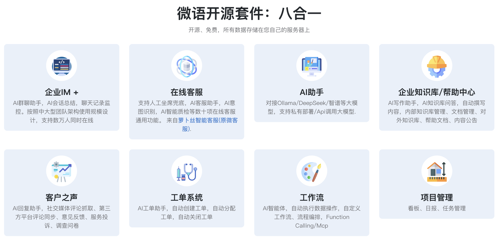
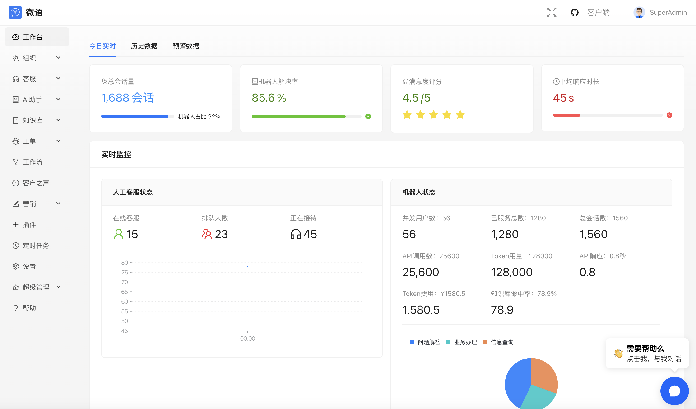

# 微语 - 重复工作自动化

企业级多租户团队协作工具，免费开源8件套：企业IM、在线客服、企业知识库/帮助文档、客户之声、工单系统、AI对话、工作流、项目管理。

## 语言

- [English](./README.md)
- [中文](./README.zh.md)


<!--  -->


## 介绍

### [企业IM](./modules/team/readme.zh.md)

- 局域网即时通讯
- 企业成员管理
- 聊天记录监控
- ...

### [全渠道客服](./modules/service/readme.zh.md)

- 多渠道接入
- 人工客服
- 客服Agent智能体，对接自有数据，自动执行操作
- ...

### [知识库](./modules/kbase/readme.zh.md)

- 对接大模型
- 自定义知识库
- Function Calling
- Mcp
- ...

### [工单系统](./modules/ticket/readme.zh.md)

- 工单管理
- 工单SLA管理
- 工单统计和报表
- ...

### [AI Agent](./modules/ai/readme.zh.md)

- Ollama/DeepSeek/ZhipuAI/...
- 智能体
- 工作流
- ...

### [客户之声](./modules/voc/readme.zh.md)

- 意见反馈
- 服务投诉
- 问卷调查
- ...

### [项目看板](./plugins/kanban/readme.zh.md)

- 待办todo卡片
- 日报/周报
- 统计
- ...

### 工作流

- 自定义表单
- 自定义流程
- 工单流程可视化
- ...

### OpenManus

- 浏览器自动化执行

### 视频会议

- 集成jitsi

### [社交群组](./modules/social/readme.zh.md)

- 类似 Discord
- ...

### 多租户

- 多租户管理
- 租户隔离
- 租户统计
- ...

## Docker 快速开始

### 方法一：克隆项目并启动docker compose容器，需要另行安装ollama，默认使用 qwen3:0.6b 模型

```bash
git clone https://gitee.com/270580156/weiyu.git && cd weiyu/deploy/docker && docker compose -p weiyu -f docker-compose.yaml up -d
```

#### 因项目默认使用ollama qwen3:0.6b模型，所以需要提前拉取模型。配置文件中可以配置其他模型，如deepseek-r1等

```bash
# 对话Chat模型
ollama pull qwen3:0.6b
# 嵌入Embedding模型
ollama pull bge-m3:latest
# 重新排序Rerank模型
ollama pull linux6200/bge-reranker-v2-m3:latest
# 或者从 huggingface 下载模型
# ollama pull hf.co/<username>/<model-repository>
```

### 方法二：使用 docker compose ollama，默认安装ollama，默认使用 qwen3:0.6b 模型

```bash
git clone https://gitee.com/270580156/weiyu.git && cd weiyu/deploy/docker && docker compose -p weiyu -f docker-compose-ollama.yaml up -d
```

#### docker 拉取ollama模型。配置文件中可以配置其他模型，如deepseek-r1等

```bash
# 对话模型
docker exec ollama-bytedesk ollama pull qwen3:0.6b
# 嵌入模型
docker exec ollama-bytedesk ollama pull bge-m3:latest
# 重新排序Rerank模型
docker exec ollama-bytedesk ollama pull linux6200/bge-reranker-v2-m3:latest
# 或者从 huggingface 下载模型
# docker exec ollama-bytedesk ollama pull hf.co/<username>/<model-repository>
```

<!-- #### 如果不需要知识库AI问答功能，可以修改 `docker-compose.yaml` 或 `docker-compose-ollama.yaml` 关闭ollama对话和嵌入功能，以节省资源

```bash
# 关闭ollama对话
SPRING_AI_OLLAMA_CHAT_ENABLED: false
# 关闭ollama嵌入
SPRING_AI_OLLAMA_EMBEDDING_ENABLED: false
``` -->

#### 停止容器

```bash
docker compose -p weiyu -f docker-compose.yaml stop
```

#### 修改配置，否则上传图片、文件和知识库无法正常显示

- 修改 `docker-compose.yaml` 文件 或 `docker-compose-ollama.yaml` 文件，修改以下配置项：

```bash
# 请将服务器127.0.0.1替换为你的服务器ip
BYTEDESK_UPLOAD_URL: http://127.0.0.1:9003
BYTEDESK_KBASE_API_URL: http://127.0.0.1:9003
```

### 方法三：宝塔面板

- [宝塔面板部署](https://www.weiyuai.cn/docs/zh-CN/docs/deploy/baota)

### 方法四：源码启动

- [源码启动](https://www.weiyuai.cn/docs/zh-CN/docs/deploy/source)

## 演示

本地预览

```bash
# 请将127.0.0.1替换为你的服务器ip
http://127.0.0.1:9003/
# 开放端口：9003, 9885
默认用户名: admin@email.com
默认密码: admin
```

```bash
# 社区版
bytedesk.appkey=ZjoyMDI1LTA2LTIxOkNPTU1VTklUWTo6
BYTEDESK_APPKEY: ZjoyMDI1LTA2LTIxOkNPTU1VTklUWTo6
# 试用演示 企业版
到期日期: 2025-06-21
bytedesk.appkey=ZjoyMDI1LTA2LTIxOkVOVEVSUFJJU0U6Og==
BYTEDESK_APPKEY: ZjoyMDI1LTA2LTIxOkVOVEVSUFJJU0U6Og==
# 试用演示 平台版
到期日期: 2025-06-21
bytedesk.appkey=ZjoyMDI1LTA2LTIxOlBMQVRGT1JNOjo=
BYTEDESK_APPKEY: ZjoyMDI1LTA2LTIxOlBMQVRGT1JNOjo=
```

## 架构图

- [架构图](https://www.weiyuai.cn/architecture.html)

## 开源客户端

- [桌面客户端](https://github.com/Bytedesk/bytedesk-desktop)
- [移动客户端](https://github.com/Bytedesk/bytedesk-mobile)

## 开源Demo + SDK

| Project     | Description           | Forks          | Stars             |
|-------------|-----------------------|----------------|-------------------|
| [iOS](https://github.com/bytedesk/bytedesk-swift) | iOS  |  |                  |
| [Android](https://github.com/bytedesk/bytedesk-android) | Android |  |   |
| [Flutter](https://github.com/bytedesk/bytedesk-flutter) | Flutter | |  |
| [UniApp](https://github.com/bytedesk/bytedesk-uniapp) | Uniapp |  |  |
| [Web](https://github.com/bytedesk/bytedesk-web) | Vue/React/Angular/Next.js/JQuery/... |  |  |
| [Wordpress](https://github.com/bytedesk/bytedesk-wordpress) | Wordpress |  |  |
| [Woocommerce](https://github.com/bytedesk/bytedesk-woocommerce) | woocommerce |  |  |
| [Magento](https://github.com/bytedesk/bytedesk-magento) | Magento |  |  |
| [Prestashop](https://github.com/bytedesk/bytedesk-prestashop) | Prestashop |  |  |
| [Shopify](https://github.com/bytedesk/bytedesk-shopify) | Shopify |  |  |
| [Opencart](https://github.com/bytedesk/bytedesk-opencart) | Opencart |  |  |
| [Laravel](https://github.com/bytedesk/bytedesk-laravel) | Laravel |  |  |
| [Django](https://github.com/bytedesk/bytedesk-django) | Django |  |  |

## 链接

- [下载](https://www.weiyuai.cn/download.html)
- [文档](https://www.weiyuai.cn/docs/zh-CN/)

## 技术栈
<!-- - [sofaboot](https://github.com/sofastack/sofa-boot/blob/master/README_ZH.md) for im server 基于金融级云原生架构-->
- [springboot-3.x for 后端](https://github.com/Bytedesk/bytedesk)
- [react for web前端](https://github.com/Bytedesk/bytedesk-web)
- [flutter for 移动客户端(ios&android)](https://github.com/Bytedesk/bytedesk-mobile)
- [electron for 桌面客户端(windows&mac&linux)](https://github.com/Bytedesk/bytedesk-desktop)
<!-- - [python for ai](https://github.com/Bytedesk/bytedesk-ai) -->

## 联系

<!-- - [Email](mailto:270580156@qq.com) -->
<!-- - [微信](./images/wechat.png) -->
- 微语技术支持群：
- 
- 服务号
- 
- 订阅号
- 

## License

版权所有 (c) 2013-2025 微语 Bytedesk.com，保留所有权利。

根据GNU通用公共许可证第三版(AGPL v3)（"许可证"）授权；除非遵守许可证，否则您不得使用此文件。您可以在以下网址获取许可证副本

<https://www.gnu.org/licenses/agpl-3.0.html>

除非适用法律要求或书面同意，否则根据许可证分发的软件是基于"按原样"分发的，没有任何明示或暗示的保证或条件。有关许可证下的特定语言和限制，请参阅许可证。
