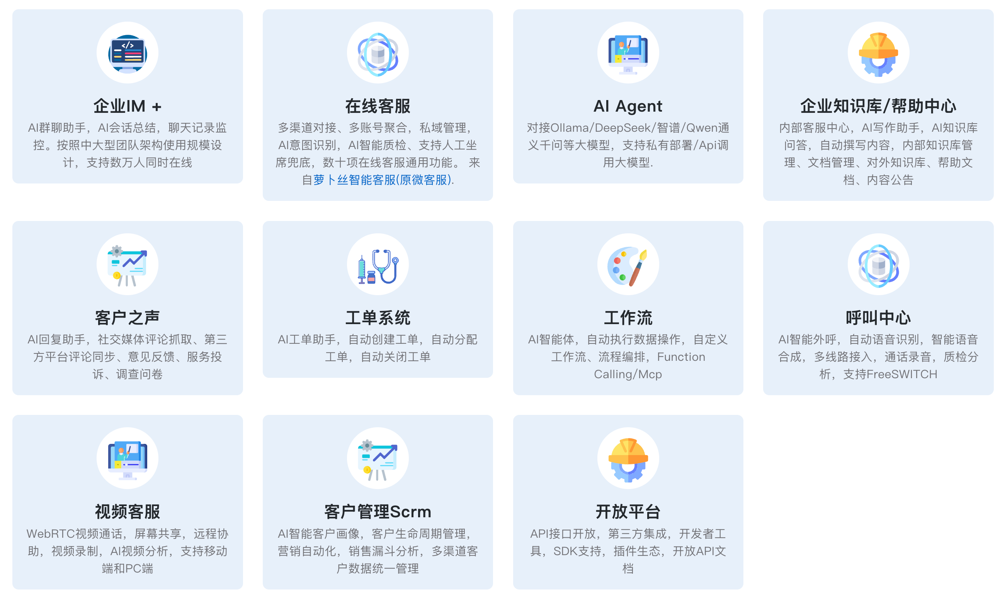

# 微语 - 重复工作自动化

基于AI全新打造的一款开源企业级多租户团队协作工具，集成多种功能于一体：[企业IM](./modules/team/readme.zh.md)、[在线客服](./modules/service/readme.zh.md)、[知识库](./modules/kbase/readme.zh.md)、[客户之声](./modules/voc/readme.zh.md)、[工单系统](./modules/ticket/readme.zh.md)、[AI对话](./modules/ai/readme.zh.md)、[工作流](./modules/core/readme.workflow.md)、[呼叫中心](./plugins/freeswitch/readme.zh.md)、[视频客服](./plugins/webrtc/readme.zh.md)、[开放平台](./plugins/readme.md)。提供智能文字客服（在线客服）、智能语音客服（热线客服）、智能外呼、智能营销、智能质检等完整解决方案。

## 语言

- [English](./README.md)
- [中文](./README.zh.md)



## 管理后台


## 多渠道


## 大模型+智能体


## 客服工作台


## 介绍

### [企业IM](./modules/team/readme.zh.md)

- 局域网即时通讯
- 企业成员管理
- 聊天记录监控
- ...

### [全渠道客服](./modules/service/readme.zh.md)

- 多渠道接入
- 人工客服
- 客服Agent智能体，对接自有数据，自动执行操作
- ...

### [知识库](./modules/kbase/readme.zh.md)

- 对接大模型
- 自定义知识库
- Function Calling
- Mcp
- ...

### [工单系统](./modules/ticket/readme.zh.md)

- 工单管理
- 工单SLA管理
- 工单统计和报表
- ...

### [AI Agent](./modules/ai/readme.zh.md)

- Ollama/DeepSeek/ZhipuAI/...
- 智能体
- 工作流
- ...

### [工作流](./modules/core/readme.workflow.md)

- 自定义表单
- 自定义流程
- 工单流程可视化
- ...

### [客户之声](./modules/voc/readme.zh.md)

- 意见反馈
- 服务投诉
- 问卷调查
- ...

### [呼叫中心](./plugins/freeswitch/readme.zh.md)

- 基于FreeSwitch的专业呼叫平台
- 支持来电弹屏、自动分配、通话录音
- 数据统计，语音与文字服务无缝集成

### [视频客服](./plugins/webrtc/readme.zh.md)

- 基于WebRTC技术的高清视频通话
- 支持一键视频对话与屏幕共享
- 适用于需要直观展示的服务场景

### [开放平台](./plugins/readme.md)

- 提供完整的RESTful API接口和SDK工具包
- 支持与第三方系统无缝集成，实现数据互通
- 多语言SDK支持，简化开发集成流程

## 快速开始

```bash
git clone https://github.com/Bytedesk/bytedesk.git
cd bytedesk/deploy/docker
# 默认不使用AI
docker compose -p bytedesk -f docker-compose-noai.yaml up -d
# 或 默认使用 智谱AI，需要配置 智谱ai key
docker compose -p bytedesk -f docker-compose.yaml up -d
# 或 默认使用 ollama
docker compose -p bytedesk -f docker-compose-ollama.yaml up -d
```

- [Docker部署](https://www.weiyuai.cn/docs/zh-CN/docs/deploy/docker)
- [宝塔面板部署](https://www.weiyuai.cn/docs/zh-CN/docs/deploy/baota)
- [源码启动](https://www.weiyuai.cn/docs/zh-CN/docs/deploy/source)

## 演示

本地预览

```bash
# 请将127.0.0.1替换为你的服务器ip
http://127.0.0.1:9003/
# 开放端口：9003, 9885
默认用户名: admin@email.com
默认密码: admin
```

## 项目目录结构

该仓库为基于 Maven 的多模块单体仓库（根目录 `pom.xml`）。以下为主要目录与用途说明：

```text
bytedesk/
├─ channels/           # 渠道接入（抖音/店铺/社交/微信 等）
├─ demos/              # 示例工程与演示代码
├─ deploy/             # 部署相关（docker、k8s、server 配置）
├─ enterprise/         # 企业版能力（ai、call、core、kbase、service、ticket）
├─ images/             # 文档与界面预览图片
├─ jmeter/             # 性能测试脚本与说明
├─ logs/               # 运行日志（本地/开发环境）
├─ modules/            # 核心业务模块（IM、客服、知识库、工单、AI 等）
├─ plugins/            # 可选插件（freeswitch、webrtc、开放平台等）
├─ projects/           # 自定义项目或扩展
├─ starter/            # 启动器/项目入口
```

## 架构图

- [架构图](https://www.weiyuai.cn/architecture.html)

## 开源客户端

- [桌面客户端](https://github.com/Bytedesk/bytedesk-desktop)
- [移动客户端](https://github.com/Bytedesk/bytedesk-mobile)
- [SipPhone](https://github.com/Bytedesk/bytedesk-phone)
- [视频会议](https://github.com/Bytedesk/bytedesk-conference)
- [Freeswitch Docker](https://github.com/Bytedesk/bytedesk-freeswitch)
- [Jitsi Docker](https://github.com/Bytedesk/bytedesk-jitsi)

## 开源Demo + SDK

| Project     | Description           | Forks          | Stars             |
|-------------|-----------------------|----------------|-------------------|
| [iOS](https://github.com/bytedesk/bytedesk-swift) | iOS  |  |                  |
| [Android](https://github.com/bytedesk/bytedesk-android) | Android |  |   |
| [Flutter](https://github.com/bytedesk/bytedesk-flutter) | Flutter | |  |
| [UniApp](https://github.com/bytedesk/bytedesk-uniapp) | Uniapp |  |  |
| [Web](https://github.com/bytedesk/bytedesk-web) | Vue/React/Angular/Next.js/JQuery/... |  |  |
| [Wordpress](https://github.com/bytedesk/bytedesk-wordpress) | Wordpress |  |  |
| [Woocommerce](https://github.com/bytedesk/bytedesk-woocommerce) | woocommerce |  |  |
| [Magento](https://github.com/bytedesk/bytedesk-magento) | Magento |  |  |
| [Prestashop](https://github.com/bytedesk/bytedesk-prestashop) | Prestashop |  |  |
| [Shopify](https://github.com/bytedesk/bytedesk-shopify) | Shopify |  |  |
| [Opencart](https://github.com/bytedesk/bytedesk-opencart) | Opencart |  |  |
| [Laravel](https://github.com/bytedesk/bytedesk-laravel) | Laravel |  |  |
| [Django](https://github.com/bytedesk/bytedesk-django) | Django |  |  |

## 链接

- [下载](https://www.weiyuai.cn/download.html)
- [文档](https://www.weiyuai.cn/docs/zh-CN/)

## 技术栈
<!-- - [sofaboot](https://github.com/sofastack/sofa-boot/blob/master/README_ZH.md) for im server 基于金融级云原生架构-->
- [springboot-3.x for 后端](https://github.com/Bytedesk/bytedesk)
- [react for web前端](https://github.com/Bytedesk/bytedesk-web)
- [flutter for 移动客户端(ios&android)](https://github.com/Bytedesk/bytedesk-mobile)
- [electron for 桌面客户端(windows&mac&linux)](https://github.com/Bytedesk/bytedesk-desktop)
<!-- - [python for ai](https://github.com/Bytedesk/bytedesk-ai) -->

## 联系

- 扫码加微信，入群，备注：微语
- [微信二维码](./images/wechat.png)
- [微信服务号二维码](./images/wechat_mp.jpg)
- [微信订阅号二维码](./images/wechatai_mp.jpg)
- [软件著作权证书](./images/copyright.png)
- [商标证书](./images/trademark.jpg)

## License

版权所有 (c) 2013-2025 微语 Bytedesk.com，保留所有权利。

根据GNU通用公共许可证第三版(AGPL v3)（"许可证"）授权；除非遵守许可证，否则您不得使用此文件。您可以在以下网址获取许可证副本

<https://www.gnu.org/licenses/agpl-3.0.html>

除非适用法律要求或书面同意，否则根据许可证分发的软件是基于"按原样"分发的，没有任何明示或暗示的保证或条件。有关许可证下的特定语言和限制，请参阅许可证。

## 使用条款

- **允许使用**：可以用于商业用途，但禁止未获得许可的情况下二次销售
- **禁止用途**：严禁用于含有木马、病毒、色情、赌博、诈骗等违法违规业务
- **免责声明**：本软件不保证任何形式的法律责任，请自行承担使用风险
