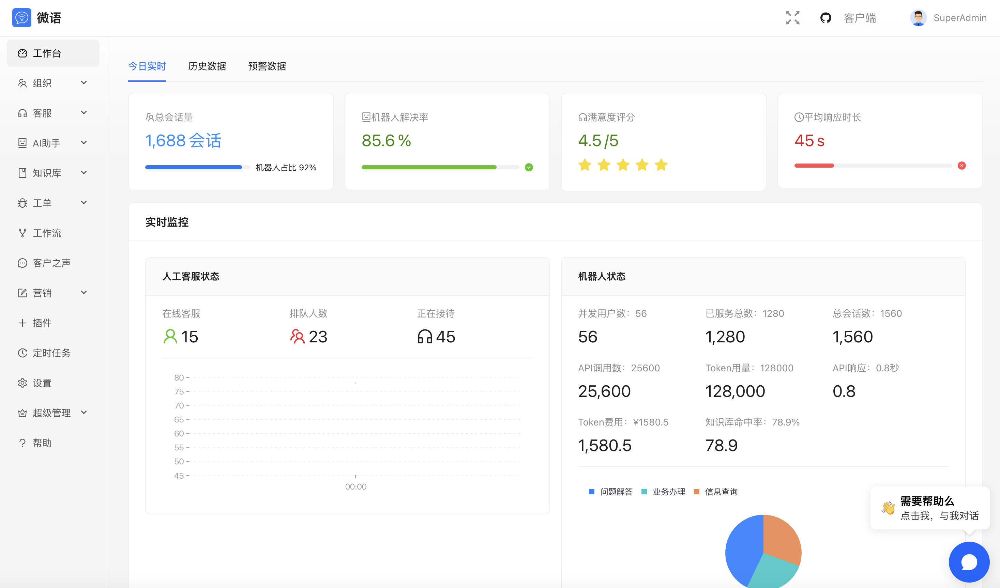

<!--
 * @Author: jackning 270580156@qq.com
 * @Date: 2025-01-03 11:35:32
 * @LastEditors: jackning 270580156@qq.com
 * @LastEditTime: 2025-02-04 14:42:18
 * @Description: bytedesk.com https://github.com/Bytedesk/bytedesk
 *   Please be aware of the BSL license restrictions before installing Bytedesk IM – 
 *  selling, reselling, or hosting Bytedesk IM as a service is a breach of the terms and automatically terminates your rights under the license. 
 *  仅支持企业内部员工自用，严禁私自用于销售、二次销售或者部署SaaS方式销售 
 *  Business Source License 1.1: https://github.com/Bytedesk/bytedesk/blob/main/LICENSE 
 *  contact: 270580156@qq.com 
 *  联系：270580156@qq.com
 * Copyright (c) 2025 by bytedesk.com, All Rights Reserved. 
-->
# 前端

- [客户端](https://github.com/Bytedesk/bytedesk-desktop)
- [访客端](https://github.com/Bytedesk/bytedesk-web)
- [移动端](https://github.com/Bytedesk/bytedesk-mobile)

## 管理后台

## 客户端

