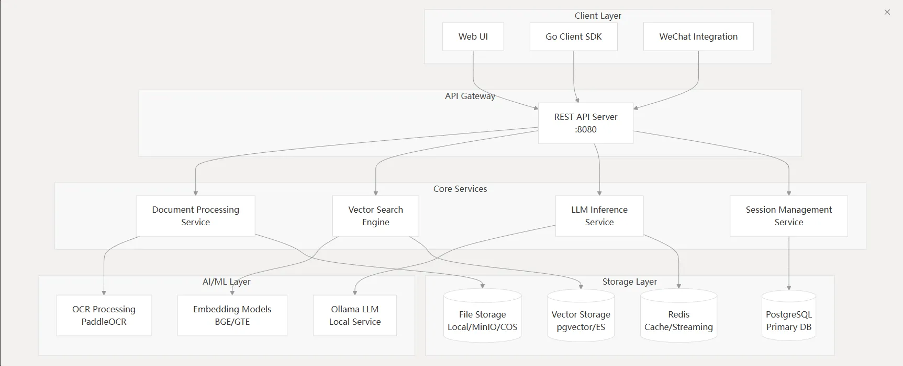

# 介绍

WeKnora 是一个可立即在生产环境投入的企业级RAG框架，实现智能文档理解和检索功能。该系统采用模块化设计，将文档理解、向量存储、推理文件等功能分离。



---

## PipeLine

WeKnora 处理文档需要多个步骤：插入-》知识提取-》索引-》检索-》生成，整个流程支持多种检索方法，


以用户上传的一张住宿流水单pdf文件为例，详细介绍下其数据流：

### 1. 接收请求与初始化

+ **请求识别**: 系统收到一个请求，并为其分配了唯一的 `request_id=Lkq0OGLYu2fV`，用于追踪整个处理流程。
+ **租户与会话验证**:
  + 系统首先验证了租户信息（ID: 1, Name: Default Tenant）。
  + 接着开始处理一个知识库问答（Knowledge QA）请求，该请求属于会话 `1f241340-ae75-40a5-8731-9a3a82e34fdd`。
+ **用户问题**: 用户的原始问题是：“**入住的房型是什么**”。
+ **消息创建**: 系统为用户的提问和即将生成的回答分别创建了消息记录，ID 分别为 `703ddf09-...` 和 `6f057649-...`。

### 2. 知识库问答流程启动

系统正式调用知识库问答服务，并定义了将要按顺序执行的完整处理管道（Pipeline），包含以下9个事件：  
`[rewrite_query, preprocess_query, chunk_search, chunk_rerank, chunk_merge, filter_top_k, into_chat_message, chat_completion_stream, stream_filter]`

---

### 3. 事件执行详情

#### 事件 1: `rewrite_query` - 问题改写

+ **目的**: 为了让检索更精确，系统需要结合上下文来理解用户的真实意图。
+ **操作**:
    1. 系统检索了当前会话最近的20条历史消息（实际检索到8条）作为上下文。
    2. 调用了一个名为 `deepseek-r1:7b` 的本地大语言模型。
    3. 模型根据聊天历史分析出提问者是“Liwx”，并将原问题“入住的房型是什么”改写得更具体。
+ **结果**: 问题被成功改写为：“**Liwx本次入住的房型是什么**”。

#### 事件 2: `preprocess_query` - 问题预处理

+ **目的**: 将改写后的问题进行分词，转换为适合搜索引擎处理的关键词序列。
+ **操作**: 对改写后的问题进行了分词处理。
+ **结果**: 生成了一串关键词：“`需要 改写 用户 问题 入住 房型 根据 提供 信息 入住 人 Liwx 选择 房型 双床 房 因此 改写 后 完整 问题 为 Liwx 本次 入住 房型`”。

#### 事件 3: `chunk_search` - 知识区块检索

这是最核心的**检索（Retrieval）**步骤，系统执行了两次混合搜索（Hybrid Search）。

+ **第一次搜索 (使用改写后的完整问句)**:
  + **向量检索**:
        1. 加载嵌入模型 `bge-m3:latest` 将问句转换为一个1024维的向量。
        2. 在PostgreSQL数据库中进行向量相似度搜索，找到了2个相关的知识区块（chunk），ID 分别为 `e3bf6599-...` 和 `3989c6ce-...`。
  + **关键词检索**:
        1. 同时，系统也进行了关键词搜索。
        2. 同样找到了上述2个知识区块。
  + **结果合并**: 两种方法找到的4个结果（实际是2个重复的）被去重，最终得到2个唯一的知识区块。
+ **第二次搜索 (使用预处理后的关键词序列)**:
  + 系统使用分词后的关键词重复了上述的**向量检索**和**关键词检索**过程。
  + 最终也得到了相同的2个知识区块。
+ **最终结果**: 经过两次搜索和结果合并，系统锁定了2个最相关的知识区块，并将它们的内容提取出来，准备用于生成答案。

#### 事件 4: `chunk_rerank` - 结果重排序

+ **目的**: 使用一个更强大的模型对初步检索出的结果进行更精细的排序，以提高最终答案的质量。
+ **操作**: 日志显示 `Rerank model ID is empty, skipping reranking`。这意味着系统配置了重排序步骤，但没有指定具体的重排序模型，因此**跳过了此步骤**。

#### 事件 5: `chunk_merge` - 区块合并

+ **目的**: 将内容上相邻或相关的知识区块进行合并，形成更完整的上下文。
+ **操作**: 系统分析了检索到的2个区块，并尝试进行合并。根据日志，最终处理后仍然是2个独立的区块，但已按相关性分数排好序。

#### 事件 6: `filter_top_k` - Top-K 过滤

+ **目的**: 仅保留最相关的K个结果，防止过多无关信息干扰语言模型。
+ **操作**: 系统配置保留前5个（Top-K = 5）最相关的区块。由于当前只有2个区块，它们全部通过了此过滤器。

#### 事件 7 & 8: `into_chat_message` & `chat_completion_stream` - 生成回答

这是**生成（Generation）**步骤。

+ **目的**: 基于检索到的信息，生成自然流畅的回答。
+ **操作**:
    1. 系统将检索到的2个知识区块的内容、用户的原始问题以及聊天历史整合在一起，形成一个完整的提示（Prompt）。
    2. 再次调用 `deepseek-r1:7b` 大语言模型，并以**流式（Stream）**的方式请求生成答案。流式输出可以实现打字机效果，提升用户体验。

#### 事件 9: `stream_filter` - 流式输出过滤

+ **目的**: 对模型生成的实时文本流进行后处理，过滤掉不需要的特殊标记或内容。
+ **操作**:
  + 系统设置了一个过滤器，用于移除模型在思考过程中可能产生的内部标记，如 `<think>` 和 `</think>`。
  + 日志显示，模型输出的第一个词块是 `<think> 根据`，过滤器成功拦截并移除了 `<think>` 标记，只将“根据”及之后的内容传递下去。

### 4. 完成与响应

+ **发送引用**: 在生成答案的同时，系统将作为依据的2个知识区块作为“参考内容”发送给前端，以便用户查证来源。
+ **更新消息**: 当模型生成完所有内容后，系统将完整的回答更新到之前创建的消息记录（ID: `6f057649-...`）中。
+ **请求结束**: 服务器返回 `200` 成功状态码，标志着本次从提问到回答的完整流程结束。

### 总结

这个日志完整地记录了一次典型的RAG流程：系统通过**问题改写**和**预处理**来精确理解用户意图，接着利用**向量与关键词混合检索**从知识库中找到相关信息，虽然跳过了**重排序**，但依然执行了**合并**与**过滤**，最后将检索到的知识作为上下文，交由大语言模型**生成**流畅、准确的回答，并通过**流式过滤**保证了输出的纯净性。

## 文档解析切分

代码实现了一个独立的、通过gRPC通信的微服务，专门负责文档内容的深度解析、分块和多模态信息提取。它正是“异步处理”阶段的核心执行者。

### **整体架构**

这是一个基于Python的gRPC服务，其核心职责是接收文件（或URL），并将其解析成结构化的、可供后续处理（如向量化）的文本块（Chunks）。

+ `server.py`: 服务的入口和网络层。它负责启动一个多进程、多线程的gRPC服务器，接收来自Go后端的请求，并将解析结果返回。
+ `parser.py`: 设计模式中的**外观（Facade）模式**。它提供了一个统一的`Parser`类，屏蔽了内部多种具体解析器（如PDF、DOCX、Markdown等）的复杂性。外部调用者（`server.py`）只需与这个`Parser`类交互。
+ `base_parser.py`: 解析器的基类，定义了所有具体解析器共享的核心逻辑和抽象方法。这是整个解析流程的“大脑”，包含了最复杂的文本分块、图片处理、OCR和图像描述生成等功能。

---

### **详细工作流程**

当Go后端启动异步任务时，它会携带文件内容和配置信息，向这个Python服务发起一次gRPC调用。以下是完整的处理流程：

#### **第一步：请求接收与分发 (**`server.py`** & **`parser.py`**)

1. **gRPC服务入口 (**`server.py: serve`**)**:
    + 服务通过`serve()`函数启动。它会根据环境变量（`GRPC_WORKER_PROCESSES`, `GRPC_MAX_WORKERS`）启动一个**多进程、多线程**的服务器，以充分利用CPU资源，提高并发处理能力。
    + 每个工作进程都监听在指定的端口（如50051），准备接收请求。
2. **请求处理 (**`server.py: ReadFromFile`**)**:
    + 当Go后端发起`ReadFromFile`请求时，其中一个工作进程会接收到该请求。
    + 该方法首先会解析请求中的参数，包括：
        + `file_name`, `file_type`, `file_content`：文件的基本信息和二进制内容。
        + `read_config`: 一个包含所有解析配置的复杂对象，如`chunk_size`（分块大小）、`chunk_overlap`（重叠大小）、`enable_multimodal`（是否启用多模态处理）、`storage_config`（对象存储配置）、`vlm_config`（视觉语言模型配置）等。
    + 它将这些配置整合成一个`ChunkingConfig`数据对象。
    + 最关键的一步是调用 `self.parser.parse_file(...)`，将解析任务交给`Parser`外观类处理。
3. **解析器选择 (**`parser.py: Parser.parse_file`**)**:
    + `Parser`类接收到任务后，首先调用`get_parser(file_type)`方法。
    + 该方法会根据文件类型（例如 `'pdf'`）在一个字典 `self.parsers` 中查找对应的具体解析器类（例如 `PDFParser`）。
    + 找到后，它会**实例化**这个`PDFParser`类，并将`ChunkingConfig`等所有配置信息传递给构造函数。

#### **第二步：核心解析与分块 (**`base_parser.py`**)**

它触及了整个流程的核心：**如何保证信息的上下文完整性和原始顺序**。

根据 `base_parser.py` 代码，**最终切分出的 Chunk 中的文本、表格和图像是按照它们在原始文档中的出现顺序来保存的**。

这个顺序得以保证，主要归功于 `BaseParser` 中几个设计精巧的方法相互协作。我们来详细追踪一下这个流程。

整个顺序的保证可以分为三个阶段：

1. **阶段一：统一的文本流创建 (**`pdf_parser.py`**)**:
    + 在 `parse_into_text` 方法中，您的代码会**逐页**处理PDF。
    + 在每一页内部，它会按照一定的逻辑（先提取非表格文本，再附加表格，最后附加图像占位符）将所有内容**拼接成一个长字符串** (`page_content_parts`)。
    + **关键点**: 虽然在这个阶段，文本、表格和图像占位符的拼接顺序可能不是100%精确到字符级别，但它保证了**同一页的内容会在一起**，并且大致遵循了从上到下的阅读顺序。
    + 最后，所有页面的内容被 `"\n\n--- Page Break ---\n\n"` 连接起来，形成一个**包含了所有信息（文本、Markdown表格、图像占位符）的、单一的、有序的文本流 (**`final_text`**)**。
2. **阶段二：原子化与保护 (**`_split_into_units`**)**:
    + 这个单一的 `final_text` 被传递给 `_split_into_units` 方法。
    + 这个方法是**保证结构完整性的关键**。它使用正则表达式，将**整个Markdown表格**和**整个Markdown图像占位符**识别为**不可分割的原子单元 (atomic units)**。
    + 它会将这些原子单元（表格、图片）和它们之间的普通文本块，按照它们在 `final_text` 中出现的**原始顺序**，切分成一个列表 (`units`)。
    + **结果**: 我们现在有了一个列表，例如 `['一些文本', '', '另一些文本', '|...|...|\n|---|---|\n...', '更多文本']`。这个列表中的元素顺序**完全等同于它们在原始文档中的顺序**。
3. **阶段三：顺序分块 (**`chunk_text`**)**:
    + `chunk_text` 方法接收到这个**有序的 **`units`** 列表**。
    + 它的工作机制非常简单直接：它会**按顺序**遍历这个列表中的每一个单元（`unit`）。
    + 它将这些单元**依次添加**到一个临时的 `current_chunk` 列表中，直到这个块的长度接近 `chunk_size` 的上限。
    + 当一个块满了之后，它就被保存下来，然后开始一个新的块（可能会带有上一个块的重叠部分）。
    + **关键点**: 因为 `chunk_text` **严格按照 **`units`** 列表的顺序进行处理**，所以它永远不会打乱表格、文本和图像之间的相对顺序。一个在文档中先出现的表格，也必然会出现在一个序号更靠前的 Chunk 中。
4. **阶段四：图像信息附加 (**`process_chunks_weknora`**)**:
    + 在文本块被切分好之后，`process_chunks_weknora` 方法会被调用。
    + 它会处理**每一个**已经生成好的 Chunk。
    + 在每个 Chunk 内部，它会找到图像占位符，然后进行AI处理。
    + 最后，它会将处理好的图像信息（包含永久URL、OCR文本、图像描述等）附加到**该 Chunk 自己**的 `.weknora` 属性中。
    + **关键点**: 这个过程**不会改变 Chunk 的顺序或其 **`.content`** 的内容**。它只是为已经存在的、顺序正确的 Chunk 附加额外的信息。

#### **第三步：多模态处理（如果启用） (**`base_parser.py`**)**

如果 `enable_multimodal` 为 `True`，在文本分块完成后，会进入最复杂的多模态处理阶段。

1. **并发任务启动 (**`BaseParser.process_chunks_weknora`**)**:
    + 该方法使用`asyncio`（Python的异步I/O框架）来**并发处理所有文本块中的图片**，以极大地提升效率。
    + 它为每个`Chunk`创建一个异步任务`process_chunk_weknora_async`。
2. **处理单个块中的图片 (**`BaseParser.process_chunk_weknora_async`**)**:
    + **提取图片引用**: 首先，使用正则表达式 `extract_weknora_from_chunk` 从当前块的文本中找到所有的图片引用（例如，``）。
    + **图片持久化**: 对于找到的每个图片，并发地调用 `download_and_upload_image`。这个函数负责：
        + 从其原始位置（可能是PDF内部、本地路径或远程URL）获取图片数据。
        + 将图片**上传到配置好的对象存储（COS/MinIO）**。这一步至关重要，它将临时的、不稳定的图片引用转换成一个持久化、可通过URL公开访问的地址。
        + 返回持久化的URL和图片对象（PIL Image）。
    + **并发AI处理**: 将所有成功上传的图片收集起来，调用`process_multiple_weknora`。
        + 该方法内部使用`asyncio.Semaphore`来限制并发数量（例如最多同时处理5张图片），防止瞬间消耗过多内存或触发模型API的速率限制。
        + 对于每张图片，它会调用`process_image_async`。
3. **处理单张图片 (**`BaseParser.process_image_async`**)**:
    + **OCR**: 调用`perform_ocr`，它会使用一个OCR引擎（如`PaddleOCR`）来识别图片中的所有文字。
    + **图像描述 (Caption)**: 调用`get_image_caption`，它会将图片数据（转为Base64）发送给配置的视觉语言模型（VLM），生成对图片内容的自然语言描述。
    + 该方法返回 `(ocr_text, caption, 持久化URL)`。
4. **结果聚合**:
    + 所有图片处理完成后，包含持久化URL、OCR文本和图像描述的结构化信息，会被附加到对应`Chunk`对象的 `.weknora` 字段上。

#### **第四步：返回结果 (**`server.py`**)**

1. **数据转换 (**`server.py: _convert_chunk_to_proto`**)**:
    + 当`parser.parse_file`执行完毕后，它返回一个包含所有处理过的`Chunk`对象的列表（`ParseResult`）。
    + `ReadFromFile`方法接收到这个结果，并调用`_convert_chunk_to_proto`，将Python的`Chunk`对象（包括其内部的图片信息）转换成gRPC定义的Protobuf消息格式。
2. **响应返回**:
    + 最后，gRPC服务器将这个包含所有分块和多模态信息的`ReadResponse`消息发送回给调用方——Go后端服务。

至此，Go后端就拿到了结构化、信息丰富的文档数据，可以进行下一步的向量化和索引存储了。

## 部署

支持Docker 镜像本地部署，并通过API端口提供接口服务

## 性能和监控

WeKnora包含丰富的监控和测试组件：

+ 分布式跟踪：集成Jaeger用于跟踪请求在服务架构中的完整执行路。本质上，Jaeger是一种帮助用户“看见”请求在分布式系统中完整生命周期的技术。
+ 健康监控：监控服务处在健康状态
+ 可扩展性：通过容器化部署，可通过多个服务满足大规模并发请求

## QA

### 问题1: 在检索过程的执行了两次混合搜索的目的是什么？以及第一次和第二次搜索有什么不同？

这是一个非常好的观察。系统执行两次混合搜索是为了**最大化检索的准确性和召回率**，本质上是一种**查询扩展（Query Expansion）和多策略检索**的组合方法。

#### 目的

通过两种不同形式的查询（原始改写句 vs. 分词后的关键词序列）去搜索，系统可以结合两种查询方式的优点：

+ **语义检索的深度**: 使用完整的句子进行搜索，能更好地利用向量模型（如`bge-m3`）对句子整体含义的理解能力，找到语义上最接近的知识区块。
+ **关键词检索的广度**: 使用分词后的关键词进行搜索，能确保即使知识区块的表述方式与原问题不同，但只要包含了核心关键词，就有机会被命中。这对于传统的关键词匹配算法（如BM25）尤其有效。

简单来说，就是**用两种不同的“问法”去问同一个问题**，然后将两边的结果汇总起来，确保最相关的知识不会被遗漏。

#### 两次搜索的不同点

它们最核心的不同在于**输入的查询文本（Query Text）**：

1. **第一次混合搜索**
    + **输入**: 使用的是经过`rewrite_query`事件后生成的、**语法完整的自然语言问句**。
    + **日志证据**:

```plain
INFO [2025-08-29 09:46:36.896] [request_id=Lkq0OGLYu2fV] knowledgebase.go:266[HybridSearch] | Hybrid search parameters, knowledge base ID: kb-00000001, query text: 需要改写的用户问题是：“入住的房型是什么”。根据提供的信息，入住人Liwx选择的房型是双床房。因此，改写后的完整问题为： “Liwx本次入住的房型是什么”
```

2. **第二次混合搜索**
    + **输入**: 使用的是经过`preprocess_query`事件处理后生成的、**由空格隔开的关键词序列**。
    + **日志证据**:

```plain
INFO [2025-08-29 09:46:37.257] [request_id=Lkq0OGLYu2fV] knowledgebase.go:266[HybridSearch] | Hybrid search parameters, knowledge base ID: kb-00000001, query text: 需要 改写 用户 问题 入住 房型 根据 提供 信息 入住 人 Liwx 选择 房型 双床 房 因此 改写 后 完整 问题 为 Liwx 本次 入住 房型
```

最终，系统将这两次搜索的结果进行去重和合并（日志中显示每次都找到2个结果，去重后总共还是2个），从而得到一个更可靠的知识集合，用于后续的答案生成。

### 问题2：重排序模型分析

Reranker（重排器）是目前RAG领域中非常先进的技术，它们在工作原理和适用场景上有着显著的区别。

简单来说，它们代表了从“**专门的判别模型**”到“**利用大语言模型（LLM）进行判别**”再到“**深度挖掘LLM内部信息进行判别**”的演进。

以下是它们的详细区别：

#### 1. Normal Reranker (常规重排器 / 交叉编码器)

这是最经典也是最主流的重排方法。

+ **模型类型**: **序列分类模型 (Sequence Classification Model)**。本质上是一个**交叉编码器 (Cross-Encoder)**，通常基于BERT、RoBERTa等双向编码器架构。`BAAI/bge-reranker-base/large/v2-m3` 都属于这一类。
+ **工作原理**:
    1. 它将**查询（Query）**和**待排序的文档（Passage）**拼接成一个单一的输入序列，例如：`[CLS] what is panda? [SEP] The giant panda is a bear species endemic to China. [SEP]`。
    2. 这个拼接后的序列被完整地送入模型中。模型内部的自注意力机制（Self-Attention）可以同时分析查询和文档中的每一个词，并计算它们之间**细粒度的交互关系**。
    3. 模型最终输出一个**单一的分数（Logit）**，这个分数直接代表了查询和文档的相关性。分数越高，相关性越强。
+ **关键特性**:
  + **优点**: 由于查询和文档在模型内部进行了充分的、深度的交互，其**准确度通常非常高**，是衡量Reranker性能的黄金标准。
  + **缺点**: **速度较慢**。因为它必须为**每一个“查询-文档”对**都独立执行一次完整的、代价高昂的计算。如果初步检索返回了100个文档，它就需要运行100次。

#### 2. LLM-based Reranker (基于LLM的重排器)

这种方法创造性地利用了通用大语言模型（LLM）的能力来进行重排。

+ **模型类型**: **因果语言模型 (Causal Language Model)**，即我们常说的GPT、Llama、Gemma这类用于生成文本的LLM。`BAAI/bge-reranker-v2-gemma` 就是一个典型的例子。
+ **工作原理**:
    1. 它**不是直接输出一个分数**，而是将重排任务**转化为一个问答或文本生成任务**。
    2. 它通过一个精心设计的**提示（Prompt）**来组织输入，例如：`"Given a query A and a passage B, determine whether the passage contains an answer to the query by providing a prediction of either 'Yes' or 'No'. A: {query} B: {passage}"`。
    3. 它将这个完整的Prompt喂给LLM，然后**观察LLM在最后生成“Yes”这个词的概率**。
    4. 这个**生成“Yes”的概率（或其Logit值）就被当作是相关性分数**。如果模型非常确信答案是“Yes”，说明它认为文档B包含了查询A的答案，即相关性高。
+ **关键特性**:
  + **优点**: 能够利用LLM强大的**语义理解、推理和世界知识**，对于需要深度理解和推理才能判断相关性的复杂查询，效果可能更好。
  + **缺点**: 计算开销可能非常大（取决于LLM的大小），并且性能**高度依赖于Prompt的设计**。

#### 3. LLM-based Layerwise Reranker (基于LLM分层信息的重排器)

这是第二种方法的“威力加强版”，是一种更前沿、更复杂的探究性技术。

+ **模型类型**: 同样是**因果语言模型 (Causal Language Model)**，例如`BAAI/bge-reranker-v2-minicpm-layerwise`。
+ **工作原理**:
    1. 输入部分与第二种方法完全相同，也是使用“Yes/No”的Prompt。
    2. 核心区别在于**分数的提取方式**。它不再仅仅依赖LLM**最后一层**的输出（即最终的预测结果）。
    3. 它认为LLM在逐层处理信息的过程中，不同深度的网络层（Layer）可能捕获了不同层次的语义相关性信息。因此，它会从**模型的多个中间层**提取出关于“Yes”这个词的预测Logit。
    4. 代码中的 `cutoff_layers=[28]` 参数就是告诉模型：“请把第28层的输出给我”。最终，你会得到一个或多个来自不同网络层的分数，这些分数可以被平均或以其他方式组合，形成一个更鲁棒的最终相关性判断。
+ **关键特性**:
  + **优点**: 理论上可以获得**更丰富、更全面的相关性信号**，可能达到比只看最后一层更高的精度，是目前探索性能极限的一种方法。
  + **缺点**: **复杂度最高**，需要对模型进行特定的修改才能提取中间层信息（代码中的`trust_remote_code=True`就是一个信号），计算开销也很大。

#### 总结对比

| 特性 | 1. Normal Reranker (常规) | 2. LLM-based Reranker (基于LLM) | 3. LLM-based Layerwise Reranker (基于LLM分层) |
| :--- | :--- | :--- | :--- |
| **底层模型** | 交叉编码器 (如BERT) | 因果语言模型 (如Gemma) | 因果语言模型 (如MiniCPM) |
| **工作原理** | 计算Query和Passage的深度交互，直接输出相关分 | 将排序任务转为"Yes/No"预测，用"Yes"的概率作为分数 | 与2类似，但从LLM的多个中间层提取"Yes"的概率 |
| **输出** | 单一的相关性分数 | 单一的相关性分数（来自最后一层） | 多个相关性分数（来自不同层） |
| **优点** | **速度与精度的最佳平衡点**，成熟稳定 | 利用LLM的推理能力，处理复杂问题 | 理论上精度最高，信号更丰富 |
| **缺点** | 相比向量检索慢 | 计算开销大，依赖Prompt设计 | **复杂度最高**，计算开销最大 |
| **推荐场景** | **大多数生产环境的首选**，效果好，易于部署 | 对答案质量有极致要求，且计算资源充足的场景 | 学术研究或追求SOTA（State-of-the-art）性能的场景 |

#### 使用建议

1. **开始阶段**: 强烈建议您**从 **`Normal Reranker`** 开始**，例如 `BAAI/bge-reranker-v2-m3`。它是目前综合表现最好的模型之一，能显著提升您的RAG系统性能，并且相对容易集成和部署。
2. **进阶探索**: 如果您发现常规Reranker在处理某些非常微妙或需要复杂推理的查询时表现不佳，并且您拥有充足的GPU资源，可以尝试 `LLM-based Reranker`。
3. **前沿研究**: `Layerwise Reranker` 更适合研究人员或希望在特定任务上压榨出最后一点性能的专家。

### 问题3：粗过滤或细过滤后的知识（带重排）如何组装发送给大模型的？

这一块主要是设计提示词，典型的指令细节，其核心任务是根据上下文回答用户问题。组装上下文时需要指定  
关键约束：必须严格按照所提供文档回答，禁止使用你自己的知识回答
未知情况处理： 如果文档中没有足够的信息来回答问题，请告知“根据所掌握的资料，无法回答这个问题”
引用要求：在回答时，如果引用了某个文档内容，请在句子末尾加上文档编号
