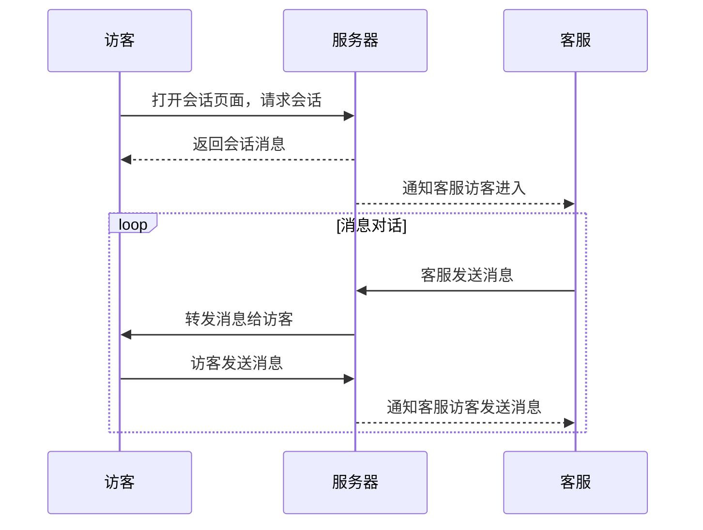

# 接待流程

## 对话流程

## 技能组接待流程

## 一对一接待流程

## 说明

vscode中使用mermaid画/显示流程图，需要安装插件`Markdown Preview Mermaid Support`

- [mermaid markdown](https://marketplace.visualstudio.com/items?itemName=bierner.markdown-mermaid)
- [mermaid](https://github.com/mermaid-js/mermaid)
- [mermaid online editor](https://mermaid.live/edit)
