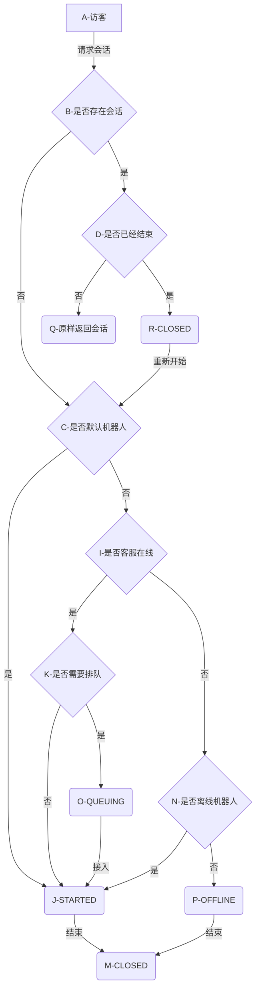

<!--
 * @Author: jackning 270580156@qq.com
 * @Date: 2024-10-15 20:54:07
 * @LastEditors: jackning 270580156@qq.com
 * @LastEditTime: 2024-10-18 16:45:25
 * @Description: bytedesk.com https://github.com/Bytedesk/bytedesk
 *   Please be aware of the BSL license restrictions before installing Bytedesk IM – 
 *  selling, reselling, or hosting Bytedesk IM as a service is a breach of the terms and automatically terminates your rights under the license. 
 *  仅支持企业内部员工自用，严禁私自用于销售、二次销售或者部署SaaS方式销售 
 *  Business Source License 1.1: https://github.com/Bytedesk/bytedesk/blob/main/LICENSE 
 *  contact: 270580156@qq.com 
 *  联系：270580156@qq.com
 * Copyright (c) 2024 by bytedesk.com, All Rights Reserved. 
-->
# 访客会话状态变化流程

## 其他

vscode中使用mermaid画/显示流程图，需要安装插件`Markdown Preview Mermaid Support`

- [mermaid docs](https://mermaid.js.org/syntax/flowchart.html#circle-edge-example)
- [mermaid markdown](https://marketplace.visualstudio.com/items?itemName=bierner.markdown-mermaid)
- [mermaid](https://github.com/mermaid-js/mermaid)
- [mermaid online editor](https://mermaid.live/edit)
