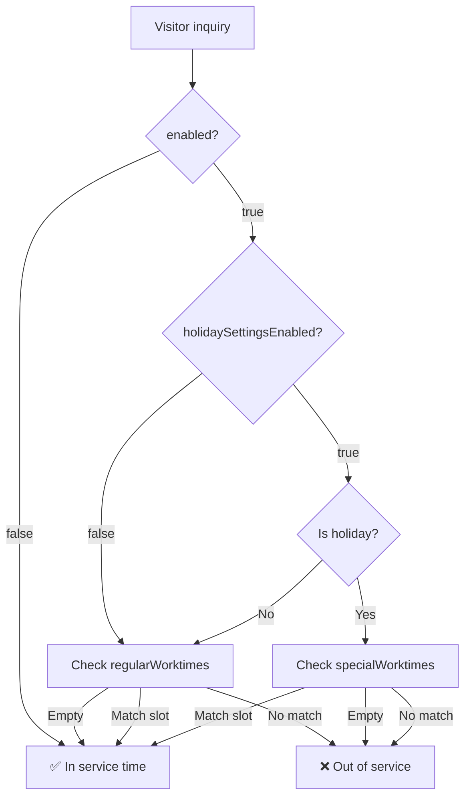

# worktime settings

## Entity Fields

| Field | Type | Default | Description |
| --- | --- | --- | --- |
| `enabled` | `Boolean` | `true` | Master switch; `false` = always in-service |
| `holidaySettingsEnabled` | `Boolean` | `false` | Enable holiday-aware scheduling; when `false`, only `regularWorktimes` is used |
| `regularWorktimes` | `List<WorktimeSlotValue>` | `[{09:00-18:00, Mon-Fri}]` | Regular working-day time slots |
| `specialWorktimes` | `List<WorktimeSlotValue>` | `[]` | Holiday-specific time slots |
| `nonWorktimeTip` | `String` | offline message | Tip shown to visitors outside service hours |

## regularWorktimes vs specialWorktimes

| Field | Purpose | Trigger | Empty meaning |
| --- | --- | --- | --- |
| `regularWorktimes` | Regular working day time slots | `holidaySettingsEnabled=false` or non-holiday | **Unrestricted** (24h considered in-service) |
| `specialWorktimes` | Holiday-specific time slots | `holidaySettingsEnabled=true` AND holiday matched | **Closed** (holidays default to off-duty) |

### Decision Flow

Holidays are determined by `holidayCountryCode` + `holidayScopeType` (currently defaulting to CN + ORG_ONLY).

### Design Rationale

- **Different empty-value semantics**: regular empty = permissive, special empty = restrictive — merging into one field would lose the distinction between "not configured" and "configured as empty"
- **Decoupled editing**: the two lists are independently managed; modifying regular schedules doesn't affect holiday arrangements
- **Independent business scenarios**: regular slots repeat periodically (e.g. Mon–Fri 9:00–18:00), special slots only apply on holidays (e.g. National Day 10:00–16:00)
