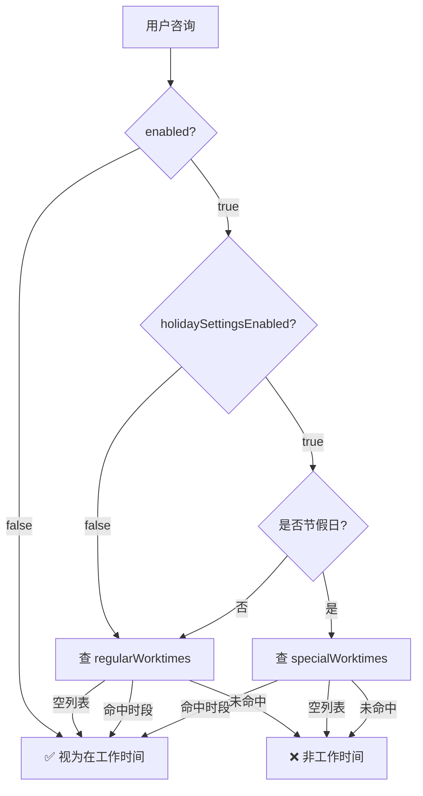

# 工作时间设置

## 实体字段

| 字段 | 类型 | 默认值 | 说明 |
| --- | --- | --- | --- |
| `enabled` | `Boolean` | `true` | 总开关，`false` 则始终视为工作时间 |
| `holidaySettingsEnabled` | `Boolean` | `false` | 是否启用节假日判定；`false` 时仅使用 `regularWorktimes` |
| `regularWorktimes` | `List<WorktimeSlotValue>` | `[{09:00-18:00, 周一至周五}]` | 常规工作日时间段 |
| `specialWorktimes` | `List<WorktimeSlotValue>` | `[]` | 节假日特殊时间段 |
| `nonWorktimeTip` | `String` | 离线提示语 | 非工作时间向访客展示的提示 |

## regularWorktimes vs specialWorktimes

| 字段 | 用途 | 触发条件 | 为空含义 |
| --- | --- | --- | --- |
| `regularWorktimes` | 常规工作日的时间段 | `holidaySettingsEnabled=false` 或非法定节假日 | **不限制**（全天 24h 视为工作时间） |
| `specialWorktimes` | 节假日的特殊工作时间段 | `holidaySettingsEnabled=true` 且命中法定节假日 | **不开放**（节假日默认不营业） |

### 判定流程

节假日由 `holidayCountryCode`（国家/地区）+ `holidayScopeType`（组织/平台范围）联合判定（当前默认值 CN + ORG_ONLY）。

### 设计理由

- **空值语义不同**：常规时段为空 = 宽松（不限时），特殊时段为空 = 严格（默认休息），合并为一个字段无法区分"未配置"和"配置为空"
- **编辑解耦**：两个列表独立增删，修改常规排班不影响节假日安排
- **业务场景独立**：常规时段周期性重复（如周一至周五 9:00–18:00），特殊时段仅在节假日生效（如国庆加班 10:00–16:00）
