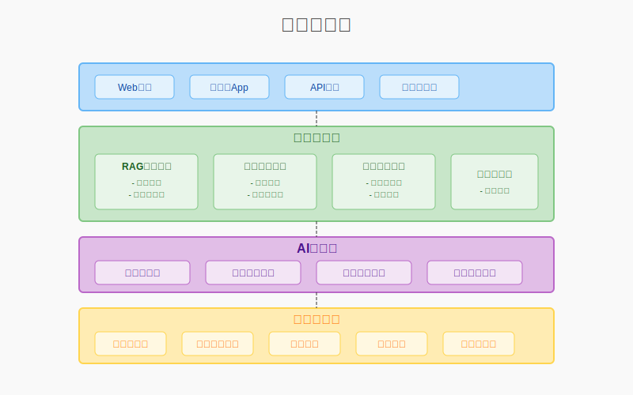

# 微语AI文生文解决方案

## 企业级智能文档生成系统 - 商务深度集成版

---

## 📋 方案概述

**微语AI文生文解决方案**是基于大语言模型技术的新一代企业文档智能生成平台，专注于三大核心场景：企业知识库智能问答（RAG）、会议纪要自动生成、提示词驱动的文档创作。系统深度集成平台核心模块，通过AI驱动的工作流，实现从零散信息到结构化文档的智能转换，大幅提升企业知识管理效率和文档创作质量。

作为微语协作平台的核心组件，它不仅是文档生成工具，更是企业数字化办公的智能大脑：

- **会议录音一键转换为规范纪要**
- **企业知识库RAG智能问答**
- **提示词驱动的高质量文档创作**
- **智能校对确保文档质量**  
- **标准公文格式自动套用**
- **与IM、工单、知识库深度融合**

**核心价值**：原本需要2-4小时的文档处理工作缩短至30分钟，整体办公效率提升70%以上！

---

## 🔧 核心集成优势

微语AI文生文解决方案与平台核心模块深度融合，实现真正的一体化智能办公：

#### **一体化数据流转**

- 与IM、工单、知识库无缝整合，文档自动流转至相应业务模块
- 消除信息孤岛，数据在各模块间智能流转
- 统一用户体系，单点登录管理所有功能

#### **智能知识沉淀**

- 生成的文档自动归类到企业知识库，形成可复用的知识资产
- 智能标签和分类，便于后续检索和应用
- 知识资产持续积累，提升组织智慧水平

#### **多租户权限管控**

- 基于微语多租户架构，确保文档生成和访问的安全隔离
- 细粒度权限控制，保障数据安全
- 支持集团化部署，各子公司数据独立管理

#### **工作流自动化**

- 结合工作流引擎，实现文档审批、分发、归档全流程自动化
- 智能路由决策，提升流程效率
- 全程留痕，确保合规性和可追溯性

---

## 🎯 三大核心功能模块

### 一、RAG知识库智能问答

#### 1. RAG检索增强生成

- **企业知识库构建**：将企业文档、规章制度、产品手册等结构化存储
- **文档向量化**：对文档进行语义化向量编码，支持精准语义检索
- **多源知识整合**：支持多种格式文档的统一管理和检索
- **实时更新机制**：支持知识库的增量更新和实时生效

#### 2. 智能问答流程

- **问题理解**：深度解析用户意图，识别核心问题点
- **相关性检索**：基于语义相似度检索最相关的知识片段
- **上下文融合**：将检索结果与用户问题融合生成完整上下文
- **答案生成**：利用大语言模型生成准确、连贯的回答

#### 3. 企业平台集成

- **IM集成**：在企业IM中直接提问和接收答案，提升沟通效率
- **工单系统集成**：从工单自动提取问题并生成回复建议
- **知识库联动**：问答结果自动归档，持续丰富企业知识库

### 二、会议纪要智能生成

#### 🎯 **音频处理与IM集成**

- 会议语音直接从企业IM录制，一键生成纪要并推送至相关群组
- 支持实时会议转录，即时了解会议进展
- 自动@相关人员，确保重要信息及时传达

#### 🎯 **工单联动**

- 会议决策自动转化为工单任务，确保执行落地
- 智能提取行动项和责任人
- 自动设置截止时间和优先级

#### 🎯 **知识库沉淀**

- 会议纪要自动分类存储，形成企业决策知识库
- 智能标签和关键词提取
- 支持全文检索和关联推荐

### **智能文档校对**

#### 🎯 **实时协作**

- 在IM聊天中实时校对文档，支持多人协同编辑
- 变更实时同步，版本自动管理
- 在线评论和建议功能

#### 🎯 **质量控制**

- 集成工单系统，文档校对结果自动生成质量评估报告
- 建立文档质量评分体系
- 持续改进文档标准

#### 🎯 **标准化管理**

- 基于企业知识库的行业标准，确保文档规范统一
- 自定义校对规则和模板
- 智能学习企业写作风格

### **公文格式套用**

#### 🎯 **模板管理**

- 与知识库深度集成，统一管理企业公文模板库
- 支持多层级模板体系
- 模板版本控制和权限管理

#### 🎯 **审批流程**

- 自动触发工作流审批，确保公文合规性和时效性
- 智能路由到相关审批人
- 审批状态实时跟踪

#### 🎯 **多渠道分发**

- 通过IM、客服等渠道智能分发至相关人员
- 支持定向推送和群发
- 阅读状态追踪和提醒

### 三、Prompt驱动的文档生成

#### 1. 提示词设计系统

- **提示词模板库**：针对不同文档类型的专业提示词模板
- **提示词生成向导**：引导用户逐步构建高质量提示词
- **意图识别增强**：智能解析用户意图，补充隐含需求
- **多轮提示优化**：通过多轮交互逐步精细化文档需求

#### 2. 场景化文档生成

- **多类型文档支持**：工作报告、项目计划书、通知公告、商务提案、培训教材等
- **行业适配能力**：政府公文、企业文档、学术论文、营销文案等风格适配
- **知识库驱动**：基于企业专业知识库，生成符合行业特色的专业文档
- **智能推荐相关参考资料**：自动推荐相关内容，丰富文档深度和广度

#### 3. 客服场景应用

- **智能回复模板**：为客服人员提供智能回复模板，提升服务质量
- **标准话术生成**：基于历史对话生成标准话术库，确保回复一致性
- **实时优化建议**：智能分析对话场景，提供最佳回复建议
- **个性化调整**：根据客户特点和历史交流自动调整回复风格和内容

#### 4. 协作效率提升

- **团队写作建议**：在团队协作中提供智能写作建议，加速文档产出
- **多人协作模式**：支持多人同时编辑同一文档，实时同步变更
- **智能冲突解决**：自动识别和处理编辑冲突，提供合并建议
- **版本比对**：直观展示不同版本文档差异，支持选择性合并

---

## 💻 用户界面设计

### 一、工作流程界面

工作流程界面是用户与系统交互的核心入口，通过直观的流程展示和状态反馈，帮助用户高效完成文档生成任务。

- **可视化流程图**：直观展示从录音到成文的完整流程，用户可清晰了解当前所处阶段
- **节点状态显示**：通过色彩和图标实时显示各节点处理状态（未开始、处理中、已完成、出错）
- **手动干预机制**：允许用户在任意节点调整参数或修改内容，确保最终文档质量
- **批量操作**：支持多文件批量处理，统一任务管理与监控

### 二、内容编辑界面

内容编辑界面是系统生成文档后的精细化处理环节，提供专业的编辑功能和AI辅助能力，帮助用户快速完成高质量文档。

- **富文本编辑**：提供与最终输出一致的所见即所得编辑体验
- **AI写作助手**：实时提供写作建议、内容优化和补充信息
- **多人实时协作**：支持多用户同时编辑同一文档，实时同步变更
- **权限管理**：细粒度的文档访问和编辑权限控制

### 三、文档管理界面

文档管理界面提供对所有生成和编辑过的文档的集中管理，实现高效的文档组织、检索和共享。

- **多维度分类**：支持按文档类型、部门、项目、时间等多维度分类管理
- **智能搜索**：基于内容的全文检索，支持高级过滤和组合查询
- **完整版本历史**：自动记录所有文档版本，包含修改者、时间和变更内容
- **版本比较与回滚**：直观展示不同版本间的差异，支持回滚到任意历史版本

### 四、界面整合与交互

上图展示了三大核心界面的整合关系和交互流程，通过流畅的界面转换和数据流动，为用户提供连贯且高效的使用体验。

## 🌟 独特竞争优势

### **平台一体化**

- 无需切换多个系统，在统一平台完成从文档生成到业务执行的全流程
- 数据互通，信息流转无缝衔接
- 用户体验一致，学习成本低

### **智能化程度高**

- AI能力与业务场景深度融合，不只是简单的文档生成工具
- 基于企业数据持续学习优化
- 支持个性化定制和智能推荐

### **企业级安全**

- 多租户架构保障数据安全，支持私有化部署
- 完善的权限管理和审计机制
- 符合企业级安全标准和合规要求

### **可扩展性强**

- 模块化设计支持灵活配置，适应不同规模企业需求
- 开放API支持第三方集成
- 支持云端和本地混合部署

### **投资回报显著**

- 平均减少70%文档处理时间
- 提升50%协作效率
- 6-12个月收回投资成本
- 年节约人力成本50-200万元

---

## 💰 价值与成本分析

### **效率提升数据**

| 业务场景 | 传统处理时间 | AI系统处理时间 | 效率提升 |
|---------|-------------|---------------|----------|
| 会议纪要整理 | 2-4小时 | 30分钟 | **87%** |
| 文档校对 | 1-2小时 | 15分钟 | **85%** |
| 公文格式调整 | 30分钟 | 5分钟 | **83%** |
| 报告撰写 | 4-8小时 | 1-2小时 | **75%** |

### **投资回报预期**

| 组织规模 | 年节约成本 | 初期投资 | 回收期 | 年度ROI |
|---------|-----------|----------|--------|---------|
| 中小企业（100-500人） | 50-100万 | 20-40万 | 3-6个月 | **200%+** |
| 大型企业（500-2000人） | 100-200万 | 50-80万 | 6-9个月 | **300%+** |
| 集团企业（2000人+） | 200-500万 | 100-150万 | 9-12个月 | **400%+** |

---

## 🎯 应用场景

### **政府机关**

- **党政会议纪要**：自动生成规范会议记录，确保决策传达
- **公文处理**：标准化公文格式，提升政务效率
- **政策解读**：智能生成政策解读文档，便民服务

### **企业办公**

- **内部协作**：会议纪要、工作报告自动化处理
- **商务活动**：客户会谈、合作谈判记录整理
- **文档管理**：企业制度、流程文档标准化

### **教育培训**

- **教学管理**：课程记录、学术会议纪要
- **行政管理**：教务会议、管理制度文档
- **知识沉淀**：教学经验和学术成果整理

### **医疗健康**

- **医疗管理**：医疗会议、制度编写
- **学术交流**：医学会议、培训记录
- **质量管理**：医疗文档规范化处理

---

## ⚙️ 技术架构与实现

### 一、系统架构设计

微语AI文生文解决方案采用现代化的分层微服务架构设计，确保系统的高可用性、可扩展性和可维护性。

#### 微服务架构

- **语音处理服务**：专门处理音频文件和语音识别，支持多语言、多说话人识别和降噪处理
- **文本处理服务**：负责文本校对、内容优化和格式规范化，集成多种专业校对引擎
- **文档生成服务**：处理文档格式化和模板套用，支持多种输出格式和模板定制
- **工作流引擎**：管理整个处理流程和状态机，确保任务有序执行和异常处理
- **知识库服务**：提供RAG检索和知识增强功能，实现精准的文档语义理解和内容生成

#### 数据流设计

- **异步处理流水线**：长任务自动分解为多阶段异步处理，避免前端阻塞
- **实时消息通知**：基于WebSocket的实时状态通知机制，保持用户随时了解处理进度
- **多级缓存策略**：从内存到分布式缓存的多级缓存设计，优化系统响应速度
- **动态负载均衡**：基于请求量和资源消耗的智能负载均衡，保障系统稳定性

### 二、安全与合规

微语AI文生文解决方案建立了全方位的安全与合规保障体系，确保系统在提供高效服务的同时，满足国家网络安全标准和数据安全法的要求。

#### 数据安全

- **多层加密体系**：采用TLS 1.3传输加密、AES-256存储加密，实现数据全生命周期保护
- **数据分级管控**：根据数据敏感度实施不同级别的安全策略，核心数据特殊保护
- **全面审计追踪**：记录所有数据访问和操作行为，支持详细审计和异常检测

#### 企业专有部署

- **专有云部署**：提供独立部署环境，数据物理隔离，满足高敏感行业需求
- **私有模型部署**：支持企业专有AI模型部署，避免数据出境风险
- **专家安全支持**：提供安全专家团队支持，及时应对安全事件和合规咨询

---

## 🔧 实施方案

### **部署选择**

- **云端部署**：2-3周快速上线，适合中小型组织
- **私有化部署**：4-6周完成，适合大型组织和高安全要求

### **实施保障**

- **专业团队**：资深实施顾问全程服务
- **完整培训**：分层次用户培训体系
- **技术支持**：7×24小时技术支持服务
- **持续优化**：功能持续升级和优化

---

## 📞 联系我们

**立即体验微语AI文生文解决方案：**

- **官方网站**：[https://www.weiyuai.cn](https://www.weiyuai.cn)
- **产品演示**：申请免费产品演示和咨询
- **技术支持**：7×24小时专业技术支持

**我们承诺：**

- 24小时内响应咨询需求
- 免费需求分析和方案设计  
- 专业团队提供全程服务支持

---

## 📝 常见问题

**Q：系统对录音质量有什么要求？**
A：系统具有智能降噪功能，可处理一般会议环境录音，支持多种音频格式。

**Q：是否支持与现有系统集成？**
A：完全支持，提供标准API接口，可与OA、ERP等系统无缝集成。

**Q：数据安全如何保障？**
A：采用企业级安全标准，支持私有化部署，传输存储全程加密。

**Q：投资回报期多长？**
A：根据组织规模，通常3-12个月收回投资，年度ROI可达200%-400%。

---

*微语AI文生文解决方案 - 让智能赋能办公，让协作更高效*
