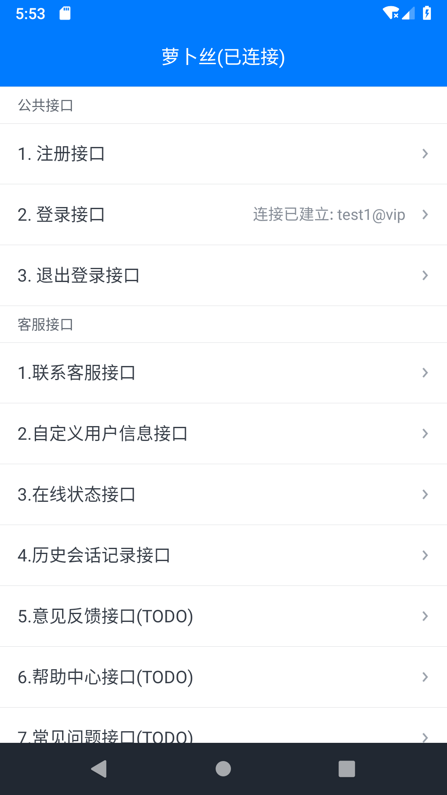
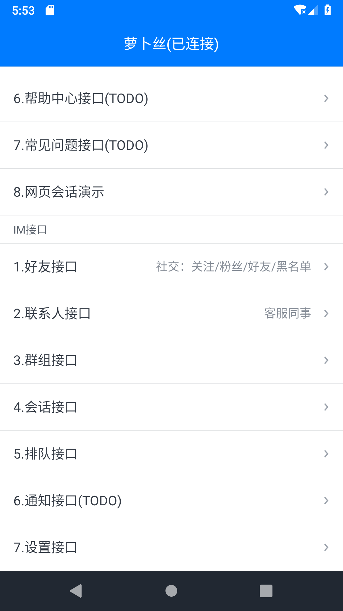
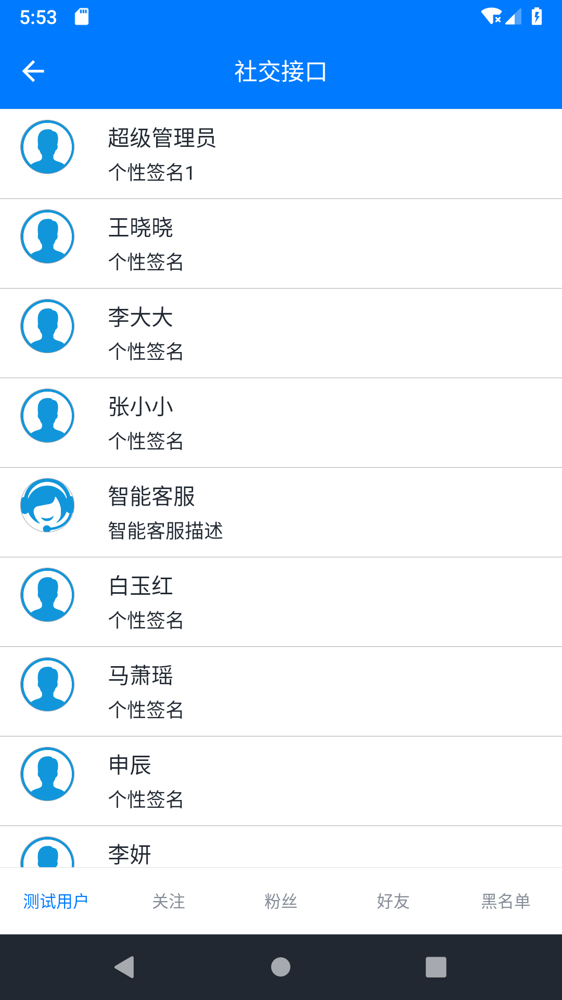
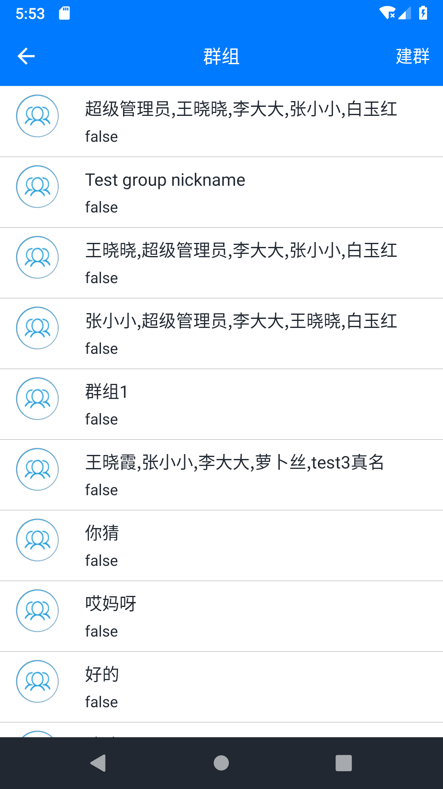
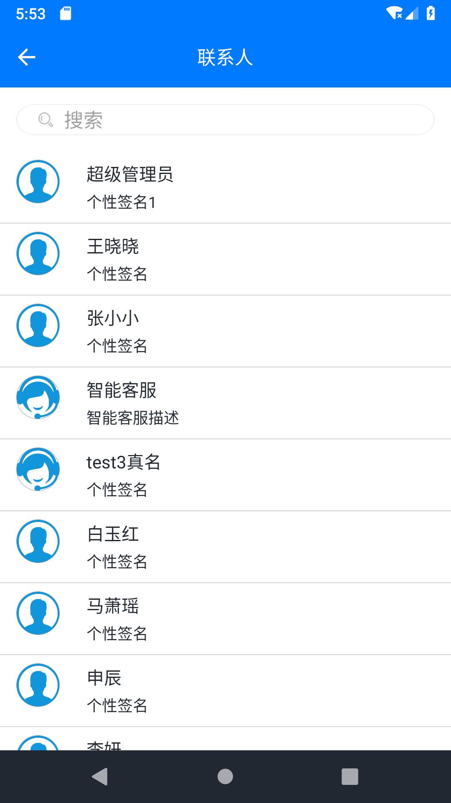
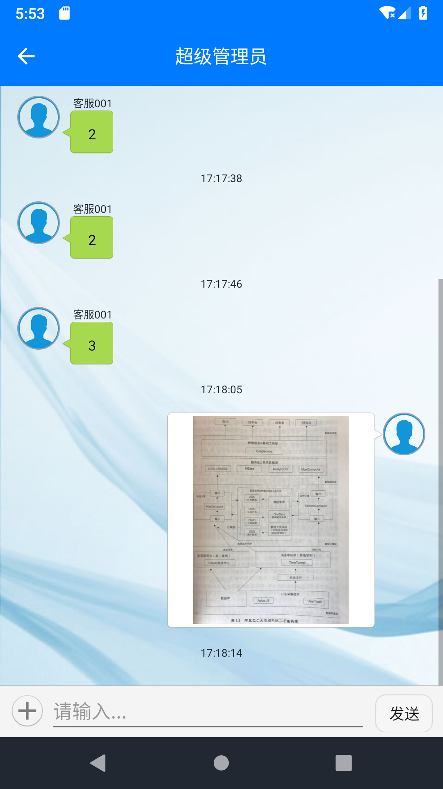
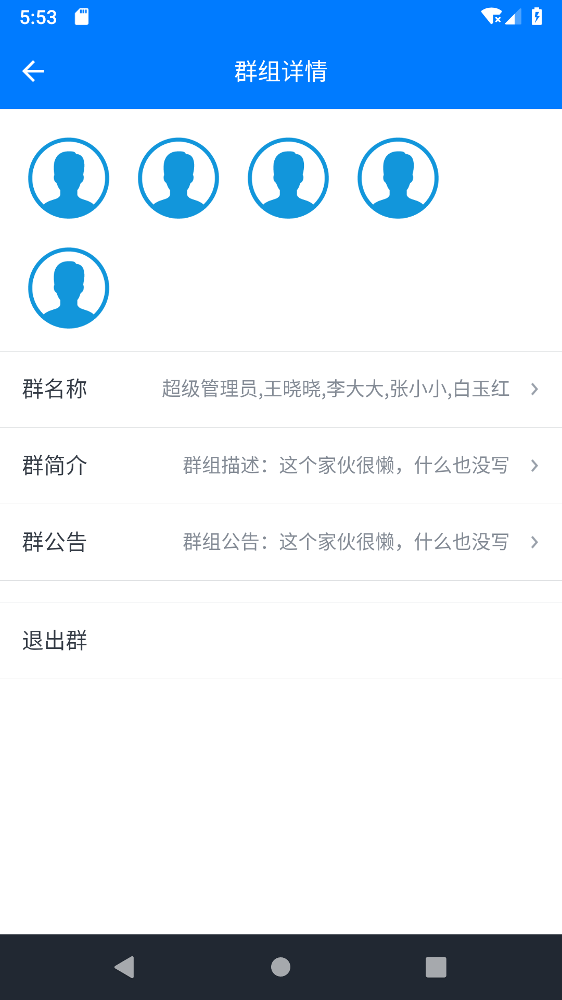

# 萝卜丝 · IM + 云客服

- 致力于提供稳定、可扩展、定制化的客户服务一站式平台
- [官方网站](https://www.bytedesk.com)
- [开发文档](https://github.com/bytedesk/bytedesk-android/wiki)

## 准备工作

- [注册账号](https://www.bytedesk.com/admin/#/antv/user/register)
- [登录后台](https://www.bytedesk.com/admin/#/antv/user/login)
- 分配应用：登录后台->客服管理->渠道管理->添加 App
- [下载 ApkDemo](https://bytedesk.oss-cn-shenzhen.aliyuncs.com/apk/bytedesk-android-sdk-demo.apk)
- 技术支持 QQ 3 群: 825257535

## 集成 SDK

萝卜丝·云客服在经典版[微客服](http://www.weikefu.net)基础上面做了重构，将原先一个 SDK 一分为二为两个 sdk：

```bash
# 在项目根目录的build.gradle
allprojects {
  repositories {
    # 添加
    # 去查看最新版：https://search.maven.org/search?q=g:com.bytedesk
    mavenCentral()
  }
}
```

```bash
# 查看最新版：https://search.maven.org/search?q=com.bytedesk
# androidx版, 参考demo：ByteDeskDemoX
- 核心库: implementation 'com.bytedesk:libcore:2.8.0'
- 界面库: implementation 'com.bytedesk:libui:2.8.0'
```

混淆

```bash
# proguard-rules.pro中添加
-keep class com.bytedesk.**{*;}
-keep class io.xiaper.**{*;}
-keep class com.tencent.**{*;}
```

<!-- - 核心库：com.bytedesk:libcore: [](https://bintray.com/jackning/maven/core/_latestVersion)
- 界面库，完全开源(Demo中的bytedesk-ui模块)，方便开发者自定义界面：com.bytedesk:libui: [](https://bintray.com/jackning/maven/ui/_latestVersion) -->

## 开发文档

- [在线客服开发文档](https://github.com/Bytedesk/bytedesk-android/wiki)
  - [5 分钟集成在线客服](https://github.com/Bytedesk/bytedesk-android/wiki/5%E5%88%86%E9%92%9F%E9%9B%86%E6%88%90%E5%9C%A8%E7%BA%BF%E5%AE%A2%E6%9C%8D)
  - [5 分钟集成工单](https://github.com/Bytedesk/bytedesk-android/wiki/5%E5%88%86%E9%92%9F%E9%9B%86%E6%88%90%E5%B7%A5%E5%8D%95)
  - [5 分钟集成帮助中心](https://github.com/Bytedesk/bytedesk-android/wiki/5%E5%88%86%E9%92%9F%E9%9B%86%E6%88%90%E5%B8%AE%E5%8A%A9%E4%B8%AD%E5%BF%83)
  - [5 分钟集成意见反馈](https://github.com/Bytedesk/bytedesk-android/wiki/5%E5%88%86%E9%92%9F%E9%9B%86%E6%88%90%E6%84%8F%E8%A7%81%E5%8F%8D%E9%A6%88)
  - [5 分钟集成自定义 UI](https://github.com/Bytedesk/bytedesk-android/wiki/5%E5%88%86%E9%92%9F%E9%9B%86%E6%88%90%E8%87%AA%E5%AE%9A%E4%B9%89UI)
- [IM 开发文档](https://github.com/bytedesk/bytedesk-android/wiki/IM%E5%BC%80%E5%8F%91%E6%96%87%E6%A1%A3)

## 截图

<!-- 





 -->

|                      image1                      |                       image2                       |                        image3                        |
| :----------------------------------------------: | :------------------------------------------------: | :--------------------------------------------------: |
|  |   |    |
|   |  |  |

## 公众号


## 其他

- [Flutter SDK](https://github.com/bytedesk/bytedesk-flutter)
- [UniApp SDK](https://github.com/bytedesk/bytedesk-uniapp)
- [iOS SDK](https://github.com/bytedesk/bytedesk-ios)
- [Android SDK](https://github.com/bytedesk/bytedesk-android)
- [Web 端接口](https://github.com/bytedesk/bytedesk-web)
- [微信公众号/小程序接口](https://github.com/bytedesk/bytedesk-wechat)
- [服务器端接口](https://github.com/bytedesk/bytedesk-server)
- [机器人](https://github.com/bytedesk/bytedesk-chatbot)
