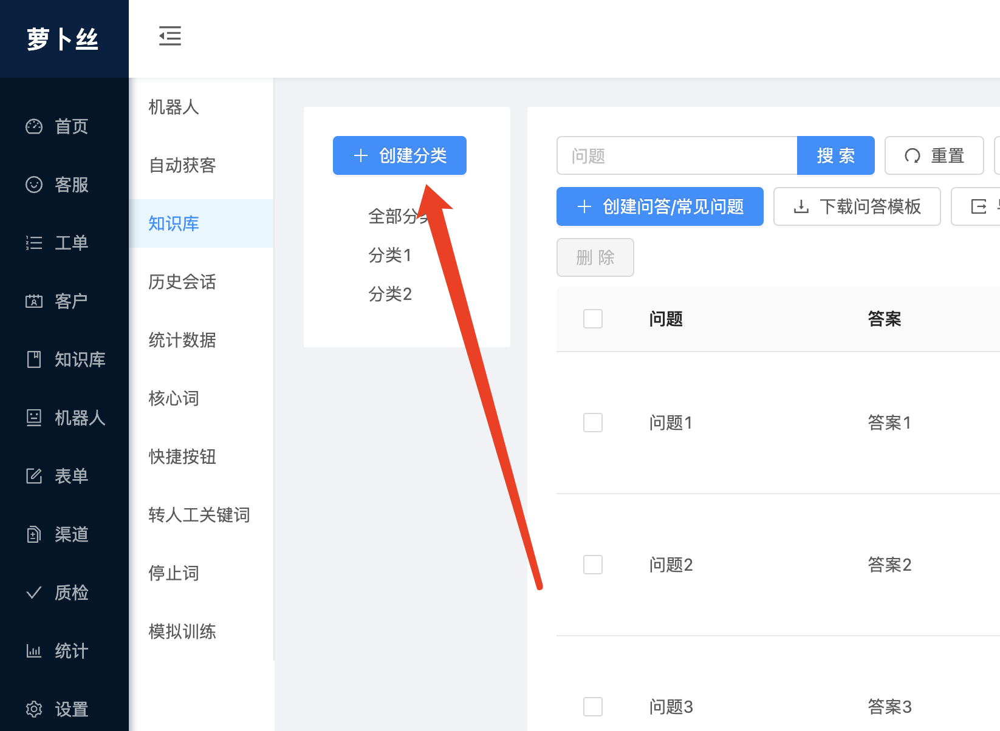
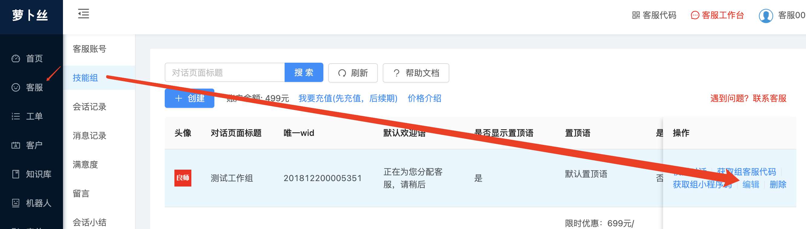
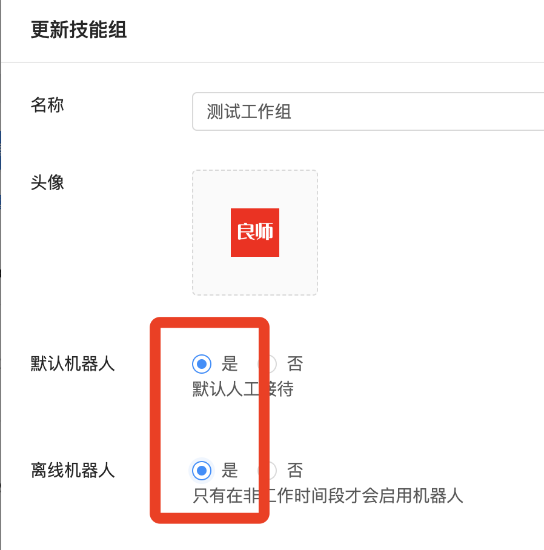

# 萝卜丝智能客服-uniapp sdk

- [官网](https://www.weikefu.net/)
- [价格](https://www.weikefu.net/pages/price.html)
- [管理后台](https://www.weikefu.net/admin)
- [客服工作台](https://www.weikefu.net/chaty)
- [客服端下载](https://www.weikefu.net/pages/download.html)

## 部分功能

- 萝卜丝官方技术支持
- 全部基于vuejs开发，不依赖原生SDK，100%全部开源，支持自定义界面
- 支持web/h5/小程序/安卓/iOS等全平台
- 支持人工客服
- 支持机器人
- 支持视频客服
- 支持文字、图片、语音、表情
- 支持消息预知：对方正在输入
- 支持消息状态：送达、已读
- 支持消息撤回
- 支持发送商品信息
- 未读消息数查询接口
- 对接第三方账号系统/多用户切换
- 支持vue2/vue3
- 注意：运行项目bytedesk_demo_vue3之前，首先需要进入项目文件夹执行yarn或者npm install初始化

## Demo下载

- [Gitee Demo](https://gitee.com/270580156/bytedesk-uniapp)
- [Github Demo](https://github.com/Bytedesk/bytedesk-uniapp)

## 配置步骤说明（共两步）

- 首先：将 bytedesk_kefu 文件夹拷贝到 components 文件夹，
- 然后：在pages.json中添加以下几个页面，具体可参考demo中pages.json文件

```js
{
	"path": "components/bytedesk_kefu/chat-kf",
	"style": {
		"navigationBarTitleText": "萝卜丝智能客服",
		"navigationBarBackgroundColor":"#007AFF",
		"navigationBarTextStyle":"white"
	}
},
{
	"path": "components/bytedesk_kefu/chat-im",
	"style": {
		"navigationBarTitleText": "萝卜丝智能客服",
		"navigationBarBackgroundColor":"#007AFF",
		"navigationBarTextStyle":"white"
	}
},
{
	"path": "components/bytedesk_kefu/rate",
	"style": {
		"navigationBarTitleText": "满意度评价",
		"navigationBarBackgroundColor":"#007AFF",
		"navigationBarTextStyle":"white"
	}
},
{
	"path": "components/bytedesk_kefu/webview",
	"style": {
		"navigationBarTitleText": "萝卜丝H5",
		"navigationBarBackgroundColor":"#007AFF",
		"navigationBarTextStyle":"white"
	}
},
{
	"path": "components/bytedesk_kefu/leavemsg",
	"style": {
		"navigationBarTitleText": "留言",
		"navigationBarBackgroundColor":"#007AFF",
		"navigationBarTextStyle":"white"
	}
}
```

## 开发步骤说明（共三步）

bytedesk_demo和bytedesk_demo_i18n的区别仅仅在于后者支持国际化，其他功能没有区别

- 第一步：引入文件。在调用客服的vue页面，如：index.vue，引入

```js
import * as bytedesk from '@/components/bytedesk_kefu/js/api/bytedesk.js'
```

- 第二步：初始化。在index.vue页面onLoad函数

```js
// 萝卜丝第二步：初始化
// 注意：init的接口要提前调用，最好在打开App的时候就调用。不要跟打开客服页面接口放在一起同时调用，否则会因未初始化完毕报错 'not login'
// 获取subDomain，也即企业号：登录后台->客服管理->客服账号->企业号
let subDomain = 'vip'
// 登录后台->渠道管理-》uniapp中创建应用获取
let appKey = 'f4970e52-8cc8-48fd-84f6-82390640549d'
bytedesk.init(subDomain, appKey);
// 注：如果需要多平台统一用户（用于同步聊天记录等），可使用下面接口替换bytedesk.init:
// bytedesk.initWithUsernameAndNicknameAndAvatar('myuniappusername', '我是美女', 'https://bytedesk.oss-cn-shenzhen.aliyuncs.com/avatars/girl.png', subDomain, appKey);
// bytedesk.initWithUsername('myuniappusername',subDomain, appKey); // 其中：username为自定义用户名，可与开发者所在用户系统对接
// 如果还需要自定义昵称/头像，可以使用 initWithUsernameAndNickname或initWithUsernameAndNicknameAndAvatar，
// 具体参数可以参考 @/components/bytedesk_kefu/js/api/bytedesk.js 文件中接口
```

- 第三步：开始会话

```js
// 第三步：到 客服管理->技能组-有一列 ‘唯一ID（wId）’, 默认设置工作组wid
// 说明：一个技能组可以分配多个客服，访客会按照一定的规则分配给组内的各个客服账号
// workGroupWid: '201807171659201', // 默认人工
// 参数说明：
// nickname 自定义昵称，可设置为非空字符串，如不设置，会系统生成默认昵称
// history 是否显示历史聊天记录，默认为显示，设置history=0，则不显示历史聊天记录
// postscript 附言，在连接成功客服之后，自动将此消息发送给客服
// lang 语言，默认值为lang=cn,显示中文，如需显示英文设置lang=en
// goods 是否显示商品信息，如果要显示，设置为goods=1，设置为其他值，则不显示商品信息
// goods_id 商品信息id，参数goods=1的情况有效
// goods_title 商品信息标题，参数goods=1的情况有效
// goods_content 商品信息详情，参数goods=1的情况有效
// goods_price 商品信息价格，参数goods=1的情况有效
// goods_url 商品信息网址，参数goods=1的情况有效
// goods_imageUrl 商品图片，参数goods=1的情况有效
// goods_categoryCode 可选，商品信息类别，参数goods=1的情况有效
startChat () {
  // console.log('start chat')
  uni.navigateTo({
  	url: '../../components/bytedesk_kefu/chat-kf?wid=' + this.workGroupWid + '&type=workGroup&aid=&title=萝卜丝'
  });
}
```

- 结束
- 具体请参考demo中index.vue页面

| 首页 | 聊天 | H5 |
| :----------: | :----------: | :----------: |
|  |  |  |
|  |  |  |

## 以下步骤为非必须步骤，开发者可根据需要调用

### 视频客服

- 权限配置

- 集成代码
```
登录管理后台：https://www.bytedesk.com/admin，客服管理-》技能组-》获取视频客服代码
```

### 获取未读消息数目

用于访客端-查询访客所有未读消息数目
```
1. 首先引入 import * as httpApi from '@/components/bytedesk_kefu/js/api/httpapi.js' (后面说明将省略此步骤说明)
2. 调用接口：
httpApi.getUnreadCountVisitor(response => {
	// console.log('getUnreadCountVisitor: ', response.data)
	let unreadCount = response.data
	if (unreadCount > 0) {
		uni.showToast({ title: '未读消息数目：' + unreadCount, duration: 2000 });
	}
}, error => {
	console.log(error)
})
```

### [开启机器人](https://vip.docs.bytedesk.com/article_202104291459561.html)

机器人会话仅针对技能组开启，指定会话不支持开启机器人

- 登录[管理后台](https://www.weikefu.net/admin)

- 首先添加分类，其次添加问答
- 


- 在技能组开启机器人。   找到 “客服管理”-》技能组-》点击相应技能组“编辑”按钮
- 


- 找到“默认机器人”和“离线机器人”，选择“是”
- 


- 开始测试使用机器人

### 对接电商商品信息

具体请参考bytedesk_demo/pages/index/chat_type.vue文件

- 参数说明：
```
goods 是否显示商品信息，如果要显示，设置为goods=1，设置为其他值，则不显示商品信息
goods_id 商品信息id，参数goods=1的情况有效
goods_title 商品信息标题，参数goods=1的情况有效
goods_content 商品信息详情，参数goods=1的情况有效
goods_price 商品信息价格，参数goods=1的情况有效
goods_url 商品信息网址，参数goods=1的情况有效
goods_imageUrl 商品图片，参数goods=1的情况有效
goods_categoryCode 可选，商品信息类别，参数goods=1的情况有效
```

- 演示代码：
```
// url编码
let goodsUrl = encodeURI('https://item.m.jd.com/product/12172344.html')
// 增加商品信息参数
uni.navigateTo({
	url: '../../components/bytedesk_kefu/chat-kf?wid=' + this.workGroupWid 
		+ '&type=workGroup&aid=&title=萝卜丝' 
		+ '&goods=1' 
		+ '&goods_categoryCode=101' 
		+ '&goods_content=商品详情' 
		+ '&goods_id=123' 
		+ '&goods_imageUrl=https://bytedesk.oss-cn-shenzhen.aliyuncs.com/images/123.webp' 
		+ '&goods_price=1000' 
		+ '&goods_title=商品标题' 
		+ '&goods_url=' + goodsUrl 
		+ '&history=0' 
		+ '&lang=cn'
});
```

### 点击商品回调

- 可用于点击商品后，跳转自定义页面

```js
// 具体参考demo中chat_type.vue页面
onLoad(option) {
	// 监听点击商品回调
	uni.$on('commodity',function(content) {
		console.log('点击商品回调:', content);
	})
},
onUnload() {
	// 移除点击商品回调监听
	uni.$off('commodity'); 
}
```

### 自定义昵称、头像和备注

具体请参考bytedesk_demo/pages/index/user_info.vue文件

```
首先引入 import * as httpApi from '@/components/bytedesk_kefu/js/api/httpapi.js'
```

- 查询当前用户信息：昵称、头像、备注
```
getProfile () {
	// 查询当前用户信息：昵称、头像
	let app = this
	httpApi.getProfile(function(response) {
		console.log('getProfile success:', response)
		app.uid = response.data.uid
		app.nickname = response.data.nickname
		app.description = response.data.description
		app.avatar = response.data.avatar
	}, function(error) {
		console.log('getProfile error', error)
		uni.showToast({ title: error, duration: 2000 });
	})
}		
```

- 可自定义用户昵称-客服端可见
```
setNickname () {
	// 可自定义用户昵称-客服端可见
	let mynickname = '自定义APP昵称uniapp'
	let app = this
	httpApi.updateNickname(mynickname, function(response) {
		console.log('updateNickname success:', response)
		app.nickname = mynickname
	}, function(error) {
		console.log('updateNickname error', error)
		uni.showToast({ title: error, duration: 2000 });
	})
}
```

- 可自定义用户备注信息-客服端可见
```
setDescription () {
	// 可自定义用户备注信息-客服端可见
	let mydescription = '自定义APP用户备注信息uniapp'
	let app = this
	httpApi.updateDescription(mydescription, function(response) {
		console.log('updateDescription success:', response)
		app.description = mydescription
	}, function(error) {
		console.log('updateDescription error', error)
		uni.showToast({ title: error, duration: 2000 });
	})
}
```

- 可自定义用户头像url-客服端可见
```
setAvatar () {
	// 可自定义用户头像url-客服端可见
	let myavatarurl = 'https://chainsnow.oss-cn-shenzhen.aliyuncs.com/avatars/visitor_default_avatar.png'; // 头像网址url
	let app = this
	httpApi.updateAvatar(myavatarurl, function(response) {
		console.log('updateAvatar success:', response)
		app.avatar = myavatarurl
	}, function(error) {
		console.log('updateAvatar error', error)
		uni.showToast({ title: error, duration: 2000 });
	})
}
```

- 将设置昵称、头像、描述接口合并为一个接口
```
setProfile () {
	let mynickname = '自定义APP昵称uniapp'
	let myavatarurl = 'https://chainsnow.oss-cn-shenzhen.aliyuncs.com/avatars/visitor_default_avatar.png'; // 头像网址url
	let mydescription = '自定义APP用户备注信息uniapp'
	let app = this
	httpApi.updateProfile(mynickname, myavatarurl, mydescription, response => {
		console.log('updateProfile success:', response)
		app.nickname = mynickname
		app.avatar = myavatarurl
		app.description = mydescription
	}, error => {
		console.log('updateAvatar error', error)
		uni.showToast({ title: error, duration: 2000 });
	}) 
}
```

### 获取客服当前在线状态

具体请参考bytedesk_demo/pages/index/online_status.vue文件

- 获取技能组在线状态：当技能组中至少有一个客服在线时，显示在线, 其中：workGroupWid为要查询技能组唯一wid
```
getWorkGroupStatus () {
	// 获取技能组在线状态：当技能组中至少有一个客服在线时，显示在线
	// 获取workGroupWid：客服管理->技能组-有一列 ‘唯一ID（wId）’, 默认设置工作组wid
	let app = this
	httpApi.getWorkGroupStatus(this.workGroupWid, function(response) {
		console.log('getWorkGroupStatus success:', response)
		// online代表在线，否则为离线
		app.workGroupOnlineStatus = response.data.status
	}, function(error) {
		console.log('getWorkGroupStatus error', error)
		uni.showToast({ title: error, duration: 2000 });
	})
}
			
```

- 获取指定客服在线状态，其中：agentUid为要查询客服唯一uid
```
getAgentStatus () {
	// 获取指定客服在线状态
	let app = this
	httpApi.getAgentStatus(this.agentUid, function(response) {
		console.log('getAgentStatus success:', response)
		// online代表在线，否则为离线
		app.agentOnlineStatus = response.data.status
	}, function(error) {
		console.log('getAgentStatus error', error)
		uni.showToast({ title: error, duration: 2000 });
	})
}
```

### 多用户切换

具体请参考bytedesk_demo/pages/index/switch_user.vue文件

- 引入文件
```
// 引入js文件
import * as constants from '@/components/bytedesk_kefu/js/constants.js'
import * as bytedesk from '@/components/bytedesk_kefu/js/api/bytedesk.js'
import * as httpApi from '@/components/bytedesk_kefu/js/api/httpapi.js'
```

- 执行登录之前请先判断是否有用户登录
```
let isLogin = uni.getStorageSync(constants.isLogin);
if (isLogin) {
	uni.showToast({ title:'请先退出登录', icon:'none', duration: 2000 })
	return
}
```

- 如果已经存在用户登录，则先执行退出登录logout
```
userLogout() {
	uni.showLoading({ title: '退出登录中', icon:'none', duration: 2000 });
	// 退出登录
	httpApi.logout(response => {
		uni.hideLoading();
		uni.showToast({ title:'退出登录成功', icon:'none', duration: 2000 })
	}, error => {
		uni.hideLoading();
		uni.showToast({ title:'退出登录失败', icon:'none', duration: 2000 })
	})
}
```

- 调用登录接口登录
```
initWithUsernameAndNicknameAndAvatar(username, nickname, avatar, subDomain, appKey) {
	bytedesk.initWithUsernameAndNicknameAndAvatar(username, nickname, avatar, subDomain, appKey)
	uni.showToast({ title:'登录成功', icon:'none', duration: 2000 })
}
```

### 国际化

- [官方国际化文档配置](https://uniapp.dcloud.net.cn/collocation/i18n)
- 参照bytedesk_demo_i18n/main.js

```js
// 引入头文件及其他
// .....

// 官方文档 https://uniapp.dcloud.net.cn/collocation/i18n
// 国际化 json 文件，文件内容详见下面的示例
import en from './components/bytedesk_kefu/i18n/en.json'
import cn from './components/bytedesk_kefu/i18n/cn.json'
const messages = {
    en,
    cn
}
let i18nConfig = {
  // 其中：中文填写 'cn', 英文填写 'en'
  locale: 'cn', // uni.getLocale(), // 获取已设置的语言
  messages
}
// 引入国际化设置插件
import VueI18n from 'vue-i18n'
Vue.use(VueI18n)
const i18n = new VueI18n(i18nConfig)

// 其他
// .....

const app = new Vue({
	i18n, // 国际化配置
    ...App
})
app.$mount()
```

## 微信小程序(百度等小程序，同理参考)

- 配置服务器域名：
- request合法域名添加：https://uniapp.bytedesk.com;
- socket合法域名添加：wss://uniapp.bytedesk.com;
- uploadFile合法域名：https://upload.bytedesk.com;
- downloadFile合法域名：https://upload.bytedesk.com;

## 减小体积

- 第一步：删除 agent-detail.vue、chat-im.vue、chat-scan.vue、cuw.vue、feedback.vue、ticket.vue、user-detail.vue、webview.vue 以及 image/cuw文件夹
- 第二步：如果上面还不能满足，则可以考虑删除 leavemsg.vue 、rate.vue 和 image/rate文件夹
- 注意：chat-kf.vue为对话页面，不能删除

## 消息推送

客服消息会额外推送到此地址，开发者可据此实现消息存储和App离线推送等。
以http或https开头，GET方式调用，参数名: json。注意: url中不能含有‘?’等字符。
例如：您填写的url为：https://www.example.com/abc, 
系统会自动在url末尾添加字符串 ‘?json=’，组成url：https://www.example.com/abc?json=消息内容。
在您服务器，只需要解析json参数内容即可

- 技能组：登录管理后台-》客服管理-》技能组-》编辑，滚动到最下方，填写webhook URL网址，客服消息会额外推送到此地址
- 指定客服：登录管理后台-》客服管理-》客服账号-》编辑，滚动到最下方，填写webhook URL网址，客服消息会额外推送到此地址
- 客服和访客发送的消息均会推送："extra": "{\"agent\":true}" // 其中：true 为客服发送消息，false 为访客发送消息
- 推送消息体json格式及说明如下：

```js
{
    "mid": "658835ef-69af-e231-eb3c-4e6685ffc4d3",
    "timestamp": "2021-05-11 17:19:34",
    "client": "web",
    "version": "1",
    "type": "text",
    "user": {
        "uid": "201808221551193",
		"username": "username",
        "nickname": "客服001",
        "avatar": "https://chainsnow.oss-cn-shenzhen.aliyuncs.com/avatars/admin_default_avatar.png",
        "extra": "{\"agent\":true}" // 说明：true 为客服发送消息，false 为访客发送消息
    },
    "text": {
        "content": "2"
    },
    "thread": {
        "tid": "202105111719261_20210507193724225efbd47566648d1bb1608b4d1f1a3f2", // 格式说明：时间戳_访客uid
        "type": "workgroup",
        "nickname": "局域网7241[172.16.0.75]",
        "avatar": "https://chainsnow.oss-cn-shenzhen.aliyuncs.com/avatars/chrome_default_avatar.png",
        "content": "2",
        "timestamp": "2021-05-11 17:19:34",
        "topic": "201809061716221/20210507193724225efbd47566648d1bb1608b4d1f1a3f2" // 格式说明：技能组wid/访客uid
    }
}
```

## 技术支持

- QQ-3群: 825257535
- 公众号：
- 
- 感谢[聊天机器人](https://ext.dcloud.net.cn/plugin?id=1326),[聊天模板](https://ext.dcloud.net.cn/plugin?id=324)

## 其他

- [UniApp SDK](https://github.com/bytedesk/bytedesk-uniapp)
- [iOS SDK](https://github.com/bytedesk/bytedesk-ios)
- [Android SDK](https://github.com/bytedesk/bytedesk-android)
- [Web 端接口](https://github.com/bytedesk/bytedesk-web)
- [微信公众号/小程序接口](https://github.com/bytedesk/bytedesk-wechat)
- [服务器端接口](https://github.com/bytedesk/bytedesk-server)
- [机器人](https://github.com/bytedesk/bytedesk-chatbot)
